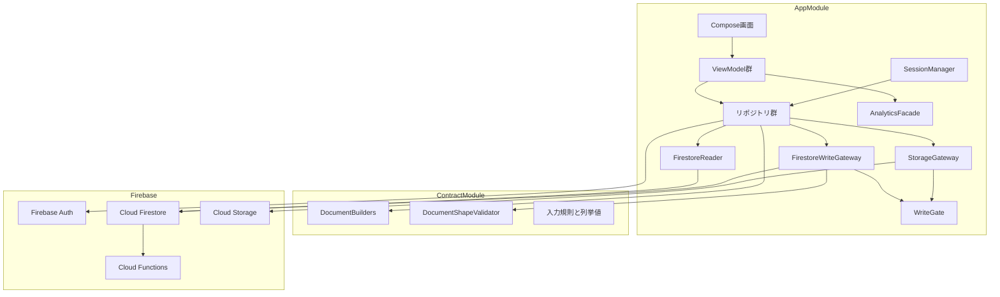
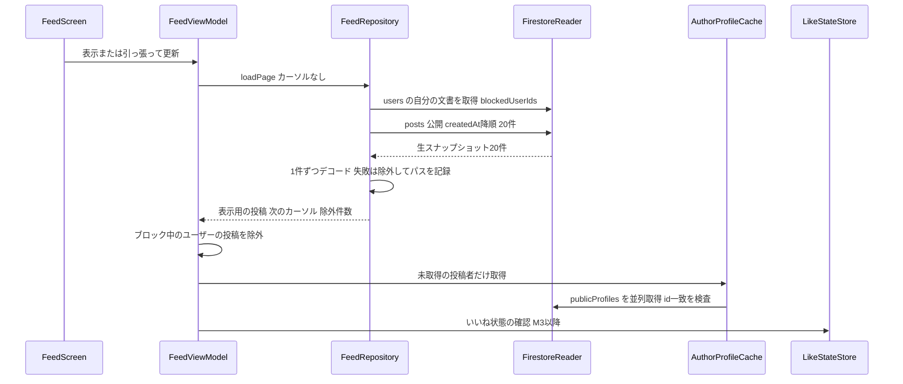
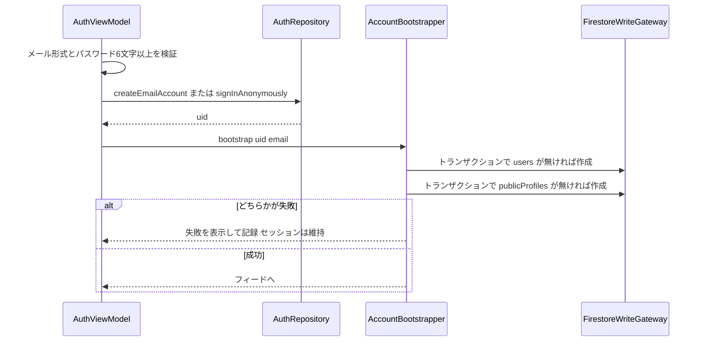
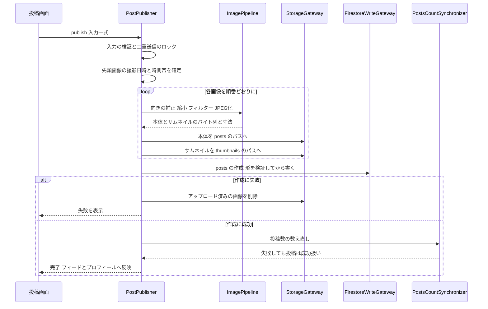
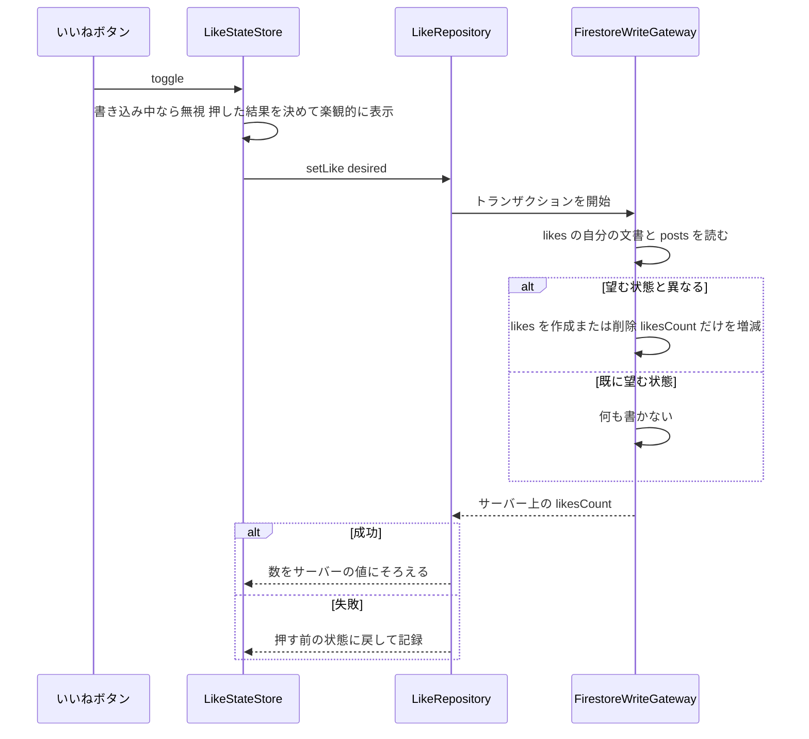
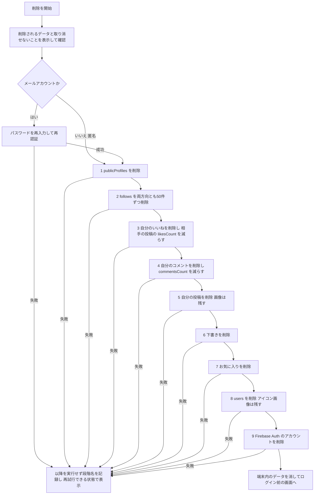

# 技術設計書：Android版MVP（android-mvp）

## Overview

**Purpose**：iOS版「そらもよう」と同じFirebaseバックエンド（`soramoyou-ios`・`asia-northeast1`）を共有するAndroidクライアントを、同一リポジトリの`android/`に新規作成します。最重要の設計目標は**iOS版とのデータ互換**です。Androidが書いたドキュメントと画像を、iOS版・Cloud Functions・Security Rulesが作成元を区別せずに扱えることを、型・実行時の検証・テストの3層で保証します。

**Users**：iOS版と同じアカウントでAndroidから空を閲覧・投稿・いいねする一般ユーザーと、両OSを同じ物差しで分析する開発者が対象です。

**Impact**：iOS版のソースと、`firestore.rules`・`storage.rules`・`firestore.indexes.json`・Cloud Functionsは変更しません（要件1.3）。リポジトリへの変更は`android/`の新設と`.gitignore`への追記に限ります。Hostingへのページ追加（削除リクエスト窓口・プライバシーポリシーの更新）は本設計では**提案にとどめ**、要件1.5に従って着手前に承認を得ます（「設計上の仮決め（要承認）」節）。

### Goals
- M1で「ログインして本番フィードを読める」状態を、**本番への書き込みが構造上起こり得ない**ビルドで実現する。
- 全ての書き込みを単一のゲートウェイに集め、コレクションごとの「形の契約」を書き込みの直前に機械的に検証する（必須キーを欠いた投稿1件で全iOSユーザーのフィードが落ちる事故を防ぐため）。
- iOS版と同一のイベント名・パラメータキー・画面名で分析を送る。
- Google Playのポリシー（UGC・アカウント削除・ターゲットAPI・クローズドテスト）を満たして公開する。

### Non-Goals
- 要件の「対象外（MVP後に検討）」に挙がった全機能（空カメラ、課金、広角合成、ウィジェット、ランキング、AI自動編集、プッシュ受信、コメント、フォロー、検索、お気に入り、下書き、再編集、位置情報、気分フレーム、レビュー誘導、匿名からの引き継ぎ、空の種類・色の自動抽出、コラージュ）。
- `editSettings`・`editRecipeV1`の書き込み（決定事項D1）。ただし拡張点は残す（「将来の拡張」参照）。
- 未ログインのゲスト閲覧（Q7の推奨）。
- バックエンド（rules・indexes・Functions）の変更。

---

## 設計上の仮決め（要承認）

本節の各項目は**推奨の既定値で設計を進めていますが、ユーザーの承認が必要**です。「不可逆」は、一度実行・公開すると戻せない（または戻すコストが高い）ことを示します。

**承認の記録（2026-10-01・ユーザー決定）**
- **QA**：推奨どおり`com.yoshidometoru.soramoyou`に決定した。
- **Q11**：推奨どおりminSdk 26に決定した。
- **QB**：**不採用**とする。退会時のStorageの画像はiOSと同じく消さない（要件12.3どおり）。ただし、Google Playが認める保持の理由はセキュリティ・不正防止・法令に限られる（`research.md`）。そのため、M5でHostingの判断をするときに審査上の扱いを再確認する。
- **Hostingの変更2件**：M5の着手前に改めて判断する。設計は現状のまま承認する。
- **その他（Q2・Q5〜Q10・Q12・QC〜QE）**：推奨の既定値で進める。いずれも可逆である。

### ⚠️ バックエンド変更の承認が必要なもの（要件1.5）

| 対象 | 変更内容 | 理由 | 可逆性 |
|---|---|---|---|
| Hosting：削除リクエスト窓口 | `hosting/delete-account/index.html`を新設します（アプリ名「そらもよう」、アプリ内の削除手順、アプリが無い場合のメールでの申請先、削除されるデータと保持されるデータ） | Google Playは、アプリ内でアカウントを作れるアプリに**Webの削除リクエストURL**の登録を求め、Data safetyフォームへの記入も必須です（Play Console Help answer/13327111、2026-10-01確認）。現状の`hosting/`には`privacy/index.html`しか無く、窓口がありません（`firebase.json:22-47`） | 可逆（ページの差し替え・削除は可能） |
| Hosting：プライバシーポリシーの更新 | Android版の追記（Androidの広告ID、PostHogの明記、「iOSアプリ」表記の修正） | 現行のポリシーは「iOSアプリ」と記載し（`hosting/privacy/index.html:7`）、広告識別子はIDFAのみ（:66）で、第三者提供の一覧にPostHogがありません（:87-112）。iOS版もPostHogへ送信しているため（`LoggingService.swift:118-130`）、**既存の記載漏れ**でもあります | 可逆 |

### 未決事項の推奨値

| ID | 推奨の既定値 | 根拠（1行） | 可逆性 |
|---|---|---|---|
| Q2 | 「フィルターなし」と、`clear`・`drama`・`soft`・`monochrome`・`pastel`・`vivid`の6種（iOSと同じ識別子・表示名） | 6種ともiOSの実装が単段の色調整で（`FilterGraphBuilder.swift:496-515, 543-563`）、Androidの4×5カラーマトリクス1枚に落とせるため、プレビューと出力が同じ演算になります。`natural`はiOSの実装が恒等変換で（:493-494）「フィルターなし」と見た目が同じなので出しません。`warm`・`cool`（色温度の変換）と`vintage`（セピアと周辺減光）は単一のマトリクスで表せないため後回しにします | 可逆 |
| Q5 | 本体90・サムネイル80（`Bitmap.compress`の品質値） | プロジェクト規約の80〜90%（`docs/firestore-schema.md:333`）の範囲内で、iOS（本体0.95：`StorageService.swift:54`、サムネイル0.80：:132）に最も近い値です。エンコーダが異なるため品質値はOS間で数値比較できず、iOSはStorageのURLを読むだけなので互換には影響しません | 可逆（以後の新規アップロードにだけ効く） |
| Q6 | **アプリ内で完結**（iOSと同じ手順）させ、上表のWeb窓口ページも用意します | どちらの方式でもWebのURL登録は必須です。Webだけにすると、開発者が手作業で削除する運用になります。アプリ内の手順は、iOSが#127・#140・#146で孤児データを解消した手順をそのまま写します | 方式の選択は可逆／実行した削除は不可逆 |
| Q7 | ゲスト閲覧はMVPに含めません | M1の定義が「ログインして…読める」です。`publicProfiles`のgetと`likes`のreadは認証が必須で（`firestore.rules:188, 317`）、ゲストには投稿者名といいね状態を出せません。iOSのゲストは別の画面体系です（`GuestTabView.swift:20-25`）。匿名ログイン（要件2.4）なら登録の手間なく閲覧を始められます | 可逆 |
| Q8 | 自分の投稿の削除をMVPに含めます（M4の最後） | Androidだけを使うユーザーが誤投稿を消せない状態を避けます。iOSと同じ手順（`FirestoreService.swift:354-378`→`StorageService.swift:332-350`）でバックエンドの変更は不要で、`storagePath`を必ず書くので画像も確実に消せます | 機能の有無は可逆／実行した削除は不可逆 |
| Q9 | クローズドテスト版から広告SDKを組み込み、**テスト広告**を表示します。本番の広告ユニットIDは本番トラック用のビルドでだけ有効にします。公開国は日本のみで始め、UMP（Google CMP）はM5で組み込んでおきます | レイアウトの崩れ（14.4・14.5）をテスト期間中に確認できます。テスターのクリックによる無効トラフィックを避けられます。AdMobはストアでの公開・リンク前は配信が制限されます（AdMob Help answer/10564477）。認定CMPの要件はEEA・英国・スイス向けで（answer/13554116）、国を広げるときに後付けしなくて済むよう先に入れます | 可逆 |
| Q10 | PostHogはiOSと同じプロジェクト（`LoggingService.swift:30-31`と同じ公開キー・ホスト）を共用し、OSの区別はSDKが既定で付ける`$os`・`$lib`で行います。Firebase Analyticsは同一プロジェクトにAndroidアプリを登録します。画面名は「ホーム」「投稿」「編集」「プロフィール」の4つで、iOSに無い画面・操作のイベントはMVPでは新設しません | 共用すれば同じファネルで両OSを比べられます。iOSは画面計測をPostHogにだけ送っているので（`LoggingService.swift:47-50`）同じ経路にそろえ、単一Activityでは画面を区別できないFirebaseの自動screen_viewは無効にします | 可逆 |
| Q11 | minSdk 26／targetSdk 36／compileSdk 36 | 下限を決める依存はGMA SDK（minSdk 24）で、FirebaseとPostHogは23です。26にするのは、`java.time`をデシュガーなしで使い、検証する端末の範囲を狭めるためです。公式の端末分布はAndroid Studio内でしか提供されておらず、本書では**未確認**です（着手時に24と26の到達率の差を確かめて確定します）。targetSdk 36は新規アプリの必須値です | minSdkを下げるのは可逆／**上げると既存ユーザーが更新を受け取れなくなる（実質不可逆）**ため公開前に確定します |
| Q12 | 下の「確認済みの現行条件」に従います | 2026-10-01に公式ページで確認しました（`research.md`にURLと取得日を記録） | — |

**Q12 確認済みの現行条件（2026-10-01）**
- 2023年11月13日より後に作成した個人アカウントは、**12人以上のテスターが14日以上連続でオプトインしたクローズドテスト**を実施し、その後にダッシュボードから本番アクセスを申請する（質問票があり、審査は通常7日以内）。内部テストは任意で、条件を満たすことには数えられない（Play Console Help answer/14151465）。
- 新規アプリとアプリの更新は、**2026年8月31日からAndroid 16（API 36）以上のターゲット**が必須である。2026年11月1日までの延長を申請できる（developer.android.com target-sdk、ページ更新2026-09-16）。
- 未確認：自分のPlay Consoleアカウントが「2023年11月13日より後に作成した個人アカウント」に当たるか（アカウントの実物で確認する）。

### 追加の仮決め（要件の未決事項以外で、設計中に判断が必要になったもの）

| ID | 推奨の既定値 | 根拠 | 可逆性 |
|---|---|---|---|
| QA | applicationIdを`com.yoshidometoru.soramoyou`にします | iOSのバンドルID`com.yoshidometoru.Soramoyou`（`project.pbxproj:644`）に合わせ、Androidの慣例に従って小文字にします。Firebaseへのアプリ登録とPlayのパッケージ名に使います | **不可逆**（Playのパッケージ名は変更できない） |
| QB | **【不採用・2026-10-01】iOSと同じく画像は消しません。** 以下は当初の提案：アカウント削除で**Storageの画像も削除します**（iOSとの意図的な差分） | iOSの`deleteUserData`はFirestoreのドキュメントしか消さないため（`FirestoreService.swift:884-945`）、公開画像はURLを知っていれば退会後も読めます。Playは「アカウントに関連するデータの削除」を求めています（answer/13327111）。要件12.3は「iOSと同じ対象」としているので、**要件からの逸脱として承認を求めます**。承認されない場合は手順5の画像削除を無効にするだけで済みます | 方式は可逆／実行した削除は不可逆 |
| QC | 作成日時の時刻源を、iOSとコレクションごとに一致させます（`posts`・`likes`・`users`・`publicProfiles`は端末の時刻、`reports`・`feedback`はサーバーの時刻） | iOSの実装どおりです（`PostViewModel.swift:918`、`Like.swift:38`、`User.swift:109`、`FirestoreService.swift:1150`、`Feedback.swift:74`）。要件17.7のキー・型の比較で差分を作りません | 可逆 |
| QD | 表示名・自己紹介を空にして保存したら、そのキーを削除します（`FieldValue.delete()`） | 要件3.5の「値が無いときはキーごと省略」と同じ形になります。iOSは`setData(merge:true)`でnilを省略するため空にできません（`ProfileViewModel.swift:534-542`→`FirestoreService.swift:594-605`）。キーが無いときiOSは「ユーザー」と表示するので（`HomeView.swift:558`）、読み手側は壊れません | 可逆 |
| QE | 読み込んだ投稿を変換できず飛ばしたときは、Crashlyticsではなく分析イベント`post_decode_failed`（`source`・`path`・`error`）で記録します | iOS PR #150（2026-10-01時点でOPEN）と同じイベント名と属性にそろえます。Crashlyticsに送ると、壊れた投稿1件で全ユーザーのページ表示のたびに記録が積み上がります。当初の設計はパスのような種類の多い値を分析に載せない方針でしたが、iOSとの比較を優先して改めました。PR #150がマージされなかった場合は見直します | 可逆 |

### 要件の記述と実装（iOS）の食い違い

| 箇所 | 要件の記述 | iOSの実装（正典） | 本設計の扱い |
|---|---|---|---|
| 12.5 | 「再認証を要求した場合」に再入力を求める（事後の方式） | メールアカウントは**データに触る前に必ず**再認証します（#142。`SettingsViewModel.swift:197-207, 241-252`）。事後の方式では「データは消えたのにAuthだけ残る」状態が本番で4件起きました | **iOSの実装に従い、メールアカウントは常に先に再認証します**。要件12.5の文言は古いため更新を推奨します |
| 12.3 | 「iOSと同じ対象」 | Storageの画像は消していません | QBが不採用のため、iOSと同じく画像は消しません（要件どおり） |
| 10.6 | 変更した項目と`updatedAt`だけを部分更新する | iOSは`users`を`User`全体の`setData(merge:true)`で書いており、手元の古いカウンタで上書きしうります（`ProfileViewModel.swift:540-542`、`FirestoreService.swift:594-605`） | 要件どおり部分更新にします（iOSを写しません）。iOS側の挙動は別issueの候補です |
| 2.5 | rulesの`isValidEmail`と同等以上に厳しく | iOSはTLDを2〜64文字に制限しますが、長さ254の上限は見ていません（`AuthService.swift:137-141`）。rulesは254以下ですが、TLDの上限はありません（`firestore.rules:46-52`） | 両方を満たすことを条件に検証します |

---

## Requirements Traceability

| 要件 | 概要 | コンポーネント | インターフェース | フロー |
|---|---|---|---|---|
| 1.1 | `android/`配下・iOSを変更しない | Gradleプロジェクトの構成 | — | — |
| 1.2 | 本番Firebaseへの接続 | AppContainer、Firebase SDK | `google-services.json` | — |
| 1.3, 1.5 | バックエンド無変更／変更時は承認 | 全体（本書「要承認」節） | — | — |
| 1.4 | 定義済みインデックスのクエリだけ | FirestoreReader（`QuerySpec`の閉じた集合） | `QuerySpec` | クエリ×インデックス表 |
| 1.6 | 秘密情報を`.gitignore`へ | ビルド構成 | `.gitignore`への追記 | — |
| 1.7 | 外部設定作業の一覧 | — | 「外部設定作業の一覧」節 | — |
| 2.1, 2.8 | ログイン・セッションの維持 | AuthRepository、RootNavigation | `AuthRepository.signIn`、`session` | — |
| 2.2 | ログイン中に書き込まない | AuthRepository（書き込みの依存を持たない）、AccountDocumentRepairerの分離 | — | M1の書き込みゼロ保証 |
| 2.3, 2.4, 2.11 | 新規登録・匿名・文書の作成に失敗したときの回復 | AuthRepository、AccountBootstrapper、AccountDocumentRepairer | `createEmailAccount`、`signInAnonymously`、`bootstrap`、`ensureAccountDocuments` | 新規登録フロー |
| 2.5, 2.6 | メールアドレス・パスワードの検証 | EmailValidator、TextLimits | `EmailValidator.isValidForSignUp` | — |
| 2.7 | 失敗の種類ごとの日本語メッセージ | AuthErrorMapper | `AuthErrorKind` | — |
| 2.9 | ログアウトで端末内のデータを残さない | SessionManager | `clearLocalUserData` | — |
| 2.10 | `fcmToken`に触れない | 依存構成（firebase-messagingを入れない）、ShapeContractの許可リスト | — | M1の書き込みゼロ保証 |
| 3.1〜3.5 | `users`・`publicProfiles`の作成内容 | DocumentBuilders、DocumentShapeValidator | 契約表 users・publicProfiles | 新規登録フロー |
| 3.6 | フォロー数は作成時以外に書かない | ShapeContract（更新系の許可リストに含めない） | 契約表 | — |
| 3.7 | 無ければ作る（上書きしない） | AccountDocumentRepairer（トランザクション） | `ensureAccountDocuments` | — |
| 4.1〜4.3 | 公開投稿20件・続きの取得・引っ張って更新 | FeedRepository、FeedViewModel | `FeedRepository.loadPage`、`RawCursor`（生スナップショット） | フィード読み込みフロー |
| 4.4〜4.6 | 投稿者は`publicProfiles`から・代替表示・未取得分だけ | AuthorProfileCache | `ensure`、`AuthorDisplay` | フィード読み込みフロー |
| 4.7, 4.8 | サムネイル優先・先頭画像と複数枚の表示 | PostDocumentReader、FeedScreen | `PostView` | — |
| 4.9 | ブロック中のユーザーを除外 | BlockListRepository、FeedViewModel | `blockedIds` | フィード読み込みフロー |
| 4.10, 4.11 | 読めない投稿は1件だけ除外・未知の項目で失敗しない | PostDocumentReader | `ReadOutcome` | フィード読み込みフロー |
| 4.12, 4.13 | 取得失敗の表示と再試行・0件の表示 | FeedViewModel、共通UI | `FeedUiState` | — |
| 5.1〜5.5 | 投稿詳細 | PostReadRepository、PostDetailScreen | `fetch`、`PostView` | — |
| 6.1, 6.2 | フォトピッカー・広範な権限を求めない | PhotoPickerLauncher | `PickMultipleVisualMedia` | — |
| 6.3, 6.4 | 1〜10枚に制限 | PhotoPickerLauncher、PostComposerViewModel（受け取り側でも検査） | — | — |
| 6.5, 6.7, 6.8 | プレビュー・フィルターの置き換え・フィルターなし | FilterPreview、PostComposerViewModel | `FilterId` | — |
| 6.6 | iOSと同じ識別子・表示名 | FilterId（:contract） | `FilterId` | — |
| 6.9 | 読めない写真を除外 | ImagePipeline | `AppError.ImageUnreadable` | — |
| 7.1〜7.5 | 2048px・正立・JPEG・5MB未満・EXIF除去・パス規則・品質の統一 | ImagePipeline、StorageGateway | `ImagePipeline.prepare`、`StorageGateway.uploadJpeg` | 投稿作成フロー |
| 7.6〜7.9 | キャプション2000・ハッシュタグの抽出と30個・公開範囲 | HashtagExtractor、TextLimits、PostComposerViewModel | `HashtagExtractor.extract` | — |
| 7.10〜7.13, 7.17 | 投稿ドキュメントの形 | DocumentBuilders、DocumentShapeValidator、FirestoreWriteGateway | 契約表 posts | 投稿作成フロー |
| 7.14〜7.16 | 撮影日時・時間帯 | PhotoMetadataReader、ExifDateTimeParser、TimeOfDayResolver | `capturedAt` | 投稿作成フロー |
| 7.18 | 作成に失敗したら画像を削除 | PostPublisher（ロールバック） | `PublishState` | 投稿作成フロー |
| 7.19, 7.20 | 投稿数の数え直し・失敗しても投稿は成功扱い | PostsCountSynchronizer | `recount` | 投稿作成フロー |
| 7.21, 7.22 | 進捗・二重送信の防止・反映 | PostPublisher、FeedViewModel、ProfileViewModel | `PublishState` | — |
| 8.1, 8.2 | `editSettings`・`editRecipeV1`を書かない・iOSの投稿を書き換えない | ShapeContract（許可リスト）、更新系の契約に含めない | 契約表 | — |
| 8.3 | 将来`editSettings`へ拡張できる内部表現 | FilterId、FsValue（拡張点） | `FilterId.raw` | — |
| 9.1, 9.2 | いいね数と状態の表示・確認 | LikeStateStore、LikeRepository | `displayedCount`、`likedAmong` | いいねフロー |
| 9.3〜9.6 | トランザクション・`likesCount`だけ・望む状態の指定 | LikeRepository | `setLike(postId, desired)` | いいねフロー |
| 9.7〜9.9 | 楽観的な表示・失敗時に戻す・書き込み中は受け付けない | LikeStateStore | `toggle` | いいねフロー |
| 10.1〜10.5 | 自分・他人のプロフィールと投稿一覧 | ProfileRepository | `observeOwn`、`fetchPublic`、`ownPostsPage`、`userPublicPostsPage` | — |
| 10.6〜10.10 | 編集の部分更新・書かない項目・アイコン・公開プロフィールの回復・入力の上限 | ProfileEditor、DocumentBuilders、AccountDocumentRepairer | `save` | — |
| 10.11 | 自分の投稿の削除 | PostDeleter | `delete` | — |
| 11.1〜11.7 | 通報・ブロック | ModerationRepository、BlockListScreen | `report`、`block`、`unblock` | — |
| 12.1〜12.7 | アカウント削除 | AccountDeletionService、SessionManager | `delete`、`DeletionStage` | アカウント削除フロー |
| 13.1〜13.6 | フィードバック | FeedbackRepository、FeedbackScreen | `submit` | — |
| 14.1〜14.5 | 広告 | AdsController、BannerAdSlot | — | — |
| 15.1〜15.9 | 分析・エラーの計測 | AnalyticsFacade、CrashReporter | `logEvent`、`logScreen`、`logError`、`setUserId` | 分析イベント一覧 |
| 16.1〜16.6 | 日本語・読み込み中・オフライン・ダーク・TalkBack・文字サイズ | テーマ、NetworkMonitor、共通UI部品 | `isOnline` | — |
| 17.1〜17.10 | 相互運用の検証 | 検証手順（Testing Strategy） | キー・型の比較手順 | — |
| 18.1〜18.9 | Playでの公開 | リリース手順 | — | — |

---

## Architecture

### Existing Architecture Analysis

- **iOS版**はSwiftUIとMVVMとサービス層（`Services/FirestoreService.swift`など）で構成され、ドキュメントの形は各モデルの`toFirestoreData()`と`init(from:)`が決めている。Androidはこの2つを**正典**として契約表に写す（「Data Models」参照）。
- **形を守る仕組みは読み手側にある**。`posts`の作成ルールは`hasAll(['userId','images','visibility','createdAt'])`だけで（`firestore.rules:57`）、余分なキーも欠けた任意のキーも通る。一方でiOSのホームフィードは`try`を含む`compactMap`でデコードしており、**1件でもデコードできないとページ全体が失敗する**（`FirestoreService.swift:290-292`。ホームはこの経路：`PaginatedPostsViewModel.swift:210-213`）。デコードに必須なのはトップレベルの`postId`・`userId`（文字列）と`images`（マップの配列）である（`Post.swift:215-228`）。
  - **iOS側の修正（PR #150・2026-10-01時点でOPEN）**：マージされると、壊れた1件だけを飛ばして`post_decode_failed`を送る形に変わり、ページ全体は失敗しなくなる（`Services/PostDocumentDecoder.swift`を新設）。それでも、必須項目を欠いた投稿はiOSで**表示されない**。Androidが書き込みの直前に形を検証する必要は変わらない。
- **他人によるカウンタの更新**には、`isCountOnlyUpdate`が`affectedKeys().hasOnly(['likesCount','commentsCount'])`とキー数の一致を求める（`firestore.rules:85-104`）。`likesCount`が無い投稿では`existing.likesCount`が評価エラーになり、誰もいいねできない。
- **Androidの書き込みで発火するFunctions**（いずれもバックエンドの変更は不要である）：
  - `onPostCreated`：公開・フォロワー限定の投稿で、フォロワー／全員へ通知する（`functions/index.js:163-235`）。
  - `onLikeCreated`：投稿者へ通知する（:104-129）。
  - `notifyFeedbackToDiscord`：開発者のDiscordへ通知する（:466）。
  - `onFollowDeleted`：退会時のfollowsの削除で、相手のカウンタを数え直す（:358）。
  - `onPublicProfileUpdated`：表示名などの更新では何も読まずに抜ける（`docs/firestore-schema.md:303`）。

### Architecture Pattern & Boundary Map

**採用するパターン**：単一Activity、Jetpack Compose、MVVM（単方向データフロー：ViewModelが`StateFlow`でUIの状態を公開）、リポジトリ層の組み合わせです。Firebaseへのアクセスは**読み取り口（FirestoreReader）と書き込み口（FirestoreWriteGateway・StorageGateway）に分け**、書き込み口だけが書き込みAPIを呼べるようにします。ドキュメントの形・列挙値・入力の規則は、Firebaseに依存しない純Kotlinのモジュール`:contract`に置き、JVMの単体テストで高速に検証します。



**Architecture Integration**
- 境界：`:contract`（形・規則・列挙値。Firebaseに依存しない）／`:app`の`data.remote.read`（読み取り専用）／`data.remote.write`（書き込みの唯一の入口）／`feature.*`（画面とViewModel）。
- 既存パターンの踏襲：iOSの`FirestoreService`の各メソッドの書き込み内容・順序・エラー処理を、Androidのリポジトリへ1対1で写す（出典は各コンポーネントに記載）。
- 新しいコンポーネントの理由：`WriteGate`（マイルストーンごとの書き込み可否）と`DocumentShapeValidator`（書き込み前の形の検証）はiOSには無いが、Androidが3番目のクライアントとして本番に加わるリスクへの対策として必須とする。
- ステアリングへの準拠：`CLAUDE.md`の画像の規約（JPEG・5MB）と、`docs/tech-spec.md`の「デコードの失敗を黙って落とさず、パスを記録する」方針を守る。

### Technology Stack

| 層 | 選定／バージョン | 役割 | 備考 |
|---|---|---|---|
| ビルド | Android Gradle Plugin 9.4.0／Gradle 9.6.0／JDK 17 | `android/`のマルチモジュールビルド | 2026-10-01に公式のリリースノートで確認 |
| 言語 | Kotlin（AGPに組み込まれたKotlinサポートを使用） | 全コード | Kotlinの確定した版数は着手時に決めます |
| UI | Jetpack Compose（Compose BOM 2026.09.00、Material 3 1.4.0） | 全画面、ダークテーマへの追従 | BOMの対応表で確認 |
| ナビゲーション | Navigation Compose（型安全なルート） | 画面遷移 | 版数は着手時に確定（未確認） |
| DI | 手動DI（`AppContainer`） | 依存の組み立て | Hiltは採用しません（`research.md`） |
| 画像表示 | Coil 3 | フィード・詳細の画像読み込み、ログアウト時のキャッシュ消去 | 版数は未確認 |
| Firebase | Firebase Android BoM 34.19.0（auth・firestore・storage・analytics・crashlytics） | バックエンドへの接続 | KTXモジュールはBoM 34.0.0で廃止済み。**firebase-messagingは入れません** |
| 分析 | posthog-android 3.x | PostHogへの送信 | API 23以上 |
| 広告 | GMA Next-Gen SDK 1.5.0とUMP SDK | バナー広告・同意の取得 | Legacy SDK（25.5.0）は保守モード。Next-GenはminSdk 24・compileSdk 35以上が必要 |
| 画像メタデータ | androidx.exifinterface | 撮影日時と向きの読み取り | — |
| テスト | JUnit（`:contract`・`:app`のJVMテスト）、Firebase Local Emulator Suite（firebase-tools） | 単体テスト・ルールとの結合テスト | エミュレータはリポジトリの`firestore.rules`・`storage.rules`をそのまま読み込みます |
| SDKレベル | minSdk 26／targetSdk 36／compileSdk 36 | — | Q11 |

### プロジェクト構成

```
android/
  settings.gradle.kts            # :app と :contract
  gradle/libs.versions.toml      # 版数の一元管理
  gradle.properties              # soramoyou.milestone=M1..M6（書き込み可否の既定）
  contract/                      # 純Kotlin（JVM）。Firebaseに依存しない
    src/main/kotlin/.../contract/
      model/                     # Visibility, TimeOfDay, SkyType, FilterId, ReportReason, FeedbackCategory, CapturedAtSource
      rules/                     # HashtagExtractor, EmailValidator, TimeOfDayResolver, ExifDateTimeParser, TextLimits
      document/                  # FsValue, DocumentBuilders, ShapeContracts, DocumentShapeValidator, IosPostReaderContract
    src/test/resources/ios-shapes/   # iOSのコードに由来する形のフィクスチャ（file:line の注記つき）
  app/
    google-services.json         # Git管理外
    src/main/kotlin/.../
      di/AppContainer.kt
      data/remote/read/          # FirestoreReader, QuerySpec（読み取り専用）
      data/remote/write/         # FirestoreWriteGateway, StorageGateway, WriteGate（書き込みの唯一の入口）
      data/repository/           # 各リポジトリ
      data/image/                # ImagePipeline, PhotoMetadataReader
      platform/                  # AnalyticsFacade, CrashReporter, NetworkMonitor, AdsController, SessionManager
      feature/{auth,feed,detail,compose,profile,settings}/
```

リポジトリ直下の`.gitignore`へ、次のものを追記します（要件1.6）。
- `android/app/google-services.json`
- `android/local.properties`、`android/keystore.properties`
- `*.jks`、`*.keystore`
- `android/.gradle/`、`android/**/build/`

### マイルストーンと有効化の範囲

書き込みの可否は、`gradle.properties`の`soramoyou.milestone`からビルド時に`BuildConfig`へ焼き込む`WriteCapability`の集合で決まります。UIの書き込み導線（新規登録・匿名・いいね・投稿タブ・設定内の操作）も、同じ集合で表示を切り替えます。

| マイルストーン | 有効な`WriteCapability` | 有効な画面・機能 | 完了の確認 |
|---|---|---|---|
| M1 | **なし（空集合）** | 既存アカウントのメールログイン、セッションの維持、ログアウト、フィード、投稿詳細、分析 | 下記「M1の書き込みゼロ保証」 |
| M2 | `ACCOUNT_CREATE`、`ACCOUNT_REPAIR`、`PROFILE_EDIT` | 新規登録、匿名、プロフィールの表示・編集 | 17.1、17.2 |
| M3 | 上記と`LIKE` | いいね | 17.6 |
| M4 | 上記と`POST_CREATE`、`POSTS_COUNT_SYNC`、`POST_DELETE`（Q8の承認時） | 写真の選択・フィルター・投稿・自分の投稿の削除 | 17.3〜17.5、17.7 |
| M5 | 上記と`REPORT`、`BLOCK`、`FEEDBACK`、`ACCOUNT_DELETE` | 通報・ブロック、アカウント削除、フィードバック、広告 | 各機能を本番データで1回通す |
| M6 | M5と同じ | クローズドテスト・本番公開 | Playの審査を通過 |

### M1の書き込みゼロ保証

本番への書き込みを「起こさないよう注意する」のではなく、**起こり得ない構成**にします。

1. **ビルド時**：M1の`WriteCapability`は空集合である。書き込みを伴うUIの導線は表示しない。
2. **構造**：`FirebaseFirestore`・`FirebaseStorage`のインスタンスは`AppContainer`だけが生成する。書き込みAPI（`set`・`update`・`delete`・`runTransaction`・`batch`・`putBytes`・`putFile`・`putStream`）を呼べるのは、`data.remote.write`パッケージだけにする。これを**アーキテクチャテスト**で強制する。テストはソースを走査し、`write`パッケージの外で上記の呼び出しが現れたら失敗する。同様に、`FieldValue`・`SetOptions`・`WriteBatch`・`Transaction`・`StorageMetadata`のimportも失敗とする。CIの単体テストとして毎回実行する。
3. **実行時**：`FirestoreWriteGateway`と`StorageGateway`は、全ての呼び出しの先頭で`WriteGate`に照会する。無効なら書き込みAPIに到達せず、`AppError.WriteBlocked`を返して記録する。
4. **依存の構成**：`firebase-messaging`をMVPの依存に含めない。FCMのSDKがバイナリに無いので、`users/{uid}.fcmToken`を書く経路そのものが存在しない（要件2.10を構造で保証）。
5. **陽性対照**（検出器が効いていることを先に確かめる）：
   - `WriteGate`が有効なときにFirebaseのフェイクが「呼ばれる」ことを先に確かめ、そのうえで無効なときに`create`が`WriteBlocked`を返し、フェイクが一度も呼ばれないことを単体テストで確かめる。
   - アーキテクチャテストは、`read`パッケージに意図的に`.set(`を含むフィクスチャファイルを置いたときに失敗することを確かめる。
   - 実機での確認：デバッグビルドで`FirebaseFirestore.setLoggingEnabled(true)`にし、Firestoreエミュレータへ意図的に1件書くビルドで書き込みストリームのログが出ることを確かめる。そのうえで、M1ビルドを本番に向けて操作したときにそのログが**出ない**ことを確かめる。
6. **キャッシュ**：Firestoreのローカルキャッシュはメモリだけにし、ディスクへ永続化しない（オフライン書き込みの待ち行列も残らない）。

---

## System Flows

### フィード読み込み（M1）



- 次のカーソルは、**デコード前の生スナップショットの最後の1件**にする（除外した投稿を含む。iOSの`fetchUserPostsPage`と同じ：`FirestoreService.swift:433-435`）。デコード後の配列で決めると、末尾が壊れた投稿のとき同じページを読み直してしまう。
- ブロックリストの取得に失敗しても表示は続ける（iOSと同じ：`HomeViewModel.swift:106-115`）。ただしAndroidでは失敗を記録する。

### 新規登録・匿名（M2）



- メールアドレスの検証に通らない場合は、Firebase Authのアカウントを作らない（2.5）。
- 文書の作成に失敗したアカウントは、後で`AccountDocumentRepairer`が補う（2.11、3.7）。

### 投稿作成（M4）



- アップロードの途中で失敗した場合も、それまでにアップロードした画像を削除してから失敗を返す（iOSの`rollbackUploadedImages`と同じ：`PostViewModel.swift:681-690`）。
- `postId`は投稿の開始時に1回だけ生成する（大文字のUUID文字列。iOS：`PostViewModel.swift:885`）。同じ`postId`への`set`は冪等なので、作成を再試行しても投稿は重複しない。

### いいね（M3）



### アカウント削除（M5、Q6＝アプリ内で完結）



- 手順と順序は、iOSの`deleteUserData`（`FirestoreService.swift:874-951`）とその呼び出し元（`SettingsViewModel.swift:188-260`）の写しである。各手順の詳細は「AccountDeletionService」を参照。
- **残存リスク（iOSと共通）**：匿名アカウントで手順9が「最近のログインが必要」で失敗した場合、匿名は再認証できないため、データを消し終えたAuthのレコードが残る（PIIは含まない）。画面上は失敗として再試行を案内し、記録する。

---

## Components and Interfaces

### コンポーネント一覧

| コンポーネント | 層 | 役割 | 要件 | 主な依存（重要度） | 契約 |
|---|---|---|---|---|---|
| FsValue／DocumentBuilders | contract | 書き込むドキュメントを型で組み立てる | 3.1〜3.5, 7.10〜7.13, 9.3, 11.2, 13.2 | なし | Service |
| DocumentShapeValidator／ShapeContracts | contract | 書き込みの直前に形を検証する | 2.10, 3.6, 7.10〜7.13, 7.17, 8.1, 9.5, 10.7 | なし | Service |
| IosPostReaderContract | contract | iOSのデコード必須条件の移植（テスト用） | 7.10, 7.11, 17.7 | なし | Service |
| 入力規則（HashtagExtractorなど） | contract | iOSと同じ抽出・検証・時間帯の判定 | 2.5, 2.6, 7.6〜7.8, 7.14〜7.16, 10.10, 13.3 | なし | Service |
| WriteGate | app/write | マイルストーンごとの書き込み可否 | M1の保証, 2.2 | BuildConfig（P0） | State |
| FirestoreWriteGateway | app/write | Firestoreへの書き込みの唯一の入口 | 全ての書き込み要件 | WriteGate（P0）、Validator（P0） | Service |
| StorageGateway | app/write | Storageのアップロード・削除の唯一の入口 | 7.1〜7.5, 7.18, 10.8, 10.11 | WriteGate（P0） | Service |
| FirestoreReader | app/read | 読み取り専用・クエリの形を閉じた集合に限る | 1.4, 4.*, 5.*, 10.* | Firestore（P0） | Service |
| AuthRepository | app/data | 認証とセッション | 2.* | Firebase Auth（P0） | Service, State |
| AccountBootstrapper／AccountDocumentRepairer | app/data | アカウント文書の作成・補完 | 2.3, 2.4, 2.11, 3.*, 10.9 | Gateway（P0） | Service |
| FeedRepository／PostDocumentReader | app/data | フィードのページ取得と1件単位のデコード | 4.1〜4.3, 4.10〜4.12 | Reader（P0） | Service |
| AuthorProfileCache | app/data | 投稿者表示の取得・検証・代替表示 | 4.4〜4.6, 10.3 | Reader（P0） | State |
| LikeRepository／LikeStateStore | app/data | いいねの書き込みと楽観的な表示 | 9.* | Gateway（P0） | Service, State |
| ImagePipeline／PhotoMetadataReader | app/image | 画像の変換・撮影日時の取得 | 6.9, 7.1〜7.5, 7.14〜7.16 | exifinterface（P1） | Service |
| PostPublisher／PostsCountSynchronizer | app/data | 投稿の作成・ロールバック・投稿数 | 7.* | Gateway、StorageGateway、Reader（P0） | Service, State |
| PostDeleter | app/data | 自分の投稿の削除 | 10.11 | Gateway、StorageGateway（P0） | Service |
| ProfileRepository／ProfileEditor | app/data | プロフィールの表示・編集 | 10.1〜10.10 | Reader、Gateway（P0） | Service |
| ModerationRepository／FeedbackRepository | app/data | 通報・ブロック・フィードバック | 11.*, 13.* | Gateway（P0） | Service |
| AccountDeletionService | app/data | iOSと同じ順序の退会処理 | 12.* | Gateway、Reader、Auth（P0） | Service, State |
| AnalyticsFacade／CrashReporter | platform | 分析と非致命エラーの単一の窓口 | 15.* | PostHog、Firebase（P1） | Service |
| SessionManager | platform | ログアウト・退会時の端末内データの消去 | 2.9, 12.7, 15.7 | Coil、Firestore、各Store（P0） | Service |
| AdsController／BannerAdSlot | platform/UI | 同意の取得とバナー | 14.* | GMA Next-Gen、UMP（P1） | State |
| NetworkMonitor | platform | オフラインの表示と再試行 | 16.3 | ConnectivityManager（P2） | State |
| 画面群（Auth・Feed・Detail・Compose・Profile・Settings） | UI | 表示のみ | 4〜6, 10〜13, 16 | 各ViewModel | — |

### 共通の型（:contract と :app で共有）

```kotlin
@JvmInline value class Uid(val value: String)
@JvmInline value class PostId(val value: String)          // iOSと同じ大文字UUID文字列
@JvmInline value class StoragePath(val value: String)

sealed interface AppResult<out T> {
    data class Ok<T>(val value: T) : AppResult<T>
    data class Err(val error: AppError) : AppResult<Nothing>
}

enum class ErrorCategory(val raw: String) {               // iOS ErrorCategory.rawValue と同じ値（LoggingService.swift:308-318）
    USER("user_error"), SYSTEM("system_error"), BUSINESS("business_error")
}

sealed interface AppError {
    val category: ErrorCategory
    data class Auth(val kind: AuthErrorKind) : AppError
    data object Network : AppError
    data object PermissionDenied : AppError
    data object NotFound : AppError
    data class WriteBlocked(val capability: WriteCapability) : AppError
    data class ShapeViolation(val violations: List<Violation>) : AppError
    data class Validation(val reason: ValidationReason) : AppError
    data class ImageUnreadable(val index: Int) : AppError
    data class ImageTooLarge(val index: Int, val bytes: Long) : AppError
    data class StageFailed(val stage: DeletionStage, val cause: AppError) : AppError
    data class Unknown(val message: String) : AppError
}
```

### :contract（形・規則・列挙値）

#### FsValue と DocumentBuilders

| Field | Detail |
|---|---|
| Intent | Firestoreへ書く値を、nullと浮動小数を持たない閉じた型で表す |
| Requirements | 3.1〜3.5, 7.10〜7.13, 8.3, 9.3, 11.2, 13.2 |

**Responsibilities & Constraints**
- `FsValue`は**nullを表現できない**。任意の項目は「キーを入れない」ことでしか表せない（要件3.5・7.12）。
- MVPの`FsValue`には**浮動小数の型を持たせない**。`width`・`height`・`order`・各カウンタに小数が混ざると、iOSの`ImageInfo`のデコード（`as? Int`：`ImageInfo.swift:80-86`）で画像が黙って落ちるためである。将来`editSettings`を書くとき（iOSは`Float`で読む：`EditSettings.swift:222-252`）に`Float64`を追加する（8.3の拡張点）。
- ビルダーは純関数で、Firebaseの型を参照しない。`:app`のゲートウェイが`FsValue`をFirebaseの値（`Timestamp`・`FieldValue`など）へ変換する。

```kotlin
sealed interface FsValue {
    data class Str(val value: String) : FsValue
    data class Int64(val value: Long) : FsValue
    data class Bool(val value: Boolean) : FsValue
    data class Time(val instant: Instant) : FsValue          // 端末時刻のTimestamp
    data object ServerTime : FsValue                          // FieldValue.serverTimestamp()
    data class Increment(val by: Long) : FsValue              // ±1のみ（契約で制限）
    data class StrList(val values: List<String>) : FsValue
    data class MapList(val values: List<Map<String, FsValue>>) : FsValue
    data class ArrayUnion(val values: List<String>) : FsValue
    data class ArrayRemove(val values: List<String>) : FsValue
    data object DeleteField : FsValue
}
typealias FsDocument = Map<String, FsValue>

data class UploadedImage(
    val url: String, val thumbnailUrl: String,
    val widthPx: Int, val heightPx: Int, val order: Int,
    val storagePath: StoragePath, val thumbnailStoragePath: StoragePath,
)
data class NewPost(
    val postId: PostId, val userId: Uid, val images: List<UploadedImage>,
    val visibility: Visibility, val caption: String?, val hashtags: List<String>,
    val capturedAt: Instant?, val timeOfDay: TimeOfDay?, val createdAt: Instant,
)
sealed interface FieldChange<out T> {
    data object Unchanged : FieldChange<Nothing>
    data class Set<T>(val value: T) : FieldChange<T>
    data object Clear : FieldChange<Nothing>
}
data class ProfileChange(val displayName: FieldChange<String>, val bio: FieldChange<String>, val photoUrl: FieldChange<String>)

object DocumentBuilders {
    fun postCreate(input: NewPost): FsDocument
    fun userCreate(uid: Uid, email: String?, now: Instant): FsDocument
    fun publicProfileCreate(uid: Uid, source: UserProfileFields?, now: Instant): FsDocument
    fun profileUpdate(change: ProfileChange, now: Instant): FsDocument
    fun postsCount(count: Long): FsDocument
    fun likeCreate(userId: Uid, postId: PostId, now: Instant): FsDocument
    fun likeCounter(delta: Int): FsDocument                  // {"likesCount": Increment(±1)} のみ
    fun reportCreate(postId: PostId, reporterId: Uid, reportedUserId: Uid, reason: ReportReason): FsDocument
    fun feedbackCreate(input: FeedbackInput): FsDocument
    fun blockedUserIds(change: BlockChange): FsDocument
}
```
- 事後条件：戻り値は、対応する`ShapeContract`で必ず合格する（単体テストで全てのビルダーを検証する）。

#### DocumentShapeValidator／ShapeContracts

| Field | Detail |
|---|---|
| Intent | 書き込みの直前に、キーの許可リスト・必須キー・値の種類・値の範囲を検証する |
| Requirements | 2.10, 3.6, 7.10〜7.13, 7.17, 8.1, 8.2, 9.5, 10.7 |

**Responsibilities & Constraints**
- 契約は**許可リスト方式**で、契約に無いキーは全て違反とする。これにより次のキーを書けなくなる。
  - `fcmToken`（2.10）
  - `editSettings`・`editRecipeV1`（8.1）
  - `skyType`・`skyColors`・`colorTemperature`（7.17）
  - `externalEditInfo`・`originalImages`（7.12）
  - 更新時の`id`・`email`・`followersCount`・`followingCount`・`postsCount`（10.7）
  - いいね時の`updatedAt`（9.5）
- 値の範囲：
  - 列挙値は`:contract`の列挙型の`raw`のみ（7.13）
  - `images`は1〜10件、`hashtags`は1〜30件、`caption`は2000以下、`Increment`は±1
  - `postId`はドキュメントIDと一致
  - `storagePath`の接頭辞は`posts/{userId}/{visibility}/`、`thumbnailStoragePath`の接頭辞は`thumbnails/{userId}/{visibility}/`（7.3）
- `FirestoreWriteGateway`は全ての書き込みでこの検証を通し、違反があれば**書き込まずに**`AppError.ShapeViolation`を返して記録する（fail-closed）。

```kotlin
enum class ValueKind { STR, INT64, BOOL, TIME, SERVER_TIME, INCREMENT, STR_LIST, MAP_LIST, ARRAY_UNION, ARRAY_REMOVE, DELETE }
enum class Basis { RULES_HAS_ALL, RULES_VALUE, IOS_READER_REQUIRED, COUNT_ONLY_UPDATE, IOS_SHAPE_PARITY, OPTIONAL }
data class FieldRule(val key: String, val kinds: Set<ValueKind>, val required: Boolean, val basis: Basis, val constraint: ValueConstraint? = null)
data class ShapeContract(val id: ContractId, val fields: List<FieldRule>, val nested: Map<String, ShapeContract> = emptyMap())
enum class ContractId { POST_CREATE, POST_IMAGE, POST_LIKE_COUNTER, USER_CREATE, USER_PROFILE_UPDATE, USER_POSTS_COUNT, USER_BLOCKED_IDS,
    PUBLIC_PROFILE_CREATE, PUBLIC_PROFILE_UPDATE, PUBLIC_PROFILE_POSTS_COUNT, LIKE_CREATE, REPORT_CREATE, FEEDBACK_CREATE }
data class WriteTarget(val documentId: String, val authUid: Uid)
sealed interface Violation {
    data class MissingKey(val key: String) : Violation
    data class UnexpectedKey(val key: String) : Violation
    data class WrongKind(val key: String, val actual: ValueKind) : Violation
    data class OutOfRange(val key: String, val detail: String) : Violation
}
interface DocumentShapeValidator {
    fun validate(contract: ShapeContract, doc: FsDocument, target: WriteTarget): List<Violation>   // 空なら合格
}
```

#### IosPostReaderContract

- iOSの`Post.init(from:)`（`Post.swift:214-335`）と`ImageInfo.init?(from:)`（`ImageInfo.swift:80-100`）のうち、**デコードを失敗させる条件だけ**をKotlinへ移植した判定関数である。`postId`・`userId`が文字列であること、`images`がマップの配列であること、各画像の`url`が文字列で`width`・`height`・`order`が整数であることを判定する。
- 用途はテストに限る。`DocumentBuilders.postCreate`の全ての出力がこの判定を通ること、`images`内の`width`を小数にした入力などが「iOSでは画像が落ちる」と判定されること（陽性対照）を確かめる。

#### 入力規則

```kotlin
interface HashtagExtractor { fun extract(caption: String): List<String> }        // 重複の除去・正規化をしない
interface EmailValidator { fun isValidForSignUp(email: String): Boolean }
object TimeOfDayResolver { fun fromLocalHour(hour: Int): TimeOfDay }
interface ExifDateTimeParser { fun parse(dateTimeOriginal: String, offsetTimeOriginal: String?, deviceZone: ZoneId): Instant? }
object TextLimits {
    const val PASSWORD_MIN = 6; const val CAPTION_MAX = 2000; const val HASHTAGS_MAX = 30
    const val FEEDBACK_MAX = 1000; const val DISPLAY_NAME_MAX = 50; const val BIO_MAX = 200
    const val IMAGES_MIN = 1; const val IMAGES_MAX = 10
}
```
- **ハッシュタグ**：iOSは`#(\w+)`をNSRegularExpression（ICU）で評価している（`PostViewModel.swift:194-207`）。ICUの`\w`は`[\p{Alphabetic}\p{Mark}\p{Decimal_Number}\p{Connector_Punctuation}‌‍]`である（ICUユーザーガイドで確認）。Javaの`\w`は既定でASCIIのみで、Androidでの既定の意味は未確認のため、**`\w`を使わずに上記と同じ文字クラスを明示する**。抽出した文字列は`#`を除いた元のままで、出現順・重複込みで保存する（iOSは重複を除かない）。日本語・絵文字・全角数字・`_`・`##`・連続したタグを含む黄金ベクタで単体テストし、本番では17.5で突き合わせる。
- **メールアドレス**：rulesの正規表現`[a-zA-Z0-9._%+-]+@[a-zA-Z0-9.-]+\.[a-zA-Z]{2,}`と長さ1〜254（`firestore.rules:46-52`）に、iOSのTLD上限64（`AuthService.swift:138`）を加え、文字列全体の一致で検証する。
- **時間帯**：5〜11時は`morning`、12〜16時は`afternoon`、17〜19時は`evening`、それ以外は`night`とする（`TimeOfDay.swift:38-51`）。「時」は撮影日時を端末のタイムゾーンで見た値である（iOSも`Calendar.current`）。
- **EXIFの日時**：書式`yyyy:MM:dd HH:mm:ss`を、グレゴリオ暦で、ロケールに依存しない形で解釈する。`OffsetTimeOriginal`（`+09:00`の形式で、6文字の範囲内のもの）があればそのオフセットで、無ければ端末のタイムゾーンで解釈する（`ImageService.swift:1047-1072`の移植）。
- **文字数**：キャプションとフィードバックは、UTF-16の長さで上限を判定する（rulesの`size()`は「文字数」で、UTF-16の長さはコードポイント数以上なので、rulesより緩くならない）。表示名と自己紹介はiOSの`String.count`（書記素クラスタの数）に合わせ、`android.icu.text.BreakIterator`で数える（`ProfileViewModel.swift:743-744`）。空白だけかどうかの判定では、全角空白を含むUnicodeの空白を取り除く。

### :app／書き込み層

#### WriteGate

```kotlin
enum class WriteCapability { ACCOUNT_CREATE, ACCOUNT_REPAIR, PROFILE_EDIT, LIKE, POST_CREATE, POSTS_COUNT_SYNC, POST_DELETE, REPORT, BLOCK, FEEDBACK, ACCOUNT_DELETE }
interface WriteGate { val enabled: Set<WriteCapability>; fun isEnabled(capability: WriteCapability): Boolean }
```
- 状態は`BuildConfig`の定数だけで決まり、実行時には変更できない（デバッグメニューなどで書き換える経路を作らない）。

#### FirestoreWriteGateway

| Field | Detail |
|---|---|
| Intent | Firestoreへの全ての書き込みを、可否の判定→形の検証→実行→記録の順で行う唯一の入口 |
| Requirements | 2.2, 2.10, 3.*, 7.10〜7.13, 8.*, 9.3〜9.6, 10.6〜10.9, 11.2〜11.5, 12.3, 13.2 |

**Dependencies**
- Inbound：各リポジトリ — 書き込みの依頼（P0）
- Outbound：WriteGate（P0）、DocumentShapeValidator（P0）、CrashReporter（P1）
- External：Cloud Firestore（P0）

```kotlin
data class DocRef(val path: String)                 // 例 "posts/{postId}"。型付きのファクトリ経由でのみ生成する
interface FirestoreWriteGateway {
    suspend fun create(cap: WriteCapability, ref: DocRef, contract: ShapeContract, doc: FsDocument): AppResult<Unit>   // set（mergeなし）
    suspend fun update(cap: WriteCapability, ref: DocRef, contract: ShapeContract, fields: FsDocument): AppResult<Unit> // 部分更新
    suspend fun delete(cap: WriteCapability, ref: DocRef): AppResult<Unit>
    suspend fun batchDelete(cap: WriteCapability, refs: List<DocRef>): AppResult<Unit>                                   // 500件ずつ
    suspend fun <T> transaction(cap: WriteCapability, block: suspend TxScope.() -> T): AppResult<T>
}
interface TxScope {
    suspend fun get(ref: DocRef): RawDocument?          // 存在しなければnull
    fun create(ref: DocRef, contract: ShapeContract, doc: FsDocument)
    fun update(ref: DocRef, contract: ShapeContract, fields: FsDocument)
    fun delete(ref: DocRef)
}
```
- 事前条件：`cap`が有効であること。無効なら`WriteBlocked`を返し、Firebaseには到達しない。
- 事後条件：形の検証に失敗した書き込みは実行しない。Firebaseの例外は`AppError`に写して返す（`PERMISSION_DENIED`は`PermissionDenied`、`NOT_FOUND`は`NotFound`、`UNAVAILABLE`は`Network`）。
- 不変条件：`merge`付きの`set`は提供しない（既存の値を巻き戻す経路を作らない）。

#### StorageGateway

```kotlin
interface StorageGateway {
    suspend fun uploadJpeg(cap: WriteCapability, path: StoragePath, bytes: ByteArray): AppResult<String>   // ダウンロードURL
    suspend fun delete(cap: WriteCapability, path: StoragePath): AppResult<Unit>
}
```
- `contentType`は`image/jpeg`に固定する（7.3、`storage.rules:21-23`）。`bytes.size >= 5 * 1024 * 1024`なら送信せずに`ImageTooLarge`を返す（`storage.rules:25-28`は「5MB未満」）。
- ダウンロードURLの取得は、iOSと同じく間隔を空けて最大3回まで再試行する（`StorageService.swift:93-120`）。

### :app／読み取り層

#### FirestoreReader と クエリ×インデックス表

```kotlin
sealed interface QuerySpec {
    data class PublicFeed(val limit: Int, val after: RawCursor?) : QuerySpec
    data class OwnPosts(val uid: Uid, val limit: Int, val after: RawCursor?) : QuerySpec
    data class UserPublicPosts(val uid: Uid, val limit: Int, val after: RawCursor?) : QuerySpec
    data class DrainByField(val collection: DrainCollection, val field: String, val uid: Uid, val limit: Int) : QuerySpec
    data class AllOwned(val collection: OwnedCollection, val uid: Uid) : QuerySpec
}
sealed interface CountSpec { data class OwnPosts(val uid: Uid) : CountSpec; data class OwnPublicPosts(val uid: Uid) : CountSpec }
enum class ReadSource { DEFAULT, SERVER }
interface FirestoreReader {
    suspend fun get(ref: DocRef, source: ReadSource = ReadSource.DEFAULT): AppResult<RawDocument?>
    suspend fun query(spec: QuerySpec, source: ReadSource = ReadSource.DEFAULT): AppResult<RawPage>   // 生スナップショットの列と最後の1件のカーソル
    suspend fun count(spec: CountSpec): AppResult<Long>                                                 // 常にサーバーで集計
}
```
- クエリの形は`QuerySpec`の閉じた集合だけで表し、任意のクエリを組み立てる経路は提供しない（1.4）。

| # | 用途 | 形 | インデックス | iOSの同じ形のクエリ |
|---|---|---|---|---|
| 1 | フィード | `posts`：`visibility == public`、`createdAt`降順、`limit 20`、`startAfter` | 複合`visibility+createdAt`（`firestore.indexes.json:3-16`） | `FirestoreService.swift:278-286` |
| 2 | 自分の投稿 | `posts`：`userId == uid`、`createdAt`降順、ページング | 複合`userId+createdAt`（:17-30） | :413-420 |
| 3 | 他人の公開投稿 | `posts`：`visibility == public`、`userId == X`、`createdAt`降順 | 複合`visibility+userId+createdAt`（:45-62） | :481-490 |
| 4 | 全投稿数 | `posts`：`userId == uid`の`count()`（サーバー） | 単一フィールド | :680-681 |
| 5 | 公開投稿数 | `posts`：`userId == uid`、`visibility == public`の`count()` | 等値条件2本のみ（iOSが本番で同じ形を実行中） | :682-684 |
| 6 | 退会：follows | `follows`：`followerId == uid`／`followeeId == uid`、`limit 50`、サーバー | 単一フィールド。rulesのlist上限は50（`firestore.rules:237`） | :974-977 |
| 7 | 退会：likes・comments | `userId == uid`、`limit 50`、サーバー | 単一フィールド | :1008-1011 |
| 8 | 退会：posts・drafts | `userId == uid`、サーバー | 単一フィールド | :923-933 |
| 9 | 退会：favorites | `users/{uid}/favorites`の全件、サーバー | 不要 | :940 |
| — | 単一ドキュメント | `users/{uid}`、`publicProfiles/{uid}`、`posts/{id}`、`likes/{uid}_{postId}` | 不要 | — |

M1で本番へ実際に投げるのは、1と単一ドキュメントの取得です。インデックスの欠落は`FAILED_PRECONDITION`として現れますが、エミュレータは複合インデックスを強制しないため検出できません。そこで、各マイルストーンの本番の読み取りで実データを1回ずつ通します（M1で1、M2で2と3、M4で4と5）。

#### PostDocumentReader（4.10・4.11）

```kotlin
sealed interface ReadOutcome { data class Ok(val post: PostView) : ReadOutcome; data class Skipped(val path: String, val reason: String) : ReadOutcome }
interface PostDocumentReader { fun read(raw: RawDocument): ReadOutcome }
```
- 表示に必須なのは、`userId`（文字列）と、`url`が文字列の画像が1件以上あることだけである。それ以外の項目は、欠落や型の違いがあっても`null`として扱う。未知のキーは無視し、未知の列挙値（`timeOfDay`・`skyType`・`visibility`など）は`null`にして表示しない。
- `Skipped`は分析イベント`post_decode_failed`（`source`・`path`・`error`）として記録し、同じページの他の投稿は表示する（iOSの方針：`docs/tech-spec.md`のFirebase実装規約、`FirestoreService.swift:425-432`）。**Crashlyticsには送らない**。壊れた投稿が1件あるだけで、全ユーザーがページを開くたびに記録が積み上がるためである（iOS PR #150の`PostDocumentDecoder.report`と同じ判断。追加の仮決めQE）。`source`はiOSと同じ値を使う（フィード＝`home_feed`、自分のプロフィール＝`user_posts`、他人の公開投稿＝`public_posts`）。
- **ページングの終了判定は、変換前の件数で行う**。次のページの起点は`snapshot.documents.last`（飛ばした分も含めた生の最後の1件）とする。「続きなし」は`snapshot.size() < limit`のときだけとし、変換できた件数やブロック中のユーザーを除外した後の件数では判断しない。変換後の件数で判断すると、壊れた1件を飛ばしたページで無限スクロールが止まる。iOSはこの理由で止まることが既知の制約として残っている（PR #150の`PostDocumentDecoder.swift`の注記）。

### :app／機能別のリポジトリ

#### AuthRepository・AccountBootstrapper・AccountDocumentRepairer

```kotlin
sealed interface SessionState {
    data object Loading : SessionState
    data object SignedOut : SessionState
    data class SignedIn(val uid: Uid, val email: String?, val isAnonymous: Boolean) : SessionState
}
enum class AuthErrorKind { INVALID_INPUT, INVALID_EMAIL, WEAK_PASSWORD, EMAIL_ALREADY_IN_USE, WRONG_PASSWORD, USER_NOT_FOUND, NETWORK, TOO_MANY_REQUESTS, REQUIRES_RECENT_LOGIN, UNKNOWN }
interface AuthRepository {
    val session: StateFlow<SessionState>
    suspend fun signIn(email: String, password: String): AppResult<Unit>              // 書き込みの依存を持たない（2.2）
    suspend fun createEmailAccount(email: String, password: String): AppResult<Uid>   // Authのアカウント作成だけ
    suspend fun signInAnonymously(): AppResult<Uid>
    suspend fun reauthenticate(password: String): AppResult<Unit>
    suspend fun deleteAuthAccount(): AppResult<Unit>
    suspend fun signOut(): AppResult<Unit>                                             // SessionManagerで端末内のデータを消す
}
interface AccountBootstrapper { suspend fun bootstrap(uid: Uid, email: String?): AppResult<Unit> }
interface AccountDocumentRepairer { suspend fun ensureAccountDocuments(): AppResult<RepairOutcome> }
enum class RepairOutcome { ALREADY_PRESENT, CREATED_USER, CREATED_PUBLIC_PROFILE, CREATED_BOTH }
```
- `AuthRepository`は`FirestoreWriteGateway`に依存しない。新規登録・匿名では、ViewModelが`AuthRepository`でAuthのアカウントを作ったあとに`AccountBootstrapper.bootstrap`を呼ぶ。
- `bootstrap`は`ACCOUNT_CREATE`で、`users`→`publicProfiles`の順に**それぞれ「無ければ作る」トランザクション**で作成する（iOSの`createPublicProfileIfMissing`と同じ方式：`FirestoreService.swift:1489-1506`）。
- iOSの新規登録は、`users`を`setData(merge:true)`で、`publicProfiles`を上書きの`setData`で書く（`AuthViewModel.swift:99-105`、`FirestoreService.swift:594-605, 1510-1518`）。Androidは、再試行しても既存の値を上書きしない方式にそろえる。
- 文書の作成に失敗した場合（2.11）は、エラーを表示・記録し、セッションは維持する。`AccountDocumentRepairer`は**ログイン処理とは独立に**、自分のプロフィール画面を表示したときと書き込み操作の直前に`ACCOUNT_REPAIR`で実行し、欠けている文書だけを作る（3.7）。`publicProfiles`を補うときは、`users`の表示名・アイコン・自己紹介・カウンタを写す（iOSの`PublicProfile(from: user)`：`PublicProfile.swift:61-75`）。
- 認証エラーの写像（2.7）。メッセージはiOSの`AuthError.errorDescription`をそのまま使う（`AuthService.swift:208-231`）。
  - 入力が空：`INVALID_INPUT`
  - 形式の不正、またはFirebaseの`ERROR_INVALID_EMAIL`：`INVALID_EMAIL`
  - `ERROR_WRONG_PASSWORD`・`ERROR_INVALID_CREDENTIAL`：`WRONG_PASSWORD`（iOSも統合している：:164-166）
  - `ERROR_USER_NOT_FOUND`：`USER_NOT_FOUND`
  - メールアドレスの衝突：`EMAIL_ALREADY_IN_USE`、弱いパスワード：`WEAK_PASSWORD`
  - `FirebaseNetworkException`：`NETWORK`、`FirebaseTooManyRequestsException`：`TOO_MANY_REQUESTS`
  - 最近のログインが必要：`REQUIRES_RECENT_LOGIN`
  - その他：`UNKNOWN`（「エラーが発生しました。もう一度お試しください。」：`ErrorHandler.swift:129`）

#### FeedRepository・AuthorProfileCache・BlockListRepository

```kotlin
data class FeedPage(val posts: List<PostView>, val next: RawCursor?, val skippedCount: Int, val reachedEnd: Boolean)
interface FeedRepository { suspend fun loadPage(after: RawCursor?): AppResult<FeedPage> }
sealed interface AuthorDisplay {
    data class Named(val name: String, val photoUrl: String?) : AuthorDisplay
    data class Fallback(val photoUrl: String?) : AuthorDisplay
}
interface AuthorProfileCache { val authors: StateFlow<Map<Uid, AuthorDisplay>>; suspend fun ensure(uids: Set<Uid>) }
interface BlockListRepository { suspend fun blockedIds(): AppResult<Set<Uid>> }
```
- `AuthorProfileCache.ensure`は、未取得のuidだけを並列（同時に最大8件）で`get`する（4.6、iOS：`HomeViewModel.swift:86-103`）。ドキュメント内の`id`がドキュメントIDと一致しない場合や`id`が無い場合は`Fallback`にする（4.5、#133：`PublicProfile.swift:151-162`）。代替表示の名前はiOSと同じ「ユーザー」である（`HomeView.swift:558`）。uidの一部を名前に使うことはない。
- 一覧ではサムネイル（無ければ本体のURL）、`order`が最小の画像、複数枚であることを示すバッジを表示する（4.7・4.8）。いいね数は0未満なら0として表示する（9.1、`LikeManager.swift:63-70`）。

#### LikeRepository・LikeStateStore

| Field | Detail |
|---|---|
| Intent | 「押した結果どうなってほしいか」を指定するいいねの書き込みと、全画面で共有する楽観的な表示 |
| Requirements | 9.1〜9.9 |

```kotlin
interface LikeRepository {
    suspend fun setLike(postId: PostId, desired: Boolean): AppResult<Long>        // 書き込み後のサーバー上のlikesCount
    suspend fun likedAmong(postIds: List<PostId>): AppResult<Set<PostId>>          // likes/{uid}_{postId} の存在を個別にget
}
data class LikeCountOverride(val baseCount: Long, val count: Long, val isLiked: Boolean)
interface LikeStateStore {
    val liked: StateFlow<Set<PostId>>
    fun displayedCount(postId: PostId, baseCount: Long): Long
    suspend fun toggle(postId: PostId, baseCount: Long)
    suspend fun refresh(postIds: List<PostId>)
}
```
- `setLike`はトランザクションの中で`likes/{uid}_{postId}`と`posts/{postId}`を読み、望む状態と異なるときだけ「いいね文書の作成または削除」と「`likesCount`の`Increment(±1)`」を書く。既に望む状態なら何も書かずに現在の値を返す（iOS：`FirestoreService.swift:1536-1582`）。投稿の読み取り権限を失っている場合は`PermissionDenied`になり、表示を元に戻す（`docs/firestore-schema.md:88`）。
- 投稿側の更新は契約`POST_LIKE_COUNTER`（許可するキーは`likesCount`のみ、`Increment`は±1のみ）で検証する。`updatedAt`を同時に書くと`isCountOnlyUpdate`で拒否されるため、契約上そもそも書けない（9.5）。
- `LikeStateStore`は、iOSの`LikeManager`（`LikeManager.swift:29-156`）の状態規則を写す。書き込み中の投稿への操作は無視し、楽観的に切り替え、成功したらサーバーの値で上書きし、失敗したら押す前の状態と数に戻す。`refresh`は問い合わせた範囲だけを置き換え、押した向きとサーバーの状態が食い違う上書き値だけを捨てる。アプリ全体で1つのインスタンスとし、ログアウト時に破棄する。

#### ImagePipeline・PhotoMetadataReader

| Field | Detail |
|---|---|
| Intent | 選んだ写真を、iOSと同じ規則のJPEG（本体・サムネイル）と撮影日時に変換する |
| Requirements | 6.5〜6.9, 7.1〜7.5, 7.14〜7.16 |

```kotlin
data class PickedPhoto(val uri: String, val index: Int)
data class PreparedImage(val body: ByteArray, val bodyWidth: Int, val bodyHeight: Int, val thumbnail: ByteArray)
enum class CapturedAtSource(val raw: String) { EXIF("exif"), ASSET("asset"), NONE("none") }   // iOS CapturedAtSource（ExternalEditInfo.swift:177-186）
data class CapturedAt(val instant: Instant, val source: CapturedAtSource)
interface ImagePipeline { suspend fun prepare(photo: PickedPhoto, filter: FilterId?): AppResult<PreparedImage> }
interface PhotoMetadataReader { suspend fun capturedAt(photo: PickedPhoto): CapturedAt? }
```
- 変換の順序：まず画像の大きさだけを読み、長辺が2048pxを下回らない範囲で間引いて復号する。次にEXIFの向き（回転・反転）を画素に焼き込み、長辺2048px以下へ縮小し、フィルターのカラーマトリクスを適用して、sRGBの品質90のJPEGにする。サムネイルは同じ画素から長辺512px以下で作り、品質80のJPEGにする（Q5）。iOSのサムネイルも縮小後の本体画像から作っている（`PostViewModel.swift:719-736`、`StorageService.swift:124-133`）。
- `Bitmap.compress`はEXIFを書かないため、GPSを含むメタデータは出力に残らない（7.2）。
- 画像は1枚ずつ順に処理し、同時に持つビットマップを最小にする。復号できない写真は`ImageUnreadable`として投稿の対象から外し、理由を表示する（6.9）。
- 撮影日時（7.14〜7.16）：先頭画像の元ファイルを`ExifInterface`で読み、`DateTimeOriginal`と`OffsetTimeOriginal`を`ExifDateTimeParser`で解釈する（出所は`EXIF`）。読めなければ、フォトピッカーが提供する撮影日時の列を照会する（出所は`ASSET`。iOSの`PHAsset.creationDate`による補完に相当：`ExternalEditInfo.swift:78-86`）。**この列を提供するかどうかは未確認**で、提供されない端末では次へ進む。どちらも無ければ`capturedAt`と`timeOfDay`のキーを書かない（iOSも`nil`でキーを省略する：`PostViewModel.swift:293-300`、`Post.swift:179-185`）。
- フィルター：`FilterId`ごとの4×5カラーマトリクスを1か所に定義し、プレビュー（Composeの`ColorFilter.colorMatrix`）と出力（`Canvas`と`ColorMatrixColorFilter`）で**同じ定数**を使う。係数はiOSの値（`FilterGraphBuilder.swift:496-563`）を出発点に近似する。OS間で見た目を一致させることはMVPの要件外である（D1）。

#### PostPublisher・PostsCountSynchronizer・PostDeleter

```kotlin
data class PostDraft(val photos: List<PickedPhoto>, val filter: FilterId?, val caption: String, val visibility: Visibility)
sealed interface PublishState {
    data object Idle : PublishState
    data class Uploading(val done: Int, val total: Int) : PublishState
    data object Saving : PublishState
    data class Succeeded(val postId: PostId) : PublishState
    data class Failed(val error: AppError) : PublishState
}
interface PostPublisher { val state: StateFlow<PublishState>; suspend fun publish(draft: PostDraft): AppResult<PostId> }
interface PostsCountSynchronizer { suspend fun recount(uid: Uid): AppResult<Long> }
interface PostDeleter { suspend fun delete(post: OwnedPost): AppResult<Unit> }
```
- `publish`は、実行中に再び呼ばれるとすぐに拒否する（7.21）。入力の検証：画像は1〜10枚、キャプションはトリム後に2000以下（空なら省略：`PostViewModel.swift:859, 892`）、ハッシュタグは30個以下、公開範囲（既定は公開）。
- Storageのパス：本体は`posts/{uid}/{visibility}/{imageId}.jpg`、サムネイルは`thumbnails/{uid}/{visibility}/{imageId}_thumb.jpg`とする。`imageId`は大文字のUUIDである（`PostViewModel.swift:728-737`）。
- `width`・`height`は**アップロードした本体JPEGの画素の寸法**、`order`は0から始まる選択順である（`PostViewModel.swift:743-746, 823-836`）。
- `recount`はサーバーでの集計（クエリ4・5）を使い、全投稿数を`users/{uid}.postsCount`へ、公開投稿数を`publicProfiles/{uid}.postsCount`へ更新する。`publicProfiles`側の失敗は記録して続行し、どちらの失敗も投稿の成功を覆さない（iOS：`FirestoreService.swift:678-713`）。
- 成功したら`post_completed`を送信し、フィード（公開投稿のときだけ先頭に挿入）と自分のプロフィールの一覧に反映するイベントを流す（7.22）。
- `PostDeleter`（Q8）は、iOSと同じ順序で処理する（`PostDetailViewModel.swift:131-136`）。
  1. 投稿ドキュメントを削除する。
  2. 投稿数を数え直す。
  3. `images[].storagePath`・`thumbnailStoragePath`の画像をベストエフォートで削除する。パスが無い旧データはURLから解決する（`StorageService.swift:353-388`）。

#### ProfileRepository・ProfileEditor

```kotlin
data class ProfileEdit(val displayName: String, val bio: String, val newIcon: PickedPhoto?)
interface ProfileRepository {
    fun observeOwn(): Flow<AppResult<OwnProfile>>                                     // users/{uid}
    suspend fun fetchPublic(uid: Uid): AppResult<PublicProfileView>                  // publicProfiles/{uid}、id一致を検査
    suspend fun ownPostsPage(after: RawCursor?): AppResult<FeedPage>                 // クエリ2（公開範囲を問わない）
    suspend fun userPublicPostsPage(uid: Uid, after: RawCursor?): AppResult<FeedPage> // クエリ3（visibility==publicを必ず含む：10.5）
}
interface ProfileEditor { suspend fun save(edit: ProfileEdit, current: OwnProfile): AppResult<Unit> }
```
- 保存（10.6〜10.9）の順序：
  1. アイコンがあれば、長辺1024px以下・品質90のJPEGを`users/{uid}/profile/profile.jpg`へアップロードし、URLを得る（iOSと同じパス：`ProfileViewModel.swift:519-530`）。
  2. 変更した項目と`updatedAt`だけで`users`を部分更新する。
  3. 同じ内容で`publicProfiles`を部分更新する。失敗したら**エラーの種類では判断せず**、`get`で存在を確かめる。不在なら`AccountDocumentRepairer`で作成してから1回だけ更新し直し、存在するなら失敗を表示する（`FirestoreService.swift:1319-1359`、`docs/firestore-schema.md:260`）。
- 入力の上限：表示名は50、自己紹介は200（書記素クラスタの数）。空にした項目は`FieldChange.Clear`（キーの削除、QD）にする。

#### ModerationRepository・FeedbackRepository

```kotlin
interface ModerationRepository {
    suspend fun report(post: PostView, reason: ReportReason): AppResult<Unit>   // reports に自動IDで作成
    suspend fun block(uid: Uid): AppResult<Unit>                                 // arrayUnion
    suspend fun unblock(uid: Uid): AppResult<Unit>                               // arrayRemove
    suspend fun blockedProfiles(): AppResult<List<BlockedUserView>>
}
data class FeedbackInput(val userId: Uid, val message: String, val category: FeedbackCategory?, val appVersion: String?, val deviceInfo: String?)
interface FeedbackRepository { suspend fun submit(input: FeedbackInput): AppResult<Unit> }
```
- 通報とブロックの操作は、自分以外の投稿にだけ表示する（11.7）。ブロックしたら、表示中のフィードから該当する投稿をすぐに除く（11.4、iOS：`HomeViewModel.swift:143-155`）。
- フィードバックのドキュメントIDは大文字のUUIDとする（iOS：`Feedback.swift:44`）。`appVersion`は`"{versionName} ({versionCode})"`、`deviceInfo`は`"Android {release} / {機種名}"`とし、メールアドレスと表示名は含めない（13.4）。送信に失敗したら本文を残す（13.6）。

#### AccountDeletionService

| Field | Detail |
|---|---|
| Intent | iOSと同じ対象・順序でユーザーのデータを削除し、最後にAuthのアカウントを削除する |
| Requirements | 12.1〜12.7 |

```kotlin
enum class DeletionStage { REAUTH, PUBLIC_PROFILE, FOLLOWS_AS_FOLLOWER, FOLLOWS_AS_FOLLOWEE, LIKES, COMMENTS, POST_IMAGES, POSTS, DRAFTS, FAVORITES, PROFILE_IMAGE, USER, AUTH }
interface AccountDeletionService {
    val stage: StateFlow<DeletionStage?>
    suspend fun delete(password: String?): AppResult<Unit>     // メールアカウントはpasswordが必須、匿名はnull
}
```
手順（`FirestoreService.swift:884-945`の写し）：
0. メールアカウントは、**データを消し始める前に**再認証する（`SettingsViewModel.swift:197-207, 241-252`）。
1. `publicProfiles/{uid}`を削除する。
2. `follows`を`followerId == uid`、次に`followeeId == uid`で、50件ずつ（rulesのlist上限）サーバーから取得して削除し、空になるまで繰り返す。最大200ページで打ち切り、超えたら失敗とする（`BatchDrainer.swift:45-74`）。削除のたびに`onFollowDeleted`が相手のカウンタを数え直す。
3. 自分の`likes`を50件ずつ取得し、**1件ずつ**3段階で削除する（`FirestoreService.swift:1044-1095`）。
   - 段A：トランザクションで投稿を読み、存在してカウンタが1以上なら`Increment(-1)`とし、いいねを削除する。
   - 段B：段Aが権限拒否・不在で失敗したら、投稿を読まずに「いいねの削除と`Increment(-1)`」をバッチで書く。
   - 段C：段Bも権限拒否・不在なら、いいねだけを削除して記録する。
   - それ以外の失敗（通信の断絶など）では退会を止める。
4. 自分の`comments`を同じ3段階で削除し、`commentsCount`を減らす。
5. 自分の`posts`をサーバーから全件取得し、500件ずつ削除する。Storageの画像は消さない（QB不採用。iOSと同じ）。将来、画像も消す方針に変えるときは、この手順の前に段階`POST_IMAGES`を足す。その段階では、各投稿の`images[].storagePath`・`thumbnailStoragePath`・`originalImages[].storagePath`（無ければURLから解決）を削除し、既に無ければ成功として扱う。Androidは`storagePath`を必ず書くため、後から足せる。
6. 自分の`drafts`を削除する。
7. `users/{uid}/favorites`を全件削除する。
8. `users/{uid}`を削除する。アイコン画像`users/{uid}/profile/profile.jpg`は消さない（QB不採用。iOSと同じ）。
9. Firebase Authのアカウントを削除する。

- 途中で失敗したら以降を実行しない。段階名を`CrashReporter`と、`error_occurred`の`error_context`（例：`AccountDeletionService.delete.likes`）に残し、再試行できる状態で表示する（12.4）。全ての取得は`ReadSource.SERVER`で行い、通信が切れたときにローカルキャッシュの一部を「全件」と誤認しないようにする（`FirestoreService.swift:960-965`）。
- 完了したら`SessionManager.clearLocalUserData()`を実行し、ログイン前の画面へ戻る（12.7）。
- `reports`と`feedback`は、rulesによりクライアントから削除できない（`firestore.rules:377, 397`）。削除窓口のページとプライバシーポリシーで「保持されるデータ」として開示する。

### :app／プラットフォーム

#### AnalyticsFacade・CrashReporter

```kotlin
@JvmInline value class EventName(val value: String)
@JvmInline value class ScreenName(val value: String)
sealed interface ParamValue {
    data class S(val v: String) : ParamValue
    data class L(val v: Long) : ParamValue
    data class B(val v: Boolean) : ParamValue
    data class D(val v: Double) : ParamValue
}
interface AnalyticsFacade {
    fun logEvent(name: EventName, params: Map<String, ParamValue> = emptyMap())   // PostHogとFirebase Analyticsの両方へ
    fun logScreen(name: ScreenName)                                                // PostHogのみ（iOSと同じ）
    fun logError(error: AppError, context: String)                                 // error_occurred と非致命エラーの記録
    fun setUserId(uid: Uid?)                                                       // nullで識別を解除
}
interface CrashReporter { fun recordNonFatal(error: AppError, context: String, extra: Map<String, String> = emptyMap()) }
```
- 送信の前に、iOSの`sanitizeParameters`・`sanitizeContext`（`LoggingService.swift:230-289`）と同じ規則で値を浄化する。キー名に`password`・`token`・`secret`・`api_key`・`auth`を含むものは伏せ字にし、文字列中のメールアドレス・パスワード・トークンらしき部分を置き換える。分析上の識別にはuidだけを使う（15.5）。
- `setUserId(null)`では、iOSと同様に、識別済みから未識別へ実際に変わるときだけPostHogの`reset()`を呼ぶ（`LoggingService.swift:200-214`）。
- 送信の失敗は握りつぶし、ユーザーの操作を止めない（15.9）。`error_occurred`の分類はiOSの`ErrorHandler`と同じ方針で、`SYSTEM`と`BUSINESS`はCrashlyticsにも非致命エラーとして記録する（`ErrorHandler.swift:146-160`）。ただし、投稿のデコード失敗は例外とし、Crashlyticsではなく`post_decode_failed`で送る（PostDocumentReader節・QE）。
- Firebase Analyticsの自動画面計測は、マニフェストで無効にする（Q10）。

**分析イベント一覧（iOSの実際の文字列をそのまま使います）**

| イベント名 | 送信の契機（Android） | パラメータキーと値 | iOSの出典 |
|---|---|---|---|
| `post_completed` | 投稿の成功時に1回 | `post_kind`="single"、`is_reedit`=false、`image_count`=投稿した枚数、`visibility`=公開範囲の`raw`、`has_mood`=false、`mood`="none"、`has_caption`=トリム後に空でないか、`has_location`=false、`saved_original_images`=false、`has_captured_at`=保存した`capturedAt`の有無、`captured_at_source`="exif"／"asset"／"none"、`colors_from_sky`=false、`photo_source`="library"、`edit_scope_sky_only`=false。`sky_coverage`はキーごと送りません | `PostViewModel.swift:614-653`（`photo_source`：`PhotoSource.swift:8-13`、`captured_at_source`：`ExternalEditInfo.swift:177-186`） |
| `error_occurred` | 記録の対象となるエラーの発生時 | `error_category`="user_error"／"system_error"／"business_error"、`error_description`、`error_context`（`クラス名.メソッド名[.段階]`） | `LoggingService.swift:133-150` |
| `retry_operation` | 自動の再試行を行ったとき（ダウンロードURLの取得など） | `operation`、`attempt`、`success`、`error_description`（失敗時） | `LoggingService.swift:153-167` |
| `post_decode_failed` | 読み込んだ投稿を1件変換できず飛ばしたとき（`PostDocumentReader`の`Skipped`） | `source`（`home_feed`・`user_posts`・`public_posts`）、`path`（例：`posts/abc123`）、`error`（飛ばした理由） | iOS PR #150の`PostDocumentDecoder.swift`（**2026-10-01時点でOPEN**。マージされなかった場合はQEを見直す） |

**画面名（PostHogの`screen`）**：「ホーム」（フィード）、「投稿」（写真の選択）、「編集」（フィルター画面）、「プロフィール」（自分のプロフィール）。出典は`MainTabView.swift:27-33, 87-92`と`EditView.swift:347`です。iOSが計測していない画面（投稿詳細・設定・ログインなど）は送りません。

- いいね・ログイン・新規登録・通報・ブロック・フィードバック・退会には、iOSのイベントが無い。そのためMVPでは送らない（15.2の「iOS版に同じ操作があるイベント」に当たらない）。新設するときは、両OSで同時に名前を決める。
- OSの区別（15.6）は、PostHog SDKが既定で付ける`$os`・`$lib`と、Firebase Analyticsのデータストリーム（プラットフォーム）で行う。Androidでの`$os`の値は、M1でPostHogのライブイベントを見て確かめる（未確認）。

#### SessionManager

```kotlin
interface SessionManager { suspend fun clearLocalUserData() }
```
- ログアウトと退会の完了時に実行する（2.9、12.7、15.7）。行うことは次のとおりである。
  - 各`StateFlow`のストア（いいね、投稿者のキャッシュ、プロフィール、フィード）を破棄する。
  - Coilのメモリとディスクのキャッシュを消す（非公開の投稿の画像を残さないため）。
  - Firestoreのインスタンスで`terminate()`・`clearPersistence()`を実行し、作り直す。
  - `AnalyticsFacade.setUserId(null)`を呼び、Crashlyticsのユーザー識別を解除する。
- `fcmToken`には触れない（iOSはログアウト時に削除するが、Androidは登録しない）。

#### AdsController・BannerAdSlot（要約）

- 起動時にUMPで同意の情報を更新し、必要ならフォームを表示してから、GMA Next-Gen SDKをバックグラウンドで初期化する。広告ユニットIDはビルドの種類で切り替える。デバッグとクローズドテストはテスト用のユニット、本番トラックはAndroid用に新規発行した本番のユニットを使い、iOSのID（`AdService.swift:37`、`Info.plist:5-6`）とは共用しない（14.2・14.3）。
- バナーは画面下部の固定領域（ボトムナビゲーションの上）に置く。読み込みに失敗したら領域を畳み、他の操作を妨げない（14.4・14.5）。投稿の画像や操作ボタンとは重ならない。

#### NetworkMonitor・共通UI（要約）

- `NetworkMonitor.isOnline: StateFlow<Boolean>`をもとに、オフラインのときは「接続できない」旨と再試行ボタンを表示し、接続が戻ったら再試行を有効にする（16.3）。
- テーマは端末のダーク設定に追従する（16.4）。アイコンだけのボタンには`contentDescription`を付ける（16.5）。高さを固定せず、文字サイズ200%で主要な画面を確認する（16.6）。
- 用語はiOSの表示名を使う。出典は次のとおりである。
  - 公開範囲：`Visibility.swift:17-23`、時間帯：`TimeOfDay.swift:17-25`、空の種類：`SkyType.swift:18-27`
  - フィルター：`FilterType.swift:24-37`、通報理由：`ReportReason.swift:19-32`、フィードバックの種別：`Feedback.swift:22-28`
- 投稿詳細の撮影日時は、iOSと同じく「撮影:」の見出しに続けて表示する（`GalleryDetailView.swift:602`）。

---

## Data Models

### 書き込むドキュメントの形の契約

凡例として、**必須の根拠**の欄の略号は次の意味です。出典の行番号は、本設計の作成時に読んだ実ファイルの位置です。

- 「rules」：`firestore.rules`の`hasAll`・値の検証
- 「iOS読」：iOSのデコードで、欠けると失敗するもの
- 「CO」：`isCountOnlyUpdate`
- 「iOS形」：iOSが常に書くため、形をそろえるもの

#### posts/{postId}（作成：契約`POST_CREATE`）

| フィールド | 型 | 値 | 必須の根拠 | 出典 |
|---|---|---|---|---|
| `postId` | string | ドキュメントIDと同値（大文字UUID） | 必須：iOS読（`Post.swift:215-218`） | `Post.swift:121`、`PostViewModel.swift:885` |
| `userId` | string | 自分のuid | 必須：rules（`firestore.rules:57, 271`）、iOS読（`Post.swift:216`） | `Post.swift:122` |
| `images` | array<map>（1〜10） | 下表 | 必須：rules（:57, 61-62）、iOS読（`Post.swift:224-228`） | `Post.swift:123` |
| `visibility` | string | `public`／`followers`／`private` | 必須：rules（:57, 60, 40-42） | `Post.swift:124`、`Visibility.swift:11-14` |
| `likesCount` | int64 | **0** | 必須：CO（`firestore.rules:88-99`。欠けると誰もいいねできない） | `Post.swift:125`、`PostViewModel.swift:916` |
| `commentsCount` | int64 | **0** | 必須：CO（:89, 101-103） | `Post.swift:126`、`PostViewModel.swift:917` |
| `createdAt` | timestamp | 端末の時刻（QC） | 必須：rules（:57）。フィードの並び順 | `Post.swift:127`、`PostViewModel.swift:918` |
| `updatedAt` | timestamp | `createdAt`と同値 | 必須：iOS形 | `Post.swift:128` |
| `caption` | string（2000以下） | トリム後の値。空なら**キーを書かない** | 任意：rules（:30-32, 58） | `Post.swift:131-133`、`PostViewModel.swift:859, 892` |
| `hashtags` | array<string>（1〜30） | 抽出結果。0件なら**キーを書かない** | 任意：rules（:35-37, 59） | `Post.swift:167-169`、`PostViewModel.swift:904` |
| `capturedAt` | timestamp | EXIF→ピッカーの撮影日時。無ければ**書かない** | 任意 | `Post.swift:179-181` |
| `timeOfDay` | string | `morning`など。`capturedAt`があるときだけ | 任意 | `Post.swift:183-185`、`TimeOfDay.swift:11-15` |

**Androidが書かないキー**（許可リストの外として、検証で拒否します）は次のとおりです。

- `editSettings`・`editRecipeV1`（8.1）
- `originalImages`
- `mood`・`frameId`・`frameCaption`・`frameTextColorHex`・`frameFontStyle`・`postKind`・`collageLayout`・`panelLabels`
- `location`
- `skyColors`・`skyType`・`colorTemperature`（7.17）

iOSは`postKind`が`single`のときキーを書きません（`PostViewModel.swift:901`）。そのため、Androidの省略はiOSの単一投稿と同じ形です。

#### posts/{postId}.images[]（契約`POST_IMAGE`）

| フィールド | 型 | 値 | 必須の根拠 | 出典 |
|---|---|---|---|---|
| `url` | string | 本体のダウンロードURL | 必須：iOS読（`ImageInfo.swift:81`） | `ImageInfo.swift:57` |
| `width` | **int64** | 本体JPEGの幅（px） | 必須：iOS読（`as? Int`：:82） | `ImageInfo.swift:58`、`PostViewModel.swift:743` |
| `height` | **int64** | 本体JPEGの高さ（px） | 必須：iOS読（:83） | `ImageInfo.swift:59` |
| `order` | **int64** | 0から始まる順番 | 必須：iOS読（:84） | `ImageInfo.swift:60`、`PostViewModel.swift:832` |
| `thumbnail` | string | サムネイルのURL | 要件4.7（iOSでは任意） | `ImageInfo.swift:63-65` |
| `storagePath` | string | `posts/{uid}/{visibility}/{imageId}.jpg` | 要件7.11。確実に削除するため（`ImageInfo.swift:24-28`） | `ImageInfo.swift:66-68`、`PostViewModel.swift:729` |
| `thumbnailStoragePath` | string | `thumbnails/{uid}/{visibility}/{imageId}_thumb.jpg` | 要件7.11 | `ImageInfo.swift:69-71`、`PostViewModel.swift:734-735` |

`externalEditInfo`は書きません（iOSはEXIFの日時があると付けます：`ImagePickerService.swift:188-190`）。iOSの`ImageInfo`のデコードは、失敗した画像を**黙って落とします**（`Post.swift:225`の`compactMap`）。そのため整数型を守らないと、iOSでは画像の無い投稿として表示されます。

#### posts/{postId}（いいねによるカウンタの更新：契約`POST_LIKE_COUNTER`）

| フィールド | 型 | 値 | 根拠 |
|---|---|---|---|
| `likesCount` | increment | +1 または −1 | CO：`affectedKeys().hasOnly(['likesCount','commentsCount'])`、キー数の一致、±1（`firestore.rules:85-104`）。**`updatedAt`などを同時に書かない**（`docs/firestore-schema.md:85`）。iOS：`FirestoreService.swift:1562, 1567` |

#### likes/{uid}_{postId}（作成：契約`LIKE_CREATE`）

| フィールド | 型 | 値 | 根拠・出典 |
|---|---|---|---|
| `userId` | string | 自分のuid | rules（`firestore.rules:321-323`）、`Like.swift:36` |
| `postId` | string | 対象の投稿ID。ドキュメントIDは`{userId}_{postId}` | rules（:322）、`Like.swift:27-29, 37` |
| `createdAt` | timestamp | 端末の時刻（QC） | rules（:323）、`Like.swift:38` |

上記の3項目以外は書きません（9.3）。

#### users/{uid}

| 操作（契約） | フィールド | 型・値 | 根拠・出典 |
|---|---|---|---|
| 作成（`USER_CREATE`） | `id` | string＝uid | rules（`firestore.rules:151`）、`User.swift:108` |
| | `createdAt`・`updatedAt` | timestamp（同値・端末の時刻） | rules（:151）、`User.swift:109-110` |
| | `email` | string。匿名では**キーを書かない** | rulesの`isValidEmail`（:152）、`User.swift:113-115` |
| | `followersCount`・`followingCount`・`postsCount` | int64＝0 | iOS形（`User.swift:137-139`） |
| | `notifyReactions`／`notifyNewPostsFromFollowing`／`notifyNewPostsFromEveryone` | bool＝true／true／false | iOS形（`User.swift:141-144`）、Functionsの既定と一致（`functions/index.js:49-53`） |
| プロフィールの更新（`USER_PROFILE_UPDATE`） | `updatedAt`（必須）、`displayName`・`bio`・`photoURL`（変更したものだけ。空はキーの削除） | — | rules：`id`・`email`を変えない（:158-160） |
| 投稿数（`USER_POSTS_COUNT`） | `postsCount` | int64 | `FirestoreService.swift:688` |
| ブロック（`USER_BLOCKED_IDS`） | `blockedUserIds` | arrayUnion／arrayRemove（1要素） | `FirestoreService.swift:1174-1193` |

`fcmToken`・`fcmTokenUpdatedAt`・`customEditTools`・`followedTags`・`iapAccountToken`は、全ての操作で許可リストの外です（2.10）。作成以外の操作では`followersCount`・`followingCount`を書けません（3.6）。

#### publicProfiles/{uid}

| 操作（契約） | フィールド | 型・値 | 根拠・出典 |
|---|---|---|---|
| 作成（`PUBLIC_PROFILE_CREATE`） | `id` | string＝ドキュメントID | rules（`firestore.rules:205-206`、#133） |
| | `createdAt`・`updatedAt` | timestamp | rules（:205）、`PublicProfile.swift:82-84` |
| | `followersCount`・`followingCount`・`postsCount` | int64（新規は0、補完時は`users`の値） | iOS形（`PublicProfile.swift:107-109`） |
| | `displayName`・`photoURL`・`bio` | string（値があるときだけ） | `PublicProfile.swift:87-97` |
| プロフィールの更新（`PUBLIC_PROFILE_UPDATE`） | `updatedAt`（必須）、`displayName`・`bio`・`photoURL` | 部分更新 | rules（:209-211）、`FirestoreService.swift:1327-1342` |
| 投稿数（`PUBLIC_PROFILE_POSTS_COUNT`） | `postsCount` | int64（公開投稿の数） | `FirestoreService.swift:694` |

`recommendedPostIds`と`customEditTools`は書きません（空のときはiOSもキーを書きません：`PublicProfile.swift:111-114`）。

#### reports（自動ID）・feedback/{UUID}

| コレクション（契約） | フィールド | 型・値 | 根拠・出典 |
|---|---|---|---|
| `reports`（`REPORT_CREATE`） | `postId`・`reporterId`（自分）・`reportedUserId` | string | rules（`firestore.rules:372-374`）、`FirestoreService.swift:1145-1151` |
| | `reason` | `inappropriate`／`spam`／`harassment`／`copyright`／`other` | `ReportReason.swift:11-16` |
| | `createdAt` | サーバーの時刻 | `FirestoreService.swift:1150` |
| `feedback`（`FEEDBACK_CREATE`） | `userId`（自分）・`message`（トリム後に1文字以上、1000以下） | string | rules（:389-394）、`Feedback.swift:60-63, 70-75` |
| | `createdAt` | サーバーの時刻 | `Feedback.swift:74` |
| | `category`（`bug`／`request`／`other`）・`appVersion`・`deviceInfo` | string（値があるときだけ） | `Feedback.swift:77-85` |

### 将来の拡張（D1：レシピ共有）

- フィルターの内部表現は`FilterId.raw`（iOSの`FilterType.rawValue`と同一）で、`editSettings.appliedFilter`（`EditSettings.swift:216, 250-252`）へそのまま写せる。
- 追加するときに必要な変更は、`FsValue`への`Float64`の追加、`POST_CREATE`の契約への`editSettings`（マップ）の追加、数値の型と精度の決定（iOSは`as? Float`で読む）の3点に限られ、既存の書き込みの経路は変わらない。

### 読み取りのモデル

- `PostView`：`postId`（ドキュメントIDを優先）、`userId`、`images`（`order`の昇順）、`caption`、`hashtags`、`visibility`、`likesCount`（欠落なら0）、`createdAt`、`capturedAt`、`timeOfDay`、`skyType`（既知の値だけ）。iOSと同じく、`likesCount`が欠けていれば0とみなす（`Post.swift:293`）。
- `PublicProfileView`：`displayName`・`photoURL`・`bio`・`postsCount`。`id`が一致しないものは不正なデータとして代替表示にする（4.5）。

---

## Error Handling

### Error Strategy
- 書き込みは**fail-closed**とする。可否の判定と形の検証のどちらかに失敗した書き込みは実行しない。
- 読み取りは**部分的に劣化**させる。1件のデコード失敗はその投稿だけを除外し（4.10）、投稿者プロフィールの取得失敗は代替表示にする（4.5）。ページ全体の失敗（通信・権限・インデックス）は、再試行ボタン付きのメッセージにする（4.12）。
- 複数の手順からなる処理は、**途中で止めて段階名を記録**する。投稿の作成ではアップロード済みの画像を消してから失敗を返し（7.18）、退会では失敗した段階で止める（12.4）。

### Error Categories and Responses
| 分類（`error_category`） | 例 | 表示 | 記録 |
|---|---|---|---|
| user_error | 入力の不足・形式の不正・権限の拒否・不在 | 入力欄やダイアログで具体的に案内（iOSの文言） | `error_occurred`のみ |
| system_error | 通信の断絶・タイムアウト・アップロードの失敗・デコードの失敗（フィードなどで投稿を1件飛ばした場合は除く。`post_decode_failed`だけで記録する：QE） | 「ネットワークエラーが発生しました…」などと再試行 | `error_occurred`とCrashlyticsの非致命エラー |
| business_error | 5MB以上の画像・上限の超過・形の契約違反・`WriteBlocked` | 理由を表示（形の契約違反は「保存できませんでした」） | `error_occurred`とCrashlyticsの非致命エラー（契約違反は違反したキーを含める） |

### Monitoring
- Crashlyticsのカスタムキー`error_context`（iOSと同じキー名：`LoggingService.swift:63-65`）に発生箇所を載せる（15.8）。
- 形の契約違反・`WriteBlocked`・デコードの失敗の件数を監視する。本番で0件でなければ、リリース判断を止める要因にする。

---

## Testing Strategy

### 単体テスト（JVM・`:contract`）
- `HashtagExtractor`：日本語（ひらがな・カタカナ・漢字）、絵文字、全角数字、`_`、`##`、連続したタグ、句読点で終わるタグ、重複したタグの黄金ベクタ（期待値はICUの`\w`の定義から作成）。
- `EmailValidator`：rulesの正規表現に一致する例・一致しない例、長さ254と255、TLDの64文字と65文字。
- `TimeOfDayResolver`・`ExifDateTimeParser`：4:59／5:00／11:59／12:00／16:59／17:00／19:59／20:00の境界、オフセットの有無、和暦を設定した端末を想定したロケールへの非依存。
- `DocumentBuilders`と`DocumentShapeValidator`：全てのビルダーの出力が合格すること。**陽性対照として**、`likesCount`の欠落、`updatedAt`入りのカウンタ更新、`fcmToken`入りのユーザー更新、`width`が小数の画像、パスの公開範囲の不一致が違反になることを先に確かめる。
- `IosPostReaderContract`：ビルダーの出力がiOSでデコード可能と判定され、`postId`が欠けた入力などが不可と判定されること。

### 単体テスト（JVM・`:app`）
- `WriteGate`と`FirestoreWriteGateway`：有効なときはフェイクが呼ばれること。無効なときは呼ばれず、`WriteBlocked`が返ること（M1保証の陽性対照）。
- アーキテクチャテスト：`write`パッケージの外での書き込みの呼び出し・importの検出（違反フィクスチャで失敗することを先に確かめる）。
- `LikeStateStore`：書き込み中の連打の無視、失敗時の巻き戻し、`refresh`で食い違う上書き値だけを捨てる規則（iOSの`LikeManager`の規則を表にしたテスト）。
- `AccountDeletionService`：段階の順序、各段階の失敗で以降が呼ばれないこと、いいねの削除の段A→B→Cの分岐、ドレインの200ページでの打ち切り。
- `PostPublisher`：アップロードの途中やドキュメント作成の失敗で、アップロード済みのパスが全て削除されること。二重送信の拒否。
- フィードのページング：20件中1件が壊れたページ（変換できるのは19件）や、ブロック中のユーザーの投稿を含むページでも、次のページを読みに行くこと。起点が生の最後の1件であること。**陽性対照として**、終了判定を変換後の件数に差し替えると、このテストが失敗することを先に確かめる。

### 結合テスト（Firebase Local Emulator Suite・リポジトリのrulesをそのまま使用）
- Androidの各ビルダーの出力で、`posts`・`users`・`publicProfiles`・`likes`・`reports`・`feedback`の作成がrulesを通ること。
- 別のユーザーとして、Androidで作成した投稿へのいいねが通ること（`isCountOnlyUpdate`）。陽性対照として、`updatedAt`を同時に書く更新が**拒否される**こと。
- プロフィールの部分更新、`blockedUserIds`の追加・削除、退会の全手順（他人の非公開の投稿にいいね・コメントが付いている場合を含む）。
- 注意：エミュレータは複合インデックスを強制しないため、インデックスの確認は本番での読み取り（M1〜M4）で行う。

### 相互運用の検証（要件17・本番）
- 検証用の投稿は「非公開」「フォロワーのみ」を基本にし、公開の投稿は通知が飛ぶことを踏まえて最小限にする（17.9）。検証のあとで投稿・アカウント・いいねを削除する（17.10）。
- 17.7のキーの集合と型の比較：同じ操作をiOSとAndroidで行ったドキュメントを読み取り専用で取得し、キーごとの型（string／int64／double／timestamp／map／array）を並べて差分を出す手順を用意する。期待する差分は「Androidは`externalEditInfo`や`skyType`などを書かない」ことだけである。差分が出たら、`:contract`のフィクスチャと契約を更新する。
- 17.5：同じ日本語のキャプションを両OSで投稿し、`hashtags`の配列が完全に一致することを確かめる。

### 性能
- 10枚・各48MP相当の写真で、順に処理することでメモリ不足にならないこと（間引いた復号）。
- フィードの初回表示：20件の取得と、投稿者プロフィールの並列取得（同時に最大8件）。

---

## Security Considerations

- **秘密情報**：`google-services.json`、アップロード鍵（`.jks`）、`keystore.properties`はGitの管理外にする。鍵とパスワードはリポジトリの外に保管し、パスワードはKeychain（`secret` CLI）で扱う。アプリの署名鍵はPlay App Signingに預け、手元にはアップロード鍵だけを置く（18.8）。
- **公開キー**：PostHogのプロジェクトキーとAdMobのアプリIDは、クライアントに埋め込む前提の公開値である（`LoggingService.swift:28-31`の注記）。設定値としてリポジトリに置くが、本書には値を転記しない。
- **個人情報**：分析にはuidだけを使い、キャプション・メールアドレス・表示名・位置は送らない（15.5）。アップロードする画像はEXIFを含まない（7.2）。ログアウトと退会の際は、非公開の画像を含むキャッシュを消す（2.9）。
- **なりすまし表示の防止**：`publicProfiles`の`id`とドキュメントIDの一致を、読み込みの際に検査する（#133）。
- **リリースビルド**：R8による難読化と、Crashlyticsのマッピングファイルのアップロードを有効にする。

---

## 外部設定作業の一覧（要件1.7）

| # | 作業 | 場所 | 時期 | 備考 |
|---|---|---|---|---|
| 1 | FirebaseプロジェクトへAndroidアプリを登録し（パッケージ名はQAのapplicationId）、`google-services.json`を取得 | Firebaseコンソール | M1の前 | ファイルは`android/app/`に置き、Git管理外 |
| 2 | Authのメール／パスワードと匿名のプロバイダが有効であることの確認 | Firebaseコンソール | M1の前 | iOSで有効になっている想定で、確認のみ |
| 3 | AndroidアプリのAnalyticsデータストリームとCrashlyticsが有効であることの確認 | Firebaseコンソール | M1の前 | — |
| 4 | Google CloudのAPIキーの制限（Androidアプリのパッケージ名と署名証明書）の検討 | Google Cloudコンソール | M6の前 | 任意 |
| 5 | AdMobでAndroidアプリとバナー広告ユニットを新規作成 | AdMob | M5の前 | iOSとは共用しない（14.2） |
| 6 | AdMobのプライバシーとメッセージ（EEAなどへ配信する場合のGDPRメッセージ） | AdMob | M5の前 | 公開国を広げる場合にだけ必須 |
| 7 | PostHog：既存のプロジェクトの共用を確認（Q10） | PostHog | M1の前 | 新規作成は不要 |
| 8 | Google Playのデベロッパーアカウント（個人・本人確認）とアプリの作成、Play App Signingの設定、アップロード鍵の作成 | Play Console | M5の前 | — |
| 9 | ストアの掲載情報、コンテンツのレーティング、対象年齢、広告の有無、UGCの申告、Data safety（収集するデータと削除URL）、プライバシーポリシーのURL | Play Console | M6の前 | 18.3〜18.6 |
| 10 | クローズドテストのトラックの作成と、12人以上のテスターの募集（14日以上連続） | Play Console | M6 | Q12 |
| 11 | 本番アクセスの申請（質問票） | Play Console | M6 | 審査は通常7日以内 |
| 12 | **Hostingのページの追加・更新（削除リクエスト窓口・プライバシーポリシー）** | `hosting/`と`firebase deploy --only hosting` | M5 | **要件1.5の承認が必要** |
| 13 | 開発環境：JDK 17、Android Studio、firebase-tools（エミュレータ用） | ローカル | M1の前 | — |

`firestore.rules`・`storage.rules`・`firestore.indexes.json`・Cloud Functionsの変更は、この一覧に含まれません（不要です）。

---

## リリース手順の設計（要件18）

- **バージョン**：`versionCode`と`versionName`は`android/app/build.gradle.kts`に実際の値でコミットし、コマンドラインで上書きしない（iOSで台帳とのずれを起こした教訓）。提出のたびに`versionCode`を増やす（18.7）。
- **ターゲットAPI**：targetSdk 36にする（Q12）。申請の直前に公式ページで再確認する（18.2）。
- **Data safety**（18.3）：収集するデータは、メールアドレス（アカウント）、ユーザーID、写真（投稿）、その他のユーザー生成コンテンツ（キャプション・フィードバック）、アプリの操作（分析）、クラッシュログと診断情報、広告ID（AdMob）である。位置情報は収集しない（EXIFを除去し、位置の機能はMVPの対象外）。削除URLも記入する。
- **事前チェック**（18.9）：要件17の検証と、`docs/pre-release-checklist.md`のうちAndroidに当てはまる項目を通す。§0（実データでのハッピーパス）、§1（新しいクエリのインデックス・読み込みの確認・rules）、§2（著者の表示・旧データ）、§3（フィードバックの導線・分析の計装）、§4（版数の確認。What's Newに相当するものはMVPの対象外）が対象である。
