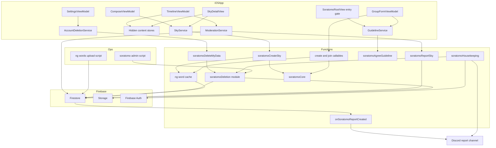
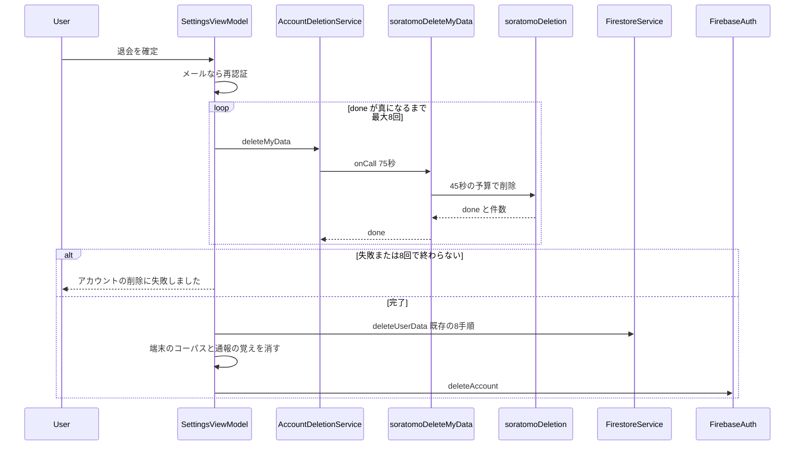
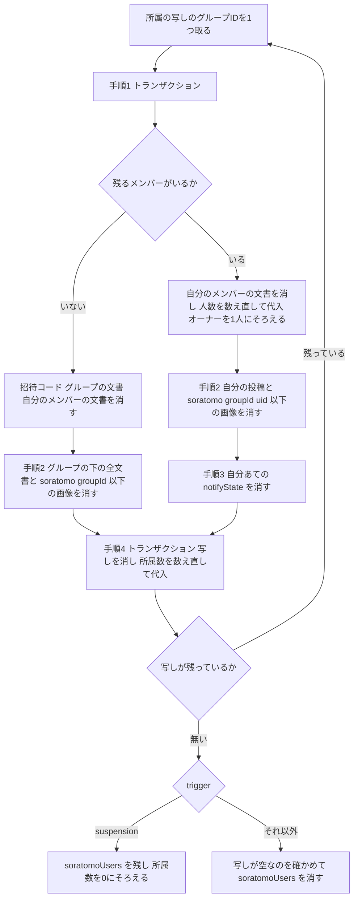
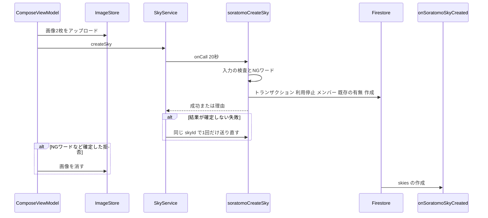
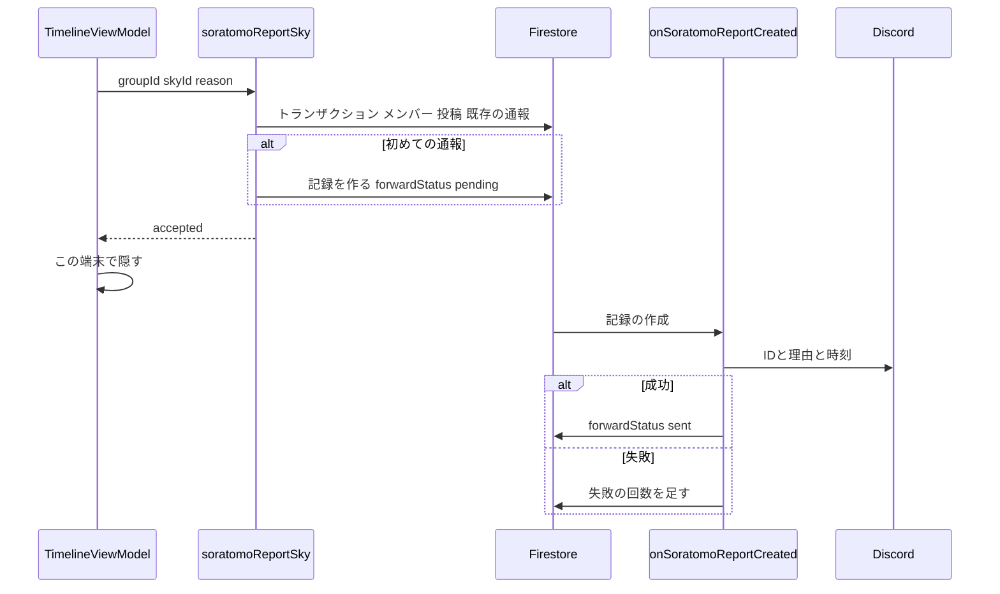
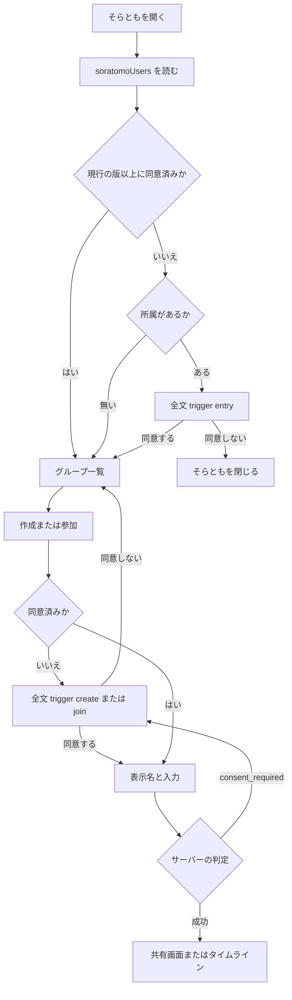
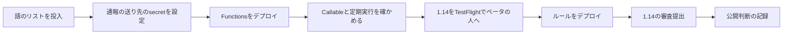

# Design Document（そらとも公開前ゲートG1・G2）

## Overview

**Purpose**: そらともを1.14で登録済みの利用者全員へ公開する前提として、App Store審査ガイドラインの5.1.1(v)（アカウントの削除）と1.2（ユーザー生成コンテンツ）を満たす。退会でそらとものデータを消し（G1）、通報・ブロック・ガイドラインへの同意・NGワードを加える（G2）。

**Users**: メンバーは、通報・ブロック・同意を画面で使う。退会する利用者は、既存の退会の操作1回で、そらとものデータまで消える。開発者は、Discordで通報を受け取り、管理スクリプトで確認・削除・利用停止・掃除をする。

**Impact**: Cloud Functionsに、Callable 4本・Firestoreトリガー1本・定期実行1本と、共通の削除のモジュールを加える。既存の作成と参加のCallableに、利用停止・同意・NGワードの検査を足す。ルールは、投稿（`skies`）の作成を閉じ、新しいコレクション2つを拒否で足す（締めるだけ）。iOSは、退会・投稿・タイムライン・投稿詳細・作成と参加の画面を変える。既存の退会の8手順・ルートの通報とブロック・フィードバックの転送は変えない。

### Goals
- 要件1〜15のすべての受け入れ条件を満たす。破られては困る規則（退会の削除・通報の検証・NGワード・同意・利用停止）は、サーバーで強制する。
- 退会の削除を冪等にし、途中で止まっても続きから消し切れるようにする。
- 本書で定めたサーバー側の規則を、許可と拒否の両方で自動テストする（13.9）。

### Non-Goals
- G3〜G5。既存の退会がルートの投稿などのStorageの画像を消さない問題（決定事項3）。ルートの投稿の画面の既存の不具合（決定事項8）。ルートの投稿の通報の転送（決定事項18）。
- ブロックの解除の画面。グループ単位と双方向のブロック。グループとメンバーの通報。通報の自由記述。通報者への結果の知らせ。
- 表示名のNGワードの検査。既存のグループ名とキャプションへの遡った検査。画像の自動判定（決定事項10・17）。
- ほかのメンバーの端末のキャッシュ・配信済みの通知・スクリーンショットの削除（決定事項2）。
- 既存の利用規約の改訂（決定事項20）。Android版の画面。
- `.kiro/specs/soratomo/`の書き換え。差分は「soratomo specとの関係」の節に書き、親セッションが反映する。

## 設計の前提（採用済みの方針と採用理由）

| # | 方針 | 採用理由 | 本書の節 |
|---|------|----------|----------|
| 1 | 投稿の作成をCallable`soratomoCreateSky`へ移し、ルールの`skies`の`create`を`false`にする | ルールでは語のリストの正規化（全角半角・かなカナ）ができず、拒否の理由をアプリへ返せない（11.6・11.7）。保存の後でトリガーが消す案は、一瞬見えて理由も返せないので採らない（決定事項10） | soratomoCreateSky |
| 2 | 退会の削除は、本人用のCallable`soratomoDeleteMyData`。クレームを検査しない | フラグを取り消された人と、一度もONになっていない人のデータも消す（1.4）。アプリはAuthを消す前に呼び、完了を確かめられる（3.1） | soratomoDeleteMyData |
| 3 | 削除は1本の共通モジュール`soratomoDeletion.js`。呼び手は4つ | 本人・定期掃除・管理スクリプト・利用停止で、同じ規則（要件1・2）を1か所で守る | soratomoDeletion |
| 4 | Authの削除の後始末は定期実行（6時間ごと） | 2nd genにはAuthの削除のトリガーが無い。走査なら、経路と時期に関わらず拾える（research.md） | soratomoHousekeeping |
| 5 | 通報は新しいコレクション`soratomoReports`とCallable。転送は別のsecretのDiscordへ | 既存の`reports`とルートの通報を変えない（13.2・13.3）。内容はIDだけ（7.2） | 通報 |
| 6 | 同意はCallableで、`soratomoUsers/{uid}`に版とサーバーの時刻を残す | 本人だけが読める（10.14）。作成と参加のトランザクションが同じ文書を読む | 同意 |
| 7 | 語のリストはFirestoreの文書（ルールで拒否）に置き、関数のメモリにキャッシュする | 公開リポジトリとアプリに置かない（11.10）。新しい版を出さずに変えられる（11.11） | NGワード |
| 8 | ブロックと通報で隠すのは、アプリの同じフィルタ | 「見せない集合」を1つにし、全部隠れたページでも続きを読む規則を1か所で守る（9.7） | 隠す集合 |

## Requirements Traceability

| Requirement | Summary | Components | Interfaces | Flows |
|-------------|---------|------------|------------|-------|
| 1.1, 1.2, 1.5 | 退会者の投稿と画像だけを、全グループから消す | soratomoDeletion | `deleteSoratomoUserData`（手順②） | 退会・共通の削除の手順 |
| 1.3 | 取り残しの画像も消す | soratomoDeletion・SoratomoStorageGateway | `soratomo/{groupId}/{uid}/`の接頭辞の削除 | 共通の削除の手順 |
| 1.4 | フラグに関わらず消す | soratomoDeleteMyData・soratomoHousekeeping・管理スクリプト | `soratomoCallable`の`requireFlag: false` | 退会 |
| 1.6 | タイムラインから自動で消える | SoratomoTimelineViewModel（既存のリスナー） | `observeTimeline` | — |
| 1.7 | 詳細で「表示できなくなった」と伝える | SoratomoSkyDetailView・SoratomoSkyService | `observeSky` | — |
| 2.1, 2.2, 2.11 | メンバーから外し、人数と所属数を数え直す | soratomoDeletion（手順①④） | `planMembershipRemoval` | 共通の削除の手順 |
| 2.3 | 利用者ごとの記録を消す | soratomoDeletion（最後の手順） | — | 共通の削除の手順 |
| 2.4 | 通知の間引きの状態を消す | soratomoDeletion（手順③） | — | 共通の削除の手順 |
| 2.5, 2.6, 2.7 | オーナーの引き継ぎ・1人にそろえる・コードを変えない | soratomoCore・soratomoDeletion（手順①） | `pickNextOwner`・`planMembershipRemoval` | 共通の削除の手順 |
| 2.8 | 引き継いだ人に再発行の操作を出す | SoratomoInviteViewModel（変更なし・`:108`） | `observeGroup` | — |
| 2.9, 2.10 | 最後の1人ならグループごと消す・コードは「見つかりません」 | soratomoDeletion（手順①②）・joinGroupTx（変更なし・`:187`・`:195`） | — | 共通の削除の手順 |
| 2.12 | 一覧に退会者を含めない | SoratomoGroupListView（戻ると読み直す・`:88-91`）・SoratomoMembersView（開くたびに読む） | `fetchMyGroups`・`fetchMembers` | — |
| 3.1, 3.2 | 消し終えてからAuthを消す・失敗の表示 | SettingsViewModel・SoratomoAccountDeletionService | `deleteMyData` | 退会 |
| 3.3, 3.4 | 続きから消す・冪等 | soratomoDeletion | 数え直して代入・写しを最後に消す | 共通の削除の手順 |
| 3.5 | 本人・要件4・要件8に限る | soratomoDeleteMyData（uidは`request.auth`から）・ルール（クライアントの書き込みは拒否のまま） | — | 退会 |
| 3.6 | 処理中の表示・重ねない | SettingsViewModel（再入の防止）・SettingsView（既存のオーバーレイ） | `isDeletingAccount` | 退会 |
| 3.7 | 確認の文言 | SettingsView | `soratomoGate.isEnabled` | — |
| 3.8 | 使っていない人も完了する | soratomoDeletion（空振りで`done: true`） | — | 退会 |
| 3.9 | 端末のキャッシュを消す | ContentView（既存の後片付け）・SoratomoReportedSkies | `erase(uid:)` | 退会 |
| 4.1 | 24時間以内の後始末 | soratomoHousekeeping | `listDocuments`・`getUsers` | — |
| 4.2, 4.3 | 指定して消す・一覧で見つける | `scripts/soratomo-admin.js` | `delete-user`・`find-orphans` | — |
| 5.1, 5.2, 5.3 | 通報の入口・自分の投稿は削除だけ・5つの理由 | SoratomoTimelineView・SoratomoSkyDetailView | `SoratomoModerationMenu` | 通報と転送 |
| 5.4, 5.6, 5.8 | 送信・失敗・二重の防止 | SoratomoTimelineViewModel・SoratomoModerationService | `report(_:reason:source:)` | 通報と転送 |
| 5.5 | 端末で直ちに隠す・再起動後も | SoratomoReportedSkies・SoratomoHiddenContent | `add(_:uid:)` | — |
| 5.7 | 削除済みの投稿 | SoratomoTimelineViewModel | `sky_not_found`→`.skyGone` | 通報と転送 |
| 5.9, 9.10 | 相手とほかのメンバーに知らせない | soratomoReportSky（通知を送らない）・ブロックは本人の文書だけを書く | — | — |
| 6.1〜6.9 | 受け付けの条件と記録の中身 | soratomoReportSky・`reportSkyTx` | API Contract | 通報と転送 |
| 6.10 | 利用者に読ませない・書かせない | ルール`soratomoReports` | — | — |
| 6.11 | 退会で消さない | トップレベルのコレクション（削除の対象外） | — | — |
| 7.1, 7.2, 7.3, 7.6 | 別のDiscordへ、IDだけを1分以内に | onSoratomoReportCreated・`DISCORD_REPORT_WEBHOOK_URL` | `buildReportForwardPayload` | 通報と転送 |
| 7.4, 7.5 | 失敗のログ・後で見つける | onSoratomoReportCreated・soratomoHousekeeping・`list-unforwarded` | `forwardStatus` | 通報と転送 |
| 8.1, 8.3 | 確かめる・結果を記録する | `scripts/soratomo-admin.js` | `show-report`・`review-report` | — |
| 8.2, 8.4 | 投稿の削除と利用停止 | `scripts/soratomo-admin.js` | `review-report --result violation`・`delete-sky` | — |
| 8.5 | 停止で投稿と所属を消す | soratomoDeletion | `trigger: "suspension"` | 共通の削除の手順 |
| 8.6 | 作成・参加・投稿を受け付けない | createGroupTx・joinGroupTx・createSkyTx | `suspended` | — |
| 8.7 | アプリの表示 | SoratomoGroupFormViewModel | `SoratomoError.suspended` | — |
| 8.8 | 解除 | `scripts/soratomo-admin.js` | `unsuspend` | — |
| 8.9 | 開発者だけが行う | ルール（`soratomoUsers`の書き込みは拒否のまま）・Callableを置かない | — | — |
| 8.10 | そらともだけに効く | 検査はそらとものCallableだけ | — | — |
| 9.1, 9.2, 9.5 | 入口・確認・詳細を閉じる | SoratomoTimelineView・SoratomoSkyDetailView | `SoratomoModerationMenu` | — |
| 9.3, 9.9 | 一覧に加える・失敗の表示 | SoratomoModerationService | `block(uid:authorId:)` | — |
| 9.4, 9.6 | 直ちに隠す・ずっと出さない | SoratomoBlockedAuthors・SoratomoHiddenContent・SoratomoTimelineViewModel・SoratomoSkyDetailView | `hides(_:)` | — |
| 9.7 | 全部隠れても読み続ける | SoratomoTimelineViewModel | 自動の続き読み | — |
| 9.8 | ルートの一覧でも隠す | `.userBlocked`（既存の購読） | — | — |
| 9.11 | 通知を送らない | soratomoCore（変更なし） | `classifyRecipient` | — |
| 10.1, 10.3, 10.4, 10.6, 10.7, 10.8 | 作成・参加の前の全文と同意 | SoratomoGroupFormViewModel・SoratomoGuidelineView・SoratomoGuidelineService | `Step.guideline` | 同意の判定 |
| 10.2, 10.5 | 入口での全文 | SoratomoRootView | `SoratomoEntryGate` | 同意の判定 |
| 10.9, 10.10, 10.14 | 古い版を認めない・同意の無い作成と参加を拒否・本人だけ | soratomoAgreeGuideline・createGroupTx・joinGroupTx・ルール（本人だけが読む・既存） | `consent_required` | 同意の判定 |
| 10.11 | 拒否されたら全文を出す | SoratomoGroupFormViewModel | `.consentRequired`→`Step.guideline` | 同意の判定 |
| 10.12 | 一覧から全文を開く | SoratomoGroupListView | 読むだけの表示 | — |
| 10.13 | 4つを明記する | SoratomoGuideline（本文） | — | — |
| 11.1〜11.5 | サーバーで検査し、保存も通知もしない | soratomoCore・soratomoNgWords・createGroupTx・createSkyTx・ルール（`skies`の`create`は`false`） | `containsNgWord` | 投稿の作成 |
| 11.6, 11.7, 11.9 | 表示と入力の保持・語を示さない | SoratomoGroupFormViewModel・SoratomoComposeViewModel | `SoratomoError.ngWord` | 投稿の作成 |
| 11.8 | 画像を消す | SoratomoComposeViewModel | `imageStore.delete` | 投稿の作成 |
| 11.10, 11.11 | 置き場と変更 | `soratomoConfig/ngWords`・`scripts/soratomo-ngwords.js` | — | — |
| 12.1 | お問い合わせを保つ | SettingsView（変更なし・`:501-508`・`openMailApp`は`:607`） | — | — |
| 12.2 | サポートURLを確かめた記録 | 公開判断の記録（soratomo spec 17.2と同じ記録） | — | Migration |
| 13.1 | 8手順を変えない | SettingsViewModel（前に1手順を足すだけ） | — | 退会 |
| 13.2, 13.3, 13.4, 13.5 | 既存の通報・ブロック・転送 | 変更なし（`reportPost`・`reports`のルール・`blockUser`・`notifyFeedbackToDiscord`） | — | — |
| 13.6, 13.8 | 締めるだけ・削除は本人のまま | ルール | — | — |
| 13.7 | 規約と同意の文 | 変更なし（`SignUpView`・`TermsOfServiceView`） | — | — |
| 13.9 | 許可と拒否の自動テスト | Testing Strategy | — | — |
| 14.1 | アプリのログ | SoratomoError.record（`StaticString`）・SoratomoAnalytics（列挙だけ） | — | — |
| 14.2, 14.3, 14.4 | サーバーのログ・転送・件数 | soratomo.js・soratomoDeletion | ログの形（Monitoring） | — |
| 15.1, 15.2, 15.3 | イベント・理由・画面名 | SoratomoAnalytics | `SoratomoEvent` | — |

### 決定事項の反映先

| # | 決定 | 反映先の節 |
|---|------|------------|
| 1 | 参加の最も古い人へ引き継ぐ・最後の1人で削除 | System Flows「共通の削除の手順」・soratomoDeletion |
| 2 | 共有した投稿も消す | soratomoDeletion・Non-Goals |
| 3 | ルートの画像は別のissue | Non-Goals |
| 4 | 別のDiscord・IDだけ | onSoratomoReportCreated |
| 5 | 24時間・削除と利用停止の手段 | 運用: 管理スクリプト |
| 6 | 通報した端末で隠す | 隠す集合（SoratomoReportedSkies） |
| 7 | タイムラインでもブロックを効かせる | soratomo specとの関係・隠す集合 |
| 8 | ルートの画面の不具合は別のissue | iOS: タイムラインと投稿詳細（同じ不具合を作らない） |
| 9 | 作成と参加の前の同意 | iOS: 同意・soratomoAgreeGuideline |
| 10 | NGワード | soratomoCreateSky・NGワード |
| 11 | 連絡先は既存で満たす | Requirements Traceability（12.1・12.2） |
| 12 | Authを消す前に消し終える | System Flows「退会」 |
| 13 | 利用停止の中身 | soratomoDeletion（`suspension`）・運用: 管理スクリプト |
| 14 | 既存のメンバーは入口で同意・投稿は拒否しない | iOS: 同意（`SoratomoEntryGate`）・soratomoCreateSky |
| 15 | 通報の対象と理由・1人1回 | soratomoReportSky |
| 16 | 通報の記録は退会で消さない | Data Models（`soratomoReports`） |
| 17 | 語のリストはサーバーだけ・遡らない | NGワード・Non-Goals |
| 18 | ルートの通報の転送は別のissue | Non-Goals |
| 19 | 計測 | iOS: エラーと計測 |
| 20 | ガイドラインはアプリの中 | iOS: 同意（`SoratomoGuideline`） |

## soratomo specとの関係

### 決定事項6の上書き（タイムラインでブロックを効かせる）
- soratomo specの決定事項6は「ブロックをタイムラインの表示には効かせない」と定めた。本specの要件9（決定事項7）が、これを上書きする。ブロックした相手の投稿は、そらとものタイムライン（新着の反映と続きの読み込みを含む）と投稿詳細に出さない（9.4・9.6）。
- 新着通知の宛先の除外は変えない。soratomo specの要件9.15と、soratomo design.mdの宛先の分類の順序（`:851`）と集計ログの`blocked`（`:873`）は、そのまま使う（9.11）。
- 本specはsoratomo specのファイルを書き換えない。親セッションが、決定事項6の行に「soratomo-release-gateの決定事項7で上書き」と書き足す。

### soratomo specの設計への差分（親セッションが反映する）

| soratomo design.mdの箇所 | 変わること |
|---------------------------|------------|
| Physical Data Modelの`skies`の書き手 | 作成はFunctions（`soratomoCreateSky`）。削除はアプリのまま |
| `skies`の`create`のルール | 項目・投稿者・作成日時（`request.time`）の検査をやめて`false`にする。同じ検査は`soratomoCore.validateSkyInput`と、Admin SDKの`serverTimestamp()`で行う |
| `soratomoUsers`の項目 | `guidelineVersion`・`guidelineAgreedAt`・`suspendedAt`を足す |
| API Contractの作成と参加 | 理由に`suspended`・`consent_required`・`ng_word`（作成だけ）を足す |
| 要件13.9・13.10（退会処理を変えない） | 本specの要件3で置き換わる |
| Security Considerationsの「既知の受け入れ」の取り残しの画像 | 退会と利用停止では、その人の分を消す（1.3） |

## Architecture

### Existing Architecture Analysis
- **Functions**: JavaScript・Node 22・`asia-northeast1`。そらともは`soratomoCore.js`（純関数）・`soratomoStore.js`（Adminのトランザクション）・`soratomo.js`（配線）の3層。Callableは共通の包み`soratomoCallable`（`soratomo.js:82-104`）が、クレームの確認→本体→ログ→`HttpsError`への写しを行う。トランザクションは「読みを全部終えてから書く」。`SoratomoDomainError`にgRPCのcodeを持たせない。
- **テスト**: 純関数は`node --test`。トランザクションと配線は、Firestoreのエミュレーターに対して直接呼ぶ。Auth・送信・ログは`Module._load`で偽物にする（`soratomo.test.js:65-71`）。
- **iOS**: `@MainActor`の`ObservableObject`とプロトコルの注入。Callableは`SoratomoGroupService.call`（20秒）と`mapCallableError`（`details["reason"]`だけで種類を決める）。失敗の文言は`SoratomoError.userMessage`、記録は`SoratomoError.record`（`StaticString`）。
- **守る統合点**: `deleteUserData`の8手順・`FirestoreService.blockUser`・`reportPost`と`reports`のルール・`notifyFeedbackToDiscord`・`.userBlocked`の購読・`onSoratomoSkyCreated`の通知の分類。

### Architecture Pattern & Boundary Map



**Architecture Integration**:
- Selected pattern: 既存の3層（純関数・トランザクション・配線）に、削除のモジュールを1つ足す。権限の強い書き込み（投稿の作成・通報・同意・退会の削除）はCallable。メンバーの日常の読み取りと、投稿者本人の削除はルールのまま。
- Domain/feature boundaries: 削除の規則は`soratomoDeletion.js`だけが持ち、4つの呼び手は引数（`trigger`）だけを変える。語のリストを読むのは`soratomoNgWords.js`だけ。iOSの「隠す集合」は2つの記録（ブロック・通報）を1つの判定（`SoratomoHiddenContent.hides`）にまとめる。
- Existing patterns preserved: `soratomoCallable`の包み・`SoratomoDomainError`・エミュレーターのテスト・`Module._load`の偽物・`SoratomoError`の写し・`StaticString`の記録・`.userBlocked`。
- New components rationale: 各節の「選定の理由」に書く。
- Steering compliance: `.kiro/steering/`は無い。`CLAUDE.md`・`docs/tech-spec.md`（日本語コメント、`compactMap { try? }`の禁止）・`docs/pre-release-checklist.md`（実データでハッピーパス）に従う。

### Technology Stack

| Layer | Choice / Version | Role in Feature | Notes |
|-------|------------------|-----------------|-------|
| Frontend | SwiftUI・iOS 16・FirebaseFunctions（既存） | 退会・同意・通報・投稿のCallable | 退会のCallableだけ制限時間75秒 |
| Frontend | FirebaseFirestore（既存） | ブロックの書き込み・投稿1件の監視・同意の読み取り | ブロックは書き込みだけのトランザクション |
| Backend | Cloud Functions 2nd gen・firebase-functions ^7.4.0・firebase-admin ^14.5.0（既存） | Callable 4本・トリガー1本・`onSchedule` 1本 | 新しい依存は無い |
| Backend | `firebase-admin/storage`（既存の依存の中） | 画像の一括削除 | このリポジトリのFunctionsで初めて使う |
| Data | Firestore `(default)` | `soratomoReports`・`soratomoConfig`・`soratomoUsers`の項目 | 複合インデックスは足さない |
| Messaging | Discord Webhook（新しいsecret `DISCORD_REPORT_WEBHOOK_URL`） | 通報の転送 | 既存の`DISCORD_WEBHOOK_URL`とは別 |
| Infrastructure | Cloud Scheduler（`onSchedule`） | 6時間ごとの後始末と再送 | 既存の`pollSkyMotionJobs`と同じ仕組み |
| Test | node:test・Firestoreと**Storage**のエミュレーター・Rules test API・XCTest | 許可と拒否の両方 | `test:emulator`を`--only firestore,storage`にする |

## System Flows

### 退会



- 新しい手順は、既存の8手順の前に置く（決定事項12・13.1）。理由は、`deleteUserData`の「人から見えなくなるものを先に」の方針（`FirestoreService.swift:860-866`）。共有された投稿は、ほかのメンバーから見えている。もう1つの理由は、関数の呼び出しが既存の手順より失敗しやすいこと。前に置けば、失敗しても既存のデータは手つかずのまま残る。
- 2つの入口（匿名`SettingsViewModel.swift:242-251`・メール`:274-287`）の両方に入れる。メールは再認証の後に呼ぶ。
- そらともを使っていない人（匿名を含む）にも呼ぶ。アプリは「データがあるか」を知れない（クレームが無いと`soratomoUsers`を読めない）ため。サーバーは空振りで`done: true`を返す（3.8）。

### 共通の削除の手順（グループ1つ分）



- **手順1を先にする理由**: メンバーの文書が消えると、ルール（`isSoratomoMember`）でStorageへのアップロードが止まり、`soratomoCreateSky`のメンバーの確認で投稿も止まる。以後の新しい投稿は増えない。手順1と投稿の作成はどちらも同じメンバーの文書をトランザクションで読むので、直列になる。投稿が先にコミットされれば手順2のクエリがそれを拾い、手順1が先なら投稿は`not_member`で拒否される。
- **人数の正しさ（2.11）**: 手順1と参加（`joinGroupTx`）は、どちらもグループの文書を読んで書く。Admin SDKは読んだ文書にロックを置くので、2つは直列になる（research.md）。手順1はメンバーのクエリで数え直して代入するので、過去のずれも直る。所属数も同じ形で、手順4と参加・作成は`soratomoUsers/{uid}`を読んで書く。クエリの範囲のロックには頼らない。
- **写しを最後に消す理由**: 写しは「利用者→グループ」の唯一の経路（`firestore.rules:564`）。手順2〜3の途中で止まっても、写しが残っていれば、再実行がそのグループから続ける（3.3）。手順1は、メンバーの文書が無ければ人数とオーナーを整えるだけで、何度でも同じ結果になる（3.4）。
- **グループごと消す順（2.9・2.10）**: 手順1のトランザクションで、招待コードの文書（このグループを指しているときだけ）・グループの文書・自分のメンバーの文書を一緒に消す。同時の参加は、コードかグループの文書が無いので`not_found`になる（`soratomoStore.js:187`・`:195`）。子（投稿・通知の間引き・残りのメンバーの文書）と画像は手順2で消す。`recursiveDelete`は親が無くても子を消せる前提で使う（要確認1）。グループの文書が無いのに写しが残っている再実行では、ほかのメンバーの文書が無いことを確かめてから、手順2の「グループごと」を行う。
- **最後の確認**: 全部の写しを処理した後、`soratomoUsers/{uid}`と写しの一覧（1件）をトランザクションで読む。途中で参加が入って写しが増えていれば、続けて処理する。空なら親の文書を消す（2.3）。親の文書は参加と作成も書くので、ここでも直列になる。
- **残る隙間**: 手順1より前に始まった画像のアップロードが、手順2の一覧の後で終わると、画像が1組残りうる。上げた側のアプリは、投稿の作成が`not_member`で拒否された後に画像を消す（削除のルールはメンバーであることを求めない）。消せなくても、その画像の場所を指す投稿の文書は無く、どの画面にも出ない。退会では`soratomoUsers`が消えるので、定期実行は拾わない。管理スクリプトの`find-orphans --deep`がStorageの接頭辞から見つける。投稿の文書が残る隙間は無い（上の手順1の理由）。

### 投稿の作成



- 同じ投稿IDの送り直しは、サーバーが「同じ投稿者の既存の投稿」を成功として返す。元の呼び出しと送り直しは同じ文書をトランザクションで読むので、結果は1件になる。今の`skyExistsOnServer`での確かめは、投稿の保存では使わない。関数の実行中に「無い」と読み、画像を消した後で投稿だけが作られうるため（research.md）。
- NGワードで拒否された投稿は文書ができないので、`onSoratomoSkyCreated`は発火せず、通知も送られない（11.4）。

### 通報と転送



- 重複の通報は記録を作らないので、トリガーも動かない（6.7）。通報者への応答は同じ`{ accepted: true }`。
- 転送に失敗した記録は`pending`のまま残り、定期実行が10分以上たったものを送り直す（7.4・7.5）。

### 同意の判定



- 入口の判定は根の画面（`SoratomoRootView`）で行う。通知のタップは一覧を経ずにタイムラインを開くため（`SoratomoRootView.swift:19`）。
- `soratomoUsers`を読めなかったときは、入口では全文を出さずに進める。作成と参加はサーバーが拒否する（10.10）ので、規則は破られない。

## Components and Interfaces

| Component | Domain/Layer | Intent | Req Coverage | Key Dependencies (P0/P1) | Contracts |
|-----------|--------------|--------|--------------|--------------------------|-----------|
| soratomoDeletion | Functions | 共通の削除（4つの呼び手） | 1.1〜1.5, 2.1〜2.7, 2.9, 2.11, 3.3, 3.4, 3.8, 8.5, 14.4 | Firestore (P0), StorageGateway (P0) | Service, Batch |
| soratomoDeleteMyData | Functions | 本人の退会の削除 | 1.4, 3.1, 3.5, 3.8 | soratomoDeletion (P0) | API |
| soratomoHousekeeping | Functions | Authの無い人の後始末・転送の再送 | 4.1, 7.5 | soratomoDeletion (P0), Auth (P0), Discord (P1) | Batch |
| soratomoCreateSky | Functions | 投稿の作成 | 8.6, 11.1〜11.5 | soratomoNgWords (P0) | API |
| 作成と参加のCallable（変更） | Functions | 利用停止・同意・NGワードの検査 | 8.6, 10.9, 10.10, 11.1, 11.3, 11.5 | soratomoNgWords (P0) | API |
| soratomoReportSky | Functions | 通報の受け付けと記録 | 5.9, 6.1〜6.9 | Firestore (P0) | API |
| onSoratomoReportCreated | Functions | 通報の転送 | 7.1〜7.4, 7.6 | Discord (P0) | Event |
| soratomoAgreeGuideline | Functions | 同意の記録 | 10.6, 10.9, 10.14 | Firestore (P0) | API |
| soratomoNgWords | Functions | 語のリストの読み込みとキャッシュ | 11.2, 11.10, 11.11 | Firestore (P0) | Service |
| soratomoCore（追加） | Functions | 正規化・入力の検査・オーナーの決定・転送の内容 | 2.5, 2.6, 6.6, 7.2, 11.2 | — | Service |
| ルール（変更） | Rules | 作成を閉じる・新しいコレクションを拒否 | 6.10, 11.5, 11.10, 13.6, 13.8 | — | API |
| `scripts/soratomo-admin.js` | 運用 | 確認・削除・停止・一覧 | 4.2, 4.3, 7.5, 8.1〜8.5, 8.8 | soratomoDeletion (P0) | Batch |
| `scripts/soratomo-ngwords.js` | 運用 | 語のリストの投入 | 11.10, 11.11 | Firestore (P0) | Batch |
| SoratomoAccountDeletionService | iOS | 退会のCallableを終わるまで呼ぶ | 3.1, 3.2 | FirebaseFunctions (P0) | Service |
| SettingsViewModel・SettingsView（変更） | iOS | 退会への組み込み・確認の文言 | 3.1, 3.2, 3.6, 3.7, 3.9, 13.1 | AccountDeletionService (P0) | State |
| SoratomoSkyService（変更） | iOS | 作成のCallable・投稿1件の監視 | 1.7, 11.7 | FirebaseFunctions (P0), Firestore (P0) | Service |
| SoratomoModerationService | iOS | 通報・ブロック・ブロックの一覧 | 5.4, 5.6, 9.3, 9.9 | FirebaseFunctions (P0), Firestore (P0) | Service |
| 隠す集合（3つの型） | iOS | ブロックと通報で隠す | 5.5, 9.4, 9.6, 9.8 | ModerationService (P1) | State |
| SoratomoTimelineViewModel・View（変更） | iOS | 入口・隠す・続き読み | 1.6, 5.1〜5.8, 9.1〜9.7 | 隠す集合 (P0) | State |
| SoratomoSkyDetailView（変更） | iOS | 入口・隠す・削除の検知 | 1.7, 5.1, 5.5, 9.1, 9.5, 9.6 | SkyService (P0) | State |
| 同意の部品（変更と追加） | iOS | 全文・入口・作成と参加の前 | 10.1〜10.8, 10.11〜10.13, 15.3 | GuidelineService (P0) | Service, State |
| SoratomoError・SoratomoAnalytics（変更） | iOS | 新しい理由・文言・計測 | 8.7, 11.6, 11.7, 11.9, 14.1, 15.1, 15.2 | LoggingService (P0) | Service |

### Backend: Cloud Functions

ファイルの構成は次のとおり。`index.js`の`Object.assign(exports, require("./soratomo"))`はそのまま使い、`soratomo.js`の`module.exports`に新しい6本を足す（計10本）。`package.json`の`lint`・`test`・`test:emulator`に新しいファイルを足し、`test:emulator`は`--only firestore,storage`にする。

| File | Responsibility |
|------|----------------|
| `functions/soratomoCore.js`（追加） | 正規化と語の照合・投稿の入力の検査・通報の理由・オーナーの決定・転送の内容 |
| `functions/soratomoStore.js`（変更） | `createGroupTx`・`joinGroupTx`に方針（`policy`）を足す。`createSkyTx`・`reportSkyTx`・`agreeGuidelineTx`を足す |
| `functions/soratomoDeletion.js`（新規） | 共通の削除・利用停止・解除・投稿1件の削除 |
| `functions/soratomoStorage.js`（新規） | Storageの接頭辞の一覧と1件の削除（差し替えられるゲートウェイ） |
| `functions/soratomoNgWords.js`（新規） | 語のリストの読み込みとキャッシュ |
| `functions/soratomo.js`（変更） | 新しい6本の配線・理由と`code`の対応・`soratomoCallable`の選択肢 |

#### soratomoDeletion（共通の削除）

| Field | Detail |
|-------|--------|
| Intent | 1人のそらとものデータを、要件1・2の規則で、冪等に消す |
| Requirements | 1.1〜1.5, 2.1〜2.7, 2.9, 2.11, 3.3, 3.4, 3.8, 8.5, 14.4 |

**Responsibilities & Constraints**
- 呼び手は4つ: `soratomoDeleteMyData`（`self`）・`soratomoHousekeeping`（`account_deleted`）・`soratomo-admin.js delete-user`（`admin`）・`soratomo-admin.js suspend`（`suspension`）。どの呼び手も同じ手順を通り、`suspension`だけが最後の手順を変える（8.5）。
- グループの一覧は`soratomoUsers/{uid}/groups`の写し（文書の無い親でも子を読める）と、管理スクリプトが渡す`extraGroupIds`の和。
- 手順はSystem Flows「共通の削除の手順」のとおり。手順1と手順4はトランザクション。読みを全部終えてから書く（既存の決まり）。
- 手順1のトランザクションで読むもの: グループの文書・メンバーの全文書（最大20件のクエリ）・招待コードの文書。書く数は最大で、グループ1・メンバーの削除1・役割の更新19・招待コード1。500件の上限から遠い。
- 手順2の投稿は、`authorId == uid`のクエリで300件ずつ読み、`BulkWriter`で消す（`authorId`の単一項目のインデックスで足りる）。グループごと消すときは`recursiveDelete(groupRef)`。
- 手順2の画像は、ゲートウェイで接頭辞を一覧し、同時に10件まで消す。無かったもの（404）は消した数に数えない。
- 予算: 各グループの前、投稿300件ごと、画像100件ごとに締め切り（`deadlineMs`）を確かめ、過ぎていれば`done: false`で返す。写しが残るので、次の呼び出しが続ける。
- グループの`lastActivityAt`は戻さない（要件2の補足）。通報の記録（`soratomoReports`）には触れない（6.11）。

**Dependencies**
- Inbound: soratomoDeleteMyData・soratomoHousekeeping・管理スクリプト — 削除の要求（P0）
- Outbound: soratomoCore — `planMembershipRemoval`（P0）
- External: Firestore（Admin）・Storage（ゲートウェイ）（P0）

**Contracts**: Service・Batch

##### Service Interface
```js
/**
 * @typedef {"self"|"account_deleted"|"admin"|"suspension"} DeletionTrigger
 * @typedef {{
 *   listFiles(prefix: string): AsyncIterable<string>,
 *   deleteFile(path: string): Promise<"deleted"|"absent">
 * }} SoratomoStorageGateway
 * @typedef {{ db: FirebaseFirestore.Firestore, storage: SoratomoStorageGateway, nowMs: () => number }} DeletionDeps
 * @typedef {{ uid: string, trigger: DeletionTrigger, deadlineMs: number, extraGroupIds?: string[] }} DeletionRequest
 * @typedef {{ done: boolean, skiesDeleted: number, imagesDeleted: number,
 *   groupsLeft: number, ownersTransferred: number, groupsDeleted: number }} DeletionResult
 */
/** @returns {Promise<DeletionResult>} */ async function deleteSoratomoUserData(deps, request) {}
/** suspendedAt を先に書いてから、trigger "suspension" で消す */
/** @returns {Promise<DeletionResult>} */ async function suspendSoratomoUser(deps, { uid, deadlineMs }) {}
/** suspendedAt を消す。消した投稿と所属は戻さない（8.8） */
/** @returns {Promise<void>} */ async function unsuspendSoratomoUser(db, { uid }) {}
/** 投稿1件の文書と画像2枚を消す（8.4） */
/** @returns {Promise<{ skyDeleted: boolean, imagesDeleted: number }>} */
async function deleteSoratomoSky(deps, { groupId, skyId }) {}
```
- Preconditions: `uid`は文書IDとして使える文字列。呼び手が本人・Authの無い人・開発者の指定のいずれかであることは、呼び手が保証する（3.5）。
- Postconditions（`done: true`）: 元の各グループで、`uid`のメンバーの文書・`authorId == uid`の投稿・`soratomo/{groupId}/{uid}/`以下の画像・`notifyState/{uid}`が無い。`uid`が最後のメンバーだったグループは、文書・子・招待コード・`soratomo/{groupId}/`以下の画像が無い。`suspension`以外では`soratomoUsers/{uid}`と写しが無い。`suspension`では`soratomoUsers/{uid}`が`suspendedAt`と`groupCount: 0`を持って残る。
- Invariants: 各トランザクションの後で、`memberCount`はメンバーの件数と等しく20以下。`groupCount`は写しの件数と等しく10以下。残ったグループのオーナーはちょうど1人（`ownerId`とメンバーの`role`が一致）。
- 件数の定義（14.4）: `groupsLeft`はこの実行でメンバーの文書を消したグループの数。`ownersTransferred`と`groupsDeleted`はその内訳。`imagesDeleted`は実際に消したファイルの数。

**Implementation Notes**
- Integration: `soratomoStorage.js`の本物のゲートウェイは`getStorage().bucket()`の`getFiles({ prefix, autoPaginate: false })`と`file.delete()`を包む。テストでは偽物に差し替えて、途中の失敗を作る。
- Validation: 冪等性は「同じ要求を2回流して、2回目の状態と件数が0であること」で確かめる。
- Risks: 写しの無い孤児のグループ（文書か子だけが残ったもの）は、この関数では見つからない。管理スクリプトの`find-orphans --deep`が見つけ、`extraGroupIds`で渡す。

#### soratomoDeleteMyData

| Field | Detail |
|-------|--------|
| Intent | 本人の要求で、本人のそらとものデータを消す |
| Requirements | 1.4, 3.1, 3.5, 3.8 |

**Responsibilities & Constraints**
- `soratomoCallable`に選択肢`{ requireFlag: false }`を足して使う。クレームを検査しない理由（1.4）を、選択肢の定義と`soratomoDeleteMyData`の両方にコメントで残す。ログイン（匿名を含む）は求める。
- 消す相手は`request.auth.uid`だけ。要求の本文にuidを受け取らない（3.5）。
- 1回の予算は45秒。関数の`timeoutSeconds`は120秒、`memory`は512MiB。

**Contracts**: API（API Contractの表）

#### soratomoHousekeeping

| Field | Detail |
|-------|--------|
| Intent | Authの無い人の残りを消し、転送に失敗した通報を送り直す |
| Requirements | 4.1, 7.5 |

**Contracts**: Batch

##### Batch / Job Contract
- Trigger: `onSchedule`。周期は`every 6 hours`、`timeoutSeconds`は540、`memory`は`512MiB`。
- `maxInstances: 1`で、前の実行と重ならない。`secrets`に`DISCORD_REPORT_WEBHOOK_URL`を渡す（仕事Bのため）。
- 仕事A（4.1）: `soratomoUsers`を`listDocuments()`で集め（文書の無い親も含む）、100件ずつ`getUsers`に渡す。成功した応答の`notFound`のuidだけに、`deleteSoratomoUserData`（`account_deleted`）を走らせる。`getUsers`が失敗した組は飛ばす（失敗を「Authが無い」と読まない）。締め切りは開始から480秒。
- 仕事B（7.5）: `soratomoReports`を`forwardStatus == "pending"`で20件まで読み、作成から10分を過ぎたものだけを送り直す。
- Output: 1回ごとの要約ログ（Monitoring）。
- Idempotency & recovery: 仕事Aは共通の削除が冪等で、写しが残る限り次の実行が続ける。6時間ごとなので、Authの削除から最悪6時間で拾い、途中で止まっても24時間の間に4回の機会がある。仕事Aと仕事Bは別の`try`で囲み、片方の失敗で他方を止めない。

**選定の理由**: 2nd genにはAuthの削除のトリガーが無い。1st genの`auth.user().onDelete()`は`firebase-functions/v1`から使えるが、混ぜない。理由は3つ。このリポジトリに初めて1st genが入り、デプロイとテストの作りが2通りになる。削除のイベントは1回きりで、関数の失敗やデプロイ前の削除（公開済みの1.13から退会した人）を拾えない。走査なら経路と時期に関わらず拾える（research.md）。

#### soratomoCreateSky

| Field | Detail |
|-------|--------|
| Intent | 投稿の文書を、NGワード・利用停止・メンバーを確かめて作る |
| Requirements | 8.6, 11.1, 11.2, 11.4, 11.5 |

**Responsibilities & Constraints**
- `soratomoCallable`（クレームを検査する）で包む。入力は`validateSkyInput`で確かめる。旧ルールの`isValidSoratomoSky`と同じ条件（`width`・`height`は1〜2048の整数、`caption`は無いか1〜100コードポイントで改行類を含まない）。
- 語のリストを読んでから`createSkyTx`を呼ぶ。トランザクションで`soratomoUsers/{uid}`・`members/{uid}`・`skies/{skyId}`を読み、判定の順は「利用停止→メンバー→既存の文書→NGワード→作成」。
- 既存の文書が同じ投稿者なら`{ created: false }`の成功で返す（送り直しの冪等）。違う投稿者なら`internal`。
- 書く項目は旧ルールと同じ5つ（`authorId`・`caption`・`width`・`height`・`createdAt`）。`createdAt`は`FieldValue.serverTimestamp()`。アプリの読み取り（`decodeSky`）は変えない。
- 同意は確かめない（決定事項14・要件10の補足）。

#### 作成と参加のCallable（変更）

- `createGroupTx`と`joinGroupTx`に、省略できない`policy: { guidelineVersion: number, containsNgWord: (text: string) => boolean }`を足す。省略は`TypeError`（検査を黙って飛ばさないため）。既存のテストは`policy`を渡すよう直す。
- 作成の判定の順: `invalid_name`（トランザクションの前）→`suspended`→`consent_required`→同じ要求IDの再送→`ng_word`→`user_limit`。
- 参加の判定の順: `invalid_format`（トランザクションの前）→`suspended`→`consent_required`→`not_found`→既存のメンバー→`user_limit`→`group_full`。
- 同意の判定は`soratomoUsers/{uid}.guidelineVersion === GUIDELINE_VERSION`。古い版は認めない（10.9）。`consent_required`の`details`に`currentVersion`を入れる。
- 文書に`groupCount`が無くても正しく動くことは、コードで確かめた（`countOf`が0を返す`soratomoStore.js:84-86`・`set`の`merge: true`が同意と利用停止の項目を残す`:157-161`・`:207`）。

#### soratomoReportSky・onSoratomoReportCreated

| Field | Detail |
|-------|--------|
| Intent | 正しい通報だけを記録し、開発者のDiscordへIDだけを届ける |
| Requirements | 5.9, 6.1〜6.9, 7.1〜7.4, 7.6 |

**Responsibilities & Constraints**
- 入力は`{ groupId, skyId, reason }`。`reason`が5つ（`inappropriate`・`spam`・`harassment`・`copyright`・`other`。iOSの`ReportReason`の`rawValue`）でなければ`invalid_reason`（6.6）。
- `reportSkyTx`の判定の順: メンバーでない→`not_member`（6.3）、投稿が無い→`sky_not_found`（6.4）、自分の投稿→`self_report`（6.5）、記録がある→作らずに同じ応答（6.7）、それ以外→作る。
- 記録の文書IDは`{groupId}_{skyId}_{reporterId}`（すべて英数字の自動IDとuidなので区切りが一意）。投稿者は`skies`の`authorId`から取る（6.8）。キャプション・名前・コード・画像の場所は書かない（6.9）。
- 通報者とほかのメンバーに何も送らない（5.9）。
- トリガー`onDocumentCreated({ document: "soratomoReports/{reportId}", region, secrets: [DISCORD_REPORT_WEBHOOK_URL] })`は、`forwardStatus`が`sent`なら何もしない。送れたら`forwardStatus: "sent"`と`forwardedAt`を書く。失敗したら`forwardAttempts`を1増やし、`logger.error`に`{ reportId, status }`だけを出して、例外を投げずに終える。送り直しは定期実行が行う。
- 既存の`notifyFeedbackToDiscord`は失敗で例外を投げる（`index.js:527-537`）。通報の転送は投げない。記録の状態で失敗を追い、送り直せるようにするため（research.md）。既存のフィードバックの転送は変えない（13.5）。
- 送り先の値は`defineSecret("DISCORD_REPORT_WEBHOOK_URL")`。設定は`firebase functions:secrets:set DISCORD_REPORT_WEBHOOK_URL`の対話の入力で行う。値はログ・リポジトリ・本書に出さない（7.6）。応答の本文もログに出さない。

**Contracts**: API・Event

##### Event Contract
- Subscribed events: `soratomoReports/{reportId}`の作成。
- Published: Discord Webhookへの`POST`（JSON）。

| 項目 | 値 |
|------|----|
| `username` | `そらとも 通報` |
| `embeds[0].title` | `そらともの通報が届きました` |
| `embeds[0].fields` | 理由（日本語の名前と値）・`reportId`・`groupId`・`skyId`・投稿者のuid・通報者のuid |
| `embeds[0].timestamp` | 受け付けた時刻（記録の`createdAt`のISO 8601） |

- 載せない: キャプション・グループ名・表示名・招待コード・画像とそのURL・コンソールのURL（7.2）。
- Ordering / delivery guarantees: トリガーの配信は少なくとも1回で、`forwardStatus`が`sent`なら送らない。送った後で記録の更新に失敗すると、定期実行が送り直して二重になりうる。内容がIDだけなので受け入れる。

#### soratomoAgreeGuideline

- 入力は`{ version: number }`。整数でなければ`invalid_input`。`GUIDELINE_VERSION`と違えば`outdated_guideline`（`details.currentVersion`を付ける）。
- 一致したら`soratomoUsers/{uid}`に`{ guidelineVersion, guidelineAgreedAt: serverTimestamp(), updatedAt }`を`merge`で書く（10.6・10.14）。
- `GUIDELINE_VERSION`は`soratomoCore.js`の定数。iOSの`SoratomoGuideline.currentVersion`と一致させ、両方の単体テストで値を固定する（`SORATOMO_PREF_DEFAULT`の先例）。

#### NGワード（soratomoNgWords・soratomoCore）

| Field | Detail |
|-------|--------|
| Intent | 語のリストをサーバーだけが持ち、同一視した部分一致で検査する |
| Requirements | 11.1, 11.2, 11.5, 11.10, 11.11 |

**Responsibilities & Constraints**
- リストは`soratomoConfig/ngWords`の`words`（文字列の配列）。ルールは読み書きとも拒否（11.10）。
- 読み込みは関数のインスタンスごとにキャッシュし、5分で読み直す（11.11）。読み直しに失敗したら古いリストを使い、`logger.warn`。一度も読めていないとき（文書が無いときを含む）は`internal`で拒否する。検査を黙って止めないため（research.md）。空の配列は「語が無い」として通す。
- 正規化（11.2）: `normalize("NFKC")`（全角英数→半角、半角カナ→全角）→`toLowerCase()`→カタカナ（U+30A1〜U+30F6・U+30FD・U+30FE）をひらがなへ。語と入力に同じ正規化をかけ、`includes`で部分一致を見る。空白と記号は取り除かない（要件11の補足）。
- 該当した語を、ログ・応答・`details`のどこにも出さない（11.9・14.2）。拒否のログは`{ uid, groupId, skyId, reason: "ng_word" }`だけ。
- 判定は作成のCallableの中で、トランザクションの中の`policy.containsNgWord`として呼ぶ。どのクライアントの要求も通る（11.5）。

##### Service Interface
```js
/** @returns {{ matcher(): Promise<(text: string) => boolean> }} 一度も読めていなければ matcher() が失敗する */
function createNgWordProvider({ db, ttlMs, nowMs }) {}
```

#### soratomoCore（追加の純関数）

```js
/** 定数: GUIDELINE_VERSION = 1,
 *  REPORT_REASONS = ["inappropriate", "spam", "harassment", "copyright", "other"],
 *  SKY_DIMENSION_MAX = 2048, CAPTION_MAX = 100 */
/**
 * @typedef {{ groupId: string, skyId: string, caption: string|null, width: number, height: number }} SkyInput
 * @typedef {{ uid: string, role: "owner"|"member", joinedAtMs: number|null }} MemberSnapshot
 * @typedef {{ kind: "delete_group", removed: boolean }
 *   | { kind: "leave", removed: boolean, memberCount: number, ownerId: string,
 *       ownerTransferred: boolean, roleUpdates: Array<{ uid: string, role: "owner"|"member" }> }} MembershipPlan
 */
/** @returns {string} NFKC → 小文字 → カタカナをひらがなへ */ function normalizeForNgCheck(text) {}
/** @returns {string[]} 正規化し、空と重複を除いた語 */ function prepareNgWords(rawWords) {}
/** @returns {boolean} */ function containsNgWord(text, preparedWords) {}
/** @returns {{ ok: true, value: SkyInput } | { ok: false }} */ function validateSkyInput(data) {}
/** @returns {boolean} */ function isReportReason(value) {}
/** @returns {string} */ function reportDocId(groupId, skyId, reporterId) {}
/** 参加日時の古い順（無いものは最後）、同じなら uid の昇順で 1 人 */
/** @returns {string|null} */ function pickNextOwner(members) {}
/** @returns {MembershipPlan} */ function planMembershipRemoval({ uid, ownerId, members }) {}
/** @returns {Object} Discord の本文（ID・理由・時刻だけ） */ function buildReportForwardPayload(report) {}
```
- `planMembershipRemoval`は、`uid`を除いた残りが0人なら`delete_group`。残りがいれば人数を残りの数にし、`ownerId`が残りにいなければ`pickNextOwner`で選ぶ。残りの全員の`role`を「新しいオーナーだけ`owner`」にそろえる更新を返す（2.6）。`uid`がすでにメンバーでない再実行でも、同じ整え方を返す（3.4）。参加日時の同点を`uid`の昇順で決めるのは、メンバー一覧の並び（`SoratomoGroupService.sortedForMembers`）と同じ規則（要件2の補足）。

#### API Contract（そらとものCallableのまとめ）

| Callable | Request | Response | Errors（`HttpsError`の`code`と`details.reason`） |
|----------|---------|----------|------------------------------------------------|
| `soratomoCreateGroup`（変更） | `{ name, requestId }` | 変更なし | 既存＋`permission-denied`・`suspended`／`failed-precondition`・`consent_required`（`currentVersion`）／`invalid-argument`・`ng_word`／`internal`（語のリストが読めない） |
| `soratomoJoinGroup`（変更） | `{ code }` | 変更なし | 既存＋`permission-denied`・`suspended`／`failed-precondition`・`consent_required`（`currentVersion`） |
| `soratomoCreateSky` | `{ groupId: string, skyId: string, caption?: string, width: number, height: number }` | `{ skyId: string, created: boolean }` | `unauthenticated`／`permission-denied`・`flag_off`・`suspended`・`not_member`／`invalid-argument`・`invalid_input`・`ng_word`／`internal` |
| `soratomoReportSky` | `{ groupId: string, skyId: string, reason: string }` | `{ accepted: true }` | `unauthenticated`／`permission-denied`・`flag_off`・`not_member`／`invalid-argument`・`invalid_input`・`invalid_reason`／`not-found`・`sky_not_found`／`failed-precondition`・`self_report`／`internal` |
| `soratomoAgreeGuideline` | `{ version: number }` | `{ version: number }` | `unauthenticated`／`permission-denied`・`flag_off`／`invalid-argument`・`invalid_input`／`failed-precondition`・`outdated_guideline`（`currentVersion`）／`internal` |
| `soratomoDeleteMyData` | `{}` | `{ done: boolean }` | `unauthenticated`／`internal` |

- `SoratomoDomainError`に任意の`details`（`currentVersion`だけ）を持てるようにし、`toHttpsError`が`{ reason, ...details }`を返す。gRPCのcodeは持たせない（既存の決まり）。
- `REASON_TO_CODE`に、上の表の理由を足す。

### Backend: セキュリティルール

既存の`match`の条件は緩めない（13.6）。変えるのは次の3か所だけ。

| パス | read | create | update | delete | 変更 |
|------|------|--------|--------|--------|------|
| `soratomoGroups/{groupId}/skies/{skyId}` | 変更なし | **`false`** | `false` | 変更なし（本人だけ・13.8） | 作成を閉じる |
| `soratomoReports/{reportId}` | `false` | `false` | `false` | `false` | 新規（6.10） |
| `soratomoConfig/{docId}` | `false` | `false` | `false` | `false` | 新規（11.10） |

- 作成を閉じると、`isValidSoratomoSky`・`isValidSoratomoCaption`・`isValidSoratomoDimension`は使われなくなる。消して、同じ条件を`soratomoCore.validateSkyInput`へ移す。コメントは移した先を指す。`SoratomoTextRules.captionMax`のコメント（`SoratomoTextRules.swift:48`）も同じ先を指すよう直す。
- `soratomoUsers/{uid}`は変えない。本人は同意と利用停止の項目も読める（10.14は本人以外に読ませないことだけを求める）。書き込みは拒否のまま（8.9）。
- `users/{uid}.blockedUserIds`の更新は既存のルール（本人は`id`と`email`以外を更新できる）で通る。変えない。
- Storageのルールは変えない。退会の削除で手順1がメンバーの文書を消すと、既存の`create`の条件（`isSoratomoMember()`）でアップロードが止まる。

### 運用: 管理スクリプト

既存の`scripts/set-soratomo-beta-claim.js`と同じ作り（ADC・接続先を`soramoyou-ios`に固定・`NODE_PATH=functions/node_modules`・`main`の外は純関数でテスト）。削除は`functions/soratomoDeletion.js`を読み込み、同じ実装を使う。出力は内部IDと件数だけ。

| コマンド | 要件 | 動き |
|----------|------|------|
| `soratomo-admin.js find-orphans [--deep]` | 4.3 | `soratomoUsers`を`listDocuments()`で集め、`getUsers`でAuthの無いuidを並べる。`--deep`は`soratomoGroups`（文書の無い親を含む）のメンバー・投稿の`authorId`・Storageの`soratomo/{groupId}/{authorId}/`からuidを集め、Authの無いuidと、データの残るグループIDを並べる |
| `soratomo-admin.js delete-user <uid> [--group <groupId>]...` | 4.2 | Authがあれば拒否する（要件4はアカウントの無い利用者が対象）。`trigger: "admin"`で消し、件数を出す |
| `soratomo-admin.js show-report <reportId>` | 8.1 | 記録の項目（ID・理由・時刻・転送と確認の状態）と、コンソールで開く文書のパスとStorageのパスを出す。キャプションと画像は出さない |
| `soratomo-admin.js review-report <reportId> --result no_violation\|violation` | 8.2, 8.3 | 記録に`reviewedAt`と`reviewResult`を書く。`violation`なら投稿を消し、投稿者を利用停止にする |
| `soratomo-admin.js delete-sky <groupId> <skyId>` | 8.4 | 文書と画像2枚を消す |
| `soratomo-admin.js suspend <uid>` | 8.2, 8.5 | `suspendedAt`を書き、`trigger: "suspension"`で消す |
| `soratomo-admin.js unsuspend <uid>` | 8.8 | `suspendedAt`を消す |
| `soratomo-admin.js list-unforwarded` | 7.5 | `forwardStatus == "pending"`の記録のIDと失敗の回数を並べる |
| `soratomo-ngwords.js <file>` | 11.10, 11.11 | リポジトリの中のパスなら拒否する（実体のパスで比べる）。1行1語で読み、前後の空白・空行・`#`の行を除き、重複を除いて`soratomoConfig/ngWords`に書く。出力は語の数だけ |

- 8.1の24時間の確認は運用の手順。Discordで通報に気づいたら`show-report`で場所を出し、コンソールで中身を見て、`review-report`で結果を残す。

### iOS

#### 退会（SoratomoAccountDeletionService・SettingsViewModel・SettingsView）

| Field | Detail |
|-------|--------|
| Intent | Authを消す前に、そらとものデータを消し終えたことを確かめる |
| Requirements | 3.1, 3.2, 3.6, 3.7, 3.9, 13.1 |

```swift
/// 退会のそらとも分の失敗（画面には「アカウントの削除に失敗しました: 」に続けて出す）
enum SoratomoAccountDeletionError: LocalizedError, Equatable {
    case network      // 通信できない・制限時間切れ
    case incomplete   // 最大回数まで呼んでも終わらなかった
    case unknown
    var errorDescription: String? { get }   // 固定の文言
}

protocol SoratomoAccountDeletionServiceProtocol: Sendable {
    /// soratomoDeleteMyData を done が真になるまで呼ぶ（最大 maxCalls 回）
    func deleteMyData() async throws(SoratomoAccountDeletionError)
}

final class SoratomoAccountDeletionService: SoratomoAccountDeletionServiceProtocol {
    static let callTimeout: TimeInterval = 75   // サーバーの予算45秒＋余裕
    static let maxCalls = 8
}
```
- `SettingsViewModel`は`init`でこのサービスと、端末の通報の覚えを消す口（`(String) -> Void`）を受け取る。2つの入口の両方で、`deleteUserData`の前に`deleteMyData`を呼ぶ。端末のコーパスを消す手順と同じ場所で、通報の覚えも消す（3.9）。そのほかの端末のキャッシュは、既存のサインアウトの後片付け（`ContentView.swift:86-93`）が消す。
- 冒頭で`isDeletingAccount`が真なら何もしない（3.6の再入の防止）。処理中の表示は既存のオーバーレイ（`SettingsView.swift:198-210`）を使う。
- 失敗の文言は既存と同じ形（`"アカウントの削除に失敗しました: \(error.userFriendlyMessage)"`）。`userFriendlyMessage`は`LocalizedError.errorDescription`を使う（`ErrorHandler.swift:101-106`）。`network`は「通信できませんでした。インターネットにつながる場所でもう一度お試しください」、`incomplete`と`unknown`は「時間をおいてもう一度お試しください」。
- 確認の文言（3.7）: `soratomoGate.isEnabled`が真のときだけ、既存の文（`SettingsView.swift:127`）の後に、そらともの投稿（写真を含む）とグループへの参加も削除されることを伝える1文を足す。偽のときは今の文のまま。文案は「ユーザーの判断が要る点」の2。

#### 投稿（SoratomoSkyService・SoratomoComposeViewModel）

```swift
enum SoratomoSkyPresence: Equatable, Sendable { case present, gone }

protocol SoratomoSkyServiceProtocol: Sendable {
    // 既存のまま: newSkyId・observeTimeline・skyExistsOnServer・deleteSky・countTodaySkies
    /// Callable soratomoCreateSky で作る（20秒。同じ draft の送り直しはサーバーが成功で返す）
    func createSky(_ draft: SoratomoSkyDraft) async throws(SoratomoError)
    /// 投稿1件を監視する。サーバーで確かめた不在だけを .gone で届ける（キャッシュだけの不在は届けない）
    func observeSky(groupId: String, skyId: String,
                    onChange: @escaping @MainActor (Result<SoratomoSkyPresence, SoratomoError>) -> Void)
        -> SoratomoListenerToken
}
```
- `createSky`の署名は変えない。中身をFirestoreのトランザクションからCallableに替える。`makeCreateFields`は使わなくなる。
- `SoratomoComposeViewModel.handleSaveFailure`（`:390-409`）を次のように変える。
  - `.network`（結果が確定しない）: 同じ`draft`で1回だけ送り直す。成功なら成功。確定した拒否なら画像を消して失敗。また確定しなければ、画像を残して失敗（既存の方針）。
  - `.ngWord`: 画像を消し（11.8）、`使えない言葉が含まれています`を出す。写真とキャプションは`Failed`の状態が持ったまま（11.7）。計測は`stage: save`・`reason: ng_word`（15.2）。
  - `.suspended`・`.notMember`・`.permissionDenied`などの確定した拒否: 画像を消して失敗（既存と同じ）。

#### 隠す集合（SoratomoBlockedAuthors・SoratomoReportedSkies・SoratomoHiddenContent）

| Field | Detail |
|-------|--------|
| Intent | ブロックと通報で隠す投稿を、1つの判定にまとめる |
| Requirements | 5.5, 9.4, 9.6, 9.8 |

```swift
struct SoratomoSkyKey: Hashable, Codable, Sendable { let groupId: String; let skyId: String }

/// 見せない集合（ブロックした投稿者・この端末で通報した投稿）
struct SoratomoHiddenContent: Equatable, Sendable {
    var blockedAuthorIds: Set<String>
    var reportedSkies: Set<SoratomoSkyKey>
    func hides(_ sky: SoratomoSky) -> Bool
}

/// ブロックの一覧（アプリ全体で1つ。セッションの間だけ持つ）
@MainActor final class SoratomoBlockedAuthors: ObservableObject {
    @Published private(set) var ids: Set<String>
    func load(uid: String) async      // users/{uid}.blockedUserIds（キャッシュも可）
    func add(_ authorId: String)      // .userBlocked の購読からも呼ぶ
    func clear()                      // サインアウト
}

/// この端末で通報した投稿（uid ごとに UserDefaults の "soratomo.reportedSkies.{uid}" に残す）
@MainActor final class SoratomoReportedSkies: ObservableObject {
    @Published private(set) var keys: Set<SoratomoSkyKey>
    func load(uid: String)
    func add(_ key: SoratomoSkyKey, uid: String)
    func clear()                      // サインアウト（メモリだけ。端末の記録は uid ごとに残す）
    static func erase(uid: String)    // 退会（端末の記録を消す・3.9）
}
```
- 2つの記録は`SoratomoDependencies.live`に持ち、すべてのグループのタイムラインと投稿詳細が同じものを読む（9.4の「すべてのグループ」）。サインアウトの後片付け（`ContentView.swift:86-93`）に`clear()`を2つ足す。
- 通報の記録をuidごとに分けるのは、アカウントを切り替えたときに別の人の通報を漏らさないため（決定事項6）。サインアウトでは端末の記録を消さない。同じ人が入り直したときも隠したままにするため。上限は1,000件で、古いものから捨てる。
- ブロックの一覧はタイムラインを開いたときに読み、`.userBlocked`で足す。ルートの画面でブロックした相手も、この読み込みで入る（9.6）。最初の表示は読み込み（キャッシュでもよい）を待つ。読めなかったら表示を優先し、次に開いたときに読み直す。

#### 通報とブロック（SoratomoModerationService）

```swift
enum SoratomoModerationSource: String, Sendable { case detail, timeline }

protocol SoratomoModerationServiceProtocol: Sendable {
    /// Callable soratomoReportSky（20秒）。重複の通報も成功で返る（6.7）
    func report(groupId: String, skyId: String, reason: ReportReason) async throws(SoratomoError)
    /// users/{uid}.blockedUserIds へ arrayUnion を、書き込みだけのトランザクションで書く
    func block(uid: String, authorId: String) async throws(SoratomoError)
    func fetchBlockedUserIds(uid: String) async throws(SoratomoError) -> Set<String>
}
```
- **選定の理由（ブロック）**: 既存の`FirestoreService.blockUser`は`updateData`で書く（`FirestoreService.swift:1159-1167`）。`updateData`は圏外でも失敗せず、つながったときに後から適用される（同じ振る舞いの注記が`SettingsViewModel.swift:184-185`にある）。9.9の「失敗を出し、隠さない」を満たせないので、書き込みだけのトランザクション（`SoratomoSkyService`の作成と削除と同じ形・`SoratomoSkyService.swift:21-23`）で同じ項目を書く。既存の`blockUser`とルートの画面は変えない（13.4）。
- ブロックが保存されたら、既存の`.userBlocked`通知を送る。ホーム・タグ・ギャラリー・ForYouの一覧（`PaginatedPostsViewModel.swift:84-108`）が、その人の投稿を隠す（9.8）。

#### タイムライン（SoratomoTimelineViewModel・SoratomoTimelineView）

| Field | Detail |
|-------|--------|
| Intent | 自分以外の投稿に通報とブロックの入口を出し、隠す集合で表示を絞り、全部隠れても続きを読む |
| Requirements | 1.6, 5.1〜5.8, 9.1〜9.7 |

```swift
@MainActor
extension SoratomoTimelineViewModel {
    // 追加の状態（宣言は本体に置く）
    // @Published private(set) var reportingSkyIds: Set<String>      5.8 の二重の防止
    // @Published private(set) var blockingAuthorIds: Set<String>
    // @Published var moderationNotice: SoratomoModerationNotice?    受け付け・失敗・もう無い
    // @Published private(set) var canLoadMoreManually: Bool         自動の続き読みが上限に達した
    static let maxAutoExtensions = 3
    func canModerate(_ sky: SoratomoSky) -> Bool          // 自分以外の投稿（5.1・5.2・9.1）
    func isHidden(_ sky: SoratomoSky) -> Bool
    var showsEmptyGuide: Bool { get }                     // 読めて、表示が0件で、続きも無いときだけ
    func report(_ sky: SoratomoSky, reason: ReportReason, source: SoratomoModerationSource) async -> Bool
    func block(_ sky: SoratomoSky, source: SoratomoModerationSource) async -> Bool
}

enum SoratomoModerationNotice: Equatable {
    case reportAccepted       // 「通報を受け付けました」
    case reportFailed         // 「通報を送信できませんでした」
    case skyGone              // 「この投稿はもうありません」
    case blockFailed          // 「ブロックできませんでした」
}
```
- **表示の絞り込み**: 監視の結果（`lastSkies`）から、削除済みと`hides`に当たる投稿を除いて`skies`にする。隠す集合が変わったら、届いている結果から作り直す（9.4の「手動で更新しなくても」）。1.6は既存のリスナーのまま満たす。他人の削除も、次のスナップショットで`skies`から消える。
- **全部隠れても読み続ける（9.7）**: `mayHaveMore`は変換前の文書の件数で決まる（`PostPage.isExhausted`と同じ規則）。上限を伸ばした結果で表示が1件も増えず、`mayHaveMore`が真なら、VMが自分で上限を伸ばす。最初の読み込みで表示が0件のときも同じ。連続で3回まで自動で伸ばし、それでも増えなければ末尾に「さらに読み込む」を出す（`PaginatedPostsViewModel.maxPagesPerLoad = 3`と同じ上限）。続きがある限り、読み込みは止まらない（自動か、ボタンの1回の操作で続く）。空の案内は`showsEmptyGuide`のときだけ出す。
- **通報**: 自分の投稿なら何もしない。通報中なら受け付けない（5.8）。始めるときに前回の通知を消す（ルートの画面の「一度失敗すると以後の成功が出ない」を作らない・5.4）。通信できなければ送らずに`reportFailed`。成功なら通報の覚えに足して隠し（5.5）、`reportAccepted`。`.skyGone`なら削除済みと同じく取り除き（5.7）、`skyGone`。それ以外は隠さずに`reportFailed`（5.6）。
- **ブロック**: 確認はViewが出す（9.2）。成功ならブロックの一覧に足して`.userBlocked`を送る（9.3・9.4・9.8）。失敗なら隠さずに`blockFailed`（9.9）。
- **View**: 長押しのメニューは、`canDelete`なら「削除」だけ（5.2）、`canModerate`なら「通報」と「ブロック」。通報は5つの理由の`confirmationDialog`（5.3）。ブロックの確認には、相手の投稿がそらともとホームから消えることと、相手に知らされないこと（9.10）を書く。表示名は確認の見出しに使ってよいが、ログと計測には出さない（14.1）。

#### 投稿詳細（SoratomoSkyDetailView）

- 開いている間、`observeSky`で投稿1件を監視する。`.gone`か`.notMember`が届いたら、「この投稿は表示できなくなりました」を出し、覚えから外す（1.7）。強制アンラップは使わない。
- **選定の理由**: 今の詳細は、タイムラインが覚えた投稿（`SoratomoSkyLookup`）を読むだけで、`remember`は追加と上書きしかしない（`SoratomoDependencies.swift:43-47`）。タイムラインの結果と比べて消えたものを忘れる方式は、`limit`の窓から押し出された投稿と削除を区別できない。文書1件の監視なら削除だけを知れる（research.md）。
- 「…」のメニューは、自分の投稿なら既存の削除だけ（5.2）、自分以外なら「通報」と「ブロック」（5.1・9.1）。操作はタイムラインのVM（既存の`activeTimelineViewModel`）の`report`・`block`を使い、判定と文言をそろえる。
- 通報が受け付けられたら「通報を受け付けました」を出し、閉じたら詳細を閉じる（5.5の「投稿詳細から隠す」）。ブロックが保存されたら詳細を閉じる（9.5）。
- `isHidden`に当たる投稿は、詳細でも「表示できません」にする（9.6）。

#### 同意（SoratomoGuideline・SoratomoGuidelineService・SoratomoGuidelineView・SoratomoRootView・SoratomoGroupFormViewModel・SoratomoGroupListView）

| Field | Detail |
|-------|--------|
| Intent | 入口と、作成・参加の前に、全文と同意を求める |
| Requirements | 10.1〜10.8, 10.11〜10.13, 15.3 |

```swift
enum SoratomoGuideline {
    /// ⚠️ functions/soratomoCore.js の GUIDELINE_VERSION と一致させる（両方の単体テストで固定）
    static let currentVersion = 1
    struct Section: Equatable, Sendable { let title: String; let body: String }
    static let sections: [Section]
}

enum SoratomoGuidelineTrigger: String, Sendable { case create, join, entry }
enum SoratomoGuidelineChoice: String, Sendable { case agree, decline }

struct SoratomoConsentStatus: Equatable, Sendable {
    let agreedVersion: Int?
    let groupCount: Int
    /// アプリの版以上に同意していれば同意済み（新しい版のアプリで同意した人を、古い版のアプリで止めない）
    var hasAgreedCurrent: Bool { get }
}

protocol SoratomoGuidelineServiceProtocol: Sendable {
    func fetchConsentStatus(uid: String) async throws(SoratomoError) -> SoratomoConsentStatus
    /// Callable soratomoAgreeGuideline（20秒）
    func agree(version: Int) async throws(SoratomoError)
}

enum SoratomoEntryGate {
    /// 入口で全文を出すか（10.2）。読めなかった（nil）なら出さない（作成と参加はサーバーが守る）
    static func needsGuideline(status: SoratomoConsentStatus?) -> Bool
}
```
- **本文（10.13）**: 4つの節を必ず持つ。
  - 不快なコンテンツや迷惑行為を許容しないこと。
  - 違反した投稿を開発者が削除し、違反した利用者のそらともの利用を停止すること。
  - 通報とブロックの方法（投稿の長押しと「…」のメニュー）。
  - 開発者への連絡の方法（設定の「お問い合わせ」と`soramoyou.app@gmail.com`。どちらもアプリとプライバシーポリシーに載せ済み）。
  - 単体テストで、4つの節の語句があることを固定する。既存の利用規約は変えない（13.7）。
- **全文の画面**: `SoratomoGuidelineView`は2つの形を持つ。同意を求める形は「同意する」と「同意しない」（10.3）。読むだけの形は「閉じる」。表示のたびに画面名「そらともガイドライン」を1回記録する（15.3）。選んだら`soratomo_guideline_result`を記録する（15.1）。
- **入口（10.2・10.5）**: `SoratomoRootView`が開くたびに状態を確かめ、`needsGuideline`なら`NavigationStack`の代わりに全文を出す。「同意しない」は`router.dismiss()`（10.5）。「同意する」は記録に成功してから一覧（または通知の行き先）を出す（10.6）。通知の保留の行き先は、ルーターのパスに残る。
- **作成と参加（10.1・10.4・10.11）**: `SoratomoGroupFormViewModel.Step`に`.guideline(SoratomoGuidelineTrigger)`を足し、`checking → guideline → displayName → form → primer`にする。`start()`で同意と表示名の両方を確かめる。「同意しない」は新しいクロージャ`onDeclined`でシートを閉じて一覧へ戻す（10.4）。記録に失敗したら、先へ進ませずに「同意を記録できませんでした」（10.7）。`submit`が`.consentRequired`で失敗したら`.guideline`へ戻り、入力は残す（10.11）。`.guideline`の間の`canCancel`は`phase == .idle`。
- **古い版のアプリ**: アプリより新しい版をサーバーが持つと、同意しても`outdated_guideline`で拒否され、全文を出し続ける恐れがある。そこで、`consent_required`か`outdated_guideline`の`details.currentVersion`をアプリの版と比べる。大きければ全文を出さずに`.outdatedApp`（アップデートの案内）にする。
- **一覧（10.12）**: `SoratomoGroupListView`のツールバーに「ガイドライン」を置き、読むだけの形で開く。同意の前でも置いてよい（読むだけで害が無い）。
- 同意済みなら、入口・作成・参加で全文を出さない（10.8）。

#### エラーと計測（SoratomoError・mapCallableError・SoratomoAnalytics）

`SoratomoError`に5つを足す。`SoratomoGroupService.reasonToError`（`:379-398`）に理由を足し、ほかのサービスも`SoratomoGroupService.mapCallableError`を使う。

| 理由（`details.reason`） | `SoratomoError` | 画面の文言 |
|--------------------------|-----------------|------------|
| `ng_word` | `.ngWord` | 「使えない言葉が含まれています」（11.6・11.7。語は示さない・11.9） |
| `suspended` | `.suspended` | 「そらともの利用が停止されています。設定の『お問い合わせ』からご連絡ください」（8.7） |
| `consent_required` | `.consentRequired`（`currentVersion`がアプリより大きければ`.outdatedApp`） | 全文を出す（10.11）。出せない場面では「そらともガイドラインへの同意が必要です」 |
| `outdated_guideline` | `.outdatedApp`（`currentVersion`がアプリより大きいとき）。それ以外は`.unknown` | 「アプリを最新の版にアップデートしてください」 |
| `sky_not_found` | `.skyGone` | 「この投稿はもうありません」（5.7） |
| `not_member` | `.notMember`（既存） | 「グループを開けませんでした」（既存） |
| `invalid_input`・`invalid_reason`・`self_report` | 対応なし（`code`から`.unknown`） | 既存の「うまくいきませんでした…」 |

- `SoratomoFailedAction`に`report`（「通報を送信できませんでした」）・`block`（「ブロックできませんでした」）・`agreeGuideline`（「同意を記録できませんでした」）を足す（5.6・9.9・10.7）。
- 計測（15.1・15.2・15.3）:
  - `SoratomoCreateFailReason`に`ng_word`・`suspended`・`consent_required`、`SoratomoJoinFailReason`に`suspended`・`consent_required`、`SoratomoPostFailReason`に`ng_word`を足す。既存の値は変えない。
  - `.outdatedApp`は、作成と参加では`consent_required`として数える。サーバーが拒否した理由はそれで、15.2の値を増やさないため。
  - 新しいイベントは4つ。
    - `reportSubmitted(reason: ReportReason, source:)` → `soratomo_report_submitted`。パラメータ名は`report_reason`と`source`
    - `reportFailed(SoratomoReportFailReason)` → `soratomo_report_failed`。パラメータ名は`reason`（`network`・`not_found`・`unknown`）
    - `userBlocked(source:)` → `soratomo_user_blocked`。パラメータ名は`source`
    - `guidelineResult(choice:trigger:version:)` → `soratomo_guideline_result`。パラメータ名は`choice`・`trigger`・`version`
    - 名前とパラメータ名は要件15.1の表と1対1にし、`SoratomoAnalyticsTests`で固定する。
  - `SoratomoScreen.guideline = "そらともガイドライン"`。
  - パラメータは列挙の`rawValue`と整数だけ（14.1）。

## Data Models

### Domain Model
- 集約の根は`GROUP`のまま。メンバーの増減・人数・オーナー・招待コードは、Callableか共通の削除のトランザクションの中だけで変わる。
- `USER_INDEX`（`soratomoUsers/{uid}`）は、所属数・写し・同意・利用停止をまとめる利用者の記録。退会で文書ごと消える。利用停止では残る。
- `REPORT`（`soratomoReports`）はグループの外に置く。グループの削除と利用者の削除のどちらでも消えない（6.11）。

### Physical Data Model

**Firestore（追加と変更）**

| コレクション | 文書ID | 項目（型） | 書き手 |
|--------------|--------|------------|--------|
| `soratomoUsers`（項目を追加） | uid | 既存＋`guidelineVersion`（整数）・`guidelineAgreedAt`（時刻）・`suspendedAt`（時刻・停止中だけ） | Functions・管理スクリプト |
| `soratomoGroups/{groupId}/skies`（書き手を変更） | 自動ID（アプリが作る） | 変更なし（5つ） | 作成はFunctions。削除はアプリ（本人） |
| `soratomoReports`（新規） | `{groupId}_{skyId}_{reporterId}` | `groupId`・`skyId`・`authorId`・`reporterId`・`reason`（文字列）・`createdAt`（サーバー時刻）・`forwardStatus`（`pending`か`sent`）・`forwardAttempts`（整数）・`forwardedAt`（時刻・任意）・`reviewedAt`（時刻・任意）・`reviewResult`（`no_violation`か`violation`・任意） | Functions・管理スクリプト |
| `soratomoConfig`（新規） | `ngWords` | `words`（文字列の配列・最大5,000語）・`updatedAt`（時刻） | 管理スクリプト |

- インデックス: 削除の`skies`の`authorId ==`と、再送の`forwardStatus ==`は、単一項目の自動のインデックスで足りる。並び替えはメモリで行い、複合インデックスを足さない。
- Storageの形は変えない（`soratomo/{groupId}/{authorId}/{skyId}/display.jpg`・`thumb.jpg`）。
- `docs/firestore-schema.md`に、新しいコレクションと項目、`soratomoReports`を退会で消さないこと（G5のプライバシーポリシーへの引き継ぎ）を書き足す。

### Data Contracts & Integration
- **Callable**: API Contractの表。JSONで、日時は返さない。
- **Discord**: Event Contractの表。
- **端末の記録**: `UserDefaults`の`soratomo.reportedSkies.{uid}`に`[SoratomoSkyKey]`をJSONで置く。

## Error Handling

### Error Strategy
- サーバー: 想定内の拒否は理由つきの`HttpsError`。想定外は`internal`で、ログは名前と`code`だけ（既存の`soratomoCallable`のまま）。語のリストが一度も読めていないときは`internal`で拒否する（検査を飛ばさない）。
- 削除: 途中の失敗は例外のまま呼び手へ返す。写しが残るので、次の呼び出しが続ける。部分的に消えた状態を戻さない（要件は原子性を求めない）。
- 転送: 失敗は記録の状態で追い、例外を投げない。
- iOS: サービスの境界で`SoratomoError`に写し、画面は固定の文言だけを出す。

### Error Categories and Responses
- **入力の誤り**: `invalid_name`・`ng_word`・`invalid_input`・`invalid_reason` → 入力を残して文言を出す。
- **権限と状態**: `suspended`（お問い合わせの案内）・`consent_required`（全文へ）・`outdated_guideline`（アップデートの案内）・`not_member`・`self_report`。
- **対象が無い**: `sky_not_found` → タイムラインから取り除く（5.7）。
- **一時的な失敗**: 通信・制限時間切れ → 退会は失敗を出してAuthを消さない（3.2）。投稿は同じIDで1回送り直す。通報とブロックは隠さずに失敗を出す。

### Monitoring

ログに出すのは内部ID・理由・件数だけ（14.2・14.3）。グループ名・表示名・キャプション・招待コード・該当した語・WebhookのURLと応答の本文は出さない。

| ログ | 形 |
|------|----|
| 退会の削除（14.4） | `soratomoDeleteMyData: ok` `{ uid, done, skiesDeleted, imagesDeleted, groupsLeft, ownersTransferred, groupsDeleted }` |
| 定期実行の削除（14.4） | 1人ごとに`soratomoDeletion: summary` `{ uid, trigger, done, …同じ5つの件数 }`。最後に`soratomoHousekeeping: sweep` `{ scanned, missingAuth, completed, unfinished }` |
| 利用停止と管理の削除（14.4） | 管理スクリプトの出力に、同じ形の件数 |
| 拒否 | `{name}: rejected` `{ uid, groupId?, skyId?, reason }`（既存の形に`groupId`と`skyId`を足す） |
| 通報 | `soratomoReportSky: ok` `{ uid, reportId, duplicate }` |
| 転送 | `soratomoReport: forwarded` `{ reportId }`／失敗は`logger.error` `{ reportId, status }`（7.4）／`soratomoHousekeeping: reforward` `{ attempted, sent }` |
| 語のリスト | `soratomoNgWords: loaded` `{ count }`／`stale` `{ ageMs }`／`unavailable`（`error`） |

- アプリは`SoratomoError.record`（`StaticString`の文脈）と計測の列挙だけを使う（14.1）。

## Testing Strategy

陽性対照: 各テストは、先に「わざと壊した実装かルール」で期待外れになることを1回確かめてから、正しいもので通す（`rules/workflow.md`の検証の作法）。

### Unit Tests（Functions・node:test）
- `normalizeForNgCheck`・`containsNgWord`: ダミーの語（例「てすとごい」）を使う。全角半角・大文字小文字・ひらがな・カタカナ・半角カナの組み合わせが該当し、無関係の文が該当しないこと。正規化を外すと全角の例がすり抜けることを陽性対照にする。実在の語はテストに書かない。
- `validateSkyInput`: 旧ルールのテストのキャプションの入力（コードポイント100・101、絵文字と結合文字の混在、改行類5種、空文字、数値）と、幅・高さの境界（0・1・2048・2049・小数・文字列）をそのまま移す。
- `pickNextOwner`・`planMembershipRemoval`: 参加日時の同点（uidの昇順）、参加日時の欠落、オーナー以外の退会、`ownerId`が残りにいない壊れた状態、最後の1人、すでに外れている再実行。
- `isReportReason`・`reportDocId`・`buildReportForwardPayload`: 本文のキーにキャプション・名前・コード・URLが無いこと（7.2）。
- `GUIDELINE_VERSION`の値の固定（iOSと一致）。

### Integration Tests（エミュレーター・`--only firestore,storage`）
- `soratomoDeletion.test.js`: 3つのグループ（他にメンバーがいるオーナー・ただのメンバー・最後の1人）と、取り残しの画像を作り、退会で消えるものと残るもの（ほかのメンバーの投稿と画像・1.5）を確かめる。2回流して状態と件数が変わらないこと（3.4）。偽のゲートウェイで途中に失敗させ、再実行で消し切ること（3.3）。締め切りを過ぎさせて`done: false`の後、続きで完了すること。
- 同時実行（2.11）: 削除と`joinGroupTx`を並べて20回流し、`memberCount`がメンバーの件数と等しく20以下、`groupCount`が写しの件数と等しく10以下であること。削除と`createSkyTx`を並べ、終わった後に退会者の投稿が残らないこと。
- 利用停止: `soratomoUsers`が`suspendedAt`と`groupCount: 0`で残り、作成・参加・投稿が`suspended`で拒否されること（8.6）。解除の後に作成と参加が通ること（8.8）。
- `soratomo.test.js`に足す（`.run()`で呼ぶ）: クレームの無い利用者の`soratomoDeleteMyData`が成功し（1.4）、未ログインは拒否されること。`soratomoCreateSky`の許可と拒否（`not_member`・`suspended`・`ng_word`・`invalid_input`・同じIDの送り直しで文書が1件）。作成と参加の`ng_word`・`consent_required`・`suspended`。通報の6.2〜6.8の各拒否と、重複で記録が増えず同じ応答になること。同意の`outdated_guideline`と記録。
- 転送: グローバルの`fetch`を偽物にして、成功で`sent`、失敗で`pending`のまま`forwardAttempts`が増え、ログが`reportId`と`status`だけであること。定期実行の送り直し。
- 定期実行: 偽の`getUsers`が`notFound`を返したuidだけが消えること。`getUsers`が失敗したら何も消さないこと（陽性対照: 失敗を「無い」と読む実装で赤になる）。
- 語のリストは、エミュレーターの`soratomoConfig/ngWords`にダミーの語を入れて使う。文書が無いときの`internal`も確かめる。
- Storageは、本物のゲートウェイをStorageのエミュレーターに対して1本確かめ（接頭辞の一覧・404）、失敗の注入は偽のゲートウェイで行う（要確認2）。

### Rules Tests（`scripts/rules_test_soratomo.py`・13.9）
- 投稿の作成のケースは、正しい5項目を含めてすべてDENYにする。キャプションと幅・高さのケースはnode:testへ移す。
- `MUTANTS`から`SKY_CREATE`・`CAPTION_RE`・`DIMENSION`と、項目・投稿者・作成日時の壊し方を除き、「投稿の作成を許す（`false`→`true`）」を足す。置き換え元がルールに1回だけ現れる検査は残す。
- `soratomoReports`と`soratomoConfig`の`get`・`list`・`create`・`update`・`delete`が、通報者・投稿者・メンバー・未ログインのどれでも拒否されるケースと、それぞれを`true`にする壊し方を足す。
- `soratomoUsers`の本人の読み取り（同意と利用停止の項目を含む）と、他人の拒否は既存のケースで見る。

### Unit Tests（iOS・XCTest）
- `mapCallableError`: 新しい理由の表のすべて。`currentVersion`がアプリと同じとき`.consentRequired`、大きいとき`.outdatedApp`。知らない理由は`.unknown`。
- 計測: 新しい4つのイベントの名前とパラメータ、15.2の理由の写し（`.outdatedApp`は`consent_required`）。
- `SoratomoHiddenContent.hides`。`SoratomoReportedSkies`がuidごとに分かれ（AのものがBに見えない）、作り直しても残り、`erase`で消えること。
- `SoratomoTimelineViewModel`: 隠す集合が変わったら直ちに絞り込むこと。全部隠れた結果なら自動で3回まで伸ばし、その後`canLoadMoreManually`になること。続きがあれば空の案内を出さないこと。通報の成功・失敗・もう無い・二重の確定。自分の投稿では`canModerate`が偽。
- `SoratomoGroupFormViewModel`: 同意の段の進み方・「同意しない」で`onDeclined`・記録の失敗・`.consentRequired`で`.guideline`へ戻り入力が残ること・`.outdatedApp`・`.suspended`・`.ngWord`の文言。
- `SoratomoComposeViewModel`: `ng_word`で画像を消して入力を残すこと。結果が確定しない失敗の後に1回だけ送り直すこと。
- `SettingsViewModel`: 呼ぶ順（`deleteMyData`→`deleteUserData`→端末の記録→`deleteAccount`）。`deleteMyData`の失敗で後の手順を呼ばないこと。再入の防止。8回で終わらないときの文言。
- `SoratomoAccountDeletionService`: `done`が偽の間呼び続け、最大回数で`incomplete`。
- `SoratomoGuideline`: 本文に10.13の4つの語句があること。`currentVersion`の値の固定。`SoratomoEntryGate`の判定。

### E2E/実機
- 2台（クレームのある2アカウント）: Aがオーナーで投稿し、Bが参加する。Aが退会すると、Bのタイムラインから投稿が消え（1.6）、Bが開いていた詳細が「表示できなくなりました」になり（1.7）、Bがオーナーになって再発行の操作が出て（2.8）、人数が減る（2.12）。
- 最後のメンバーの退会の後、古い招待コードで「招待コードが見つかりません」（2.10）。
- 機内モードで退会して失敗が出てアカウントが残り（3.2）、つないでやり直すと完了すること（3.3）。そらともを使っていないアカウントの退会が今までどおり終わること（3.8）。
- 通報が1分以内にDiscordへ届くこと（7.3）。ブロックでそらともとホームから隠れること（9.4・9.8）。入口と作成と参加の同意。グループ名とキャプションのNGワード（試験の語を一時的にリストへ入れて確かめ、終わったら外す）。
- 1.13の版で退会したアカウントの残りが、6時間以内の定期実行で消えること（4.1。`find-orphans`で確かめる）。

### Performance
- 投稿1,000件・画像2,000枚の退会の削除の時間を、エミュレーターで測り、45秒の予算と8回の上限を見直す。

## Security Considerations
- **退会のCallable**: クレームを検査しないが、消す相手は`request.auth.uid`だけ。ほかの人のデータを消す口は無い（3.5）。アカウントを消した後もIDトークンは最長1時間有効で、その間の参加や投稿で残ったデータは定期実行が拾う（推測。要確認に挙げたが、結果に関わらず設計は変わらない）。
- **語のリスト**: 利用者と公開リポジトリから読めない（11.10）。応答はどの語に該当したかを示さない（11.9）。作成と投稿の応答から「NGワードを含むか」は分かるので、総当たりで探られる余地は残る。回数の制限はv1では足さない（受け入れる）。
- **通報**: 記録は利用者に読ませず書かせない（6.10）。Discordへ送るのはIDと理由と時刻だけ。Webhookの値はsecretで、ログに出さない（7.6）。
- **管理スクリプト**: ADCで認証し、鍵ファイルを置かない。接続先を固定し、出力はIDと件数だけ。語のリストの投入は、リポジトリの中のファイルを拒否する。
- **個人情報の残り方**: 通報の記録（内部ID・理由・時刻）は退会の後も残る（決定事項16）。プライバシーポリシーとラベルへの記載はG5へ引き継ぐ。

## Performance & Scalability

| 操作 | Firestoreの読み取りと書き込み | 備考 |
|------|------------------------------|------|
| 退会（グループ1つ） | 読み: グループ1・メンバー最大20・コード1・写しと親。書き: メンバー1・役割最大19・自分の投稿N | 画像は2N枚の一覧と削除 |
| 定期実行の走査 | `soratomoUsers`の件数分の一覧（`listDocuments`）と、100件ごとの`getUsers` | 1万人で1回あたり約1万件・1日4回 |
| 投稿 | 読み3・書き1（Callable） | 語のリストはキャッシュ（5分） |
| 通報 | 読み3・書き1 | 重複は書き0 |
| タイムラインの自動の続き読み | 伸ばすたびに張り直しの分 | 自動は連続3回まで |

- 退会の削除は時間の予算で区切るので、1回の呼び出しの長さは投稿数に依らない。
- 定期実行の費用は公開後に実測し、増えすぎたら`soratomoUsers`に「最後に確かめた時刻」を持たせて間引く（v1では足さない）。

## Migration Strategy



- **語のリスト→Functionsの順**: 語のリストが無いと、作成と投稿が`internal`で失敗する（検査を飛ばさない設計）。先に`soratomo-ngwords.js`で投入する。
- **Functionsをアプリより先に**: 1.14のアプリは`soratomoDeleteMyData`・`soratomoCreateSky`・`soratomoAgreeGuideline`を呼ぶ。関数が無いと、1.14の退会がすべて失敗する。Functionsは、mainを取り込んだブランチからデプロイする（soratomo specと同じ注意）。デプロイの後、新しいCallableの公開呼び出しの許可を確かめる（要確認4）。
- **Functionsのデプロイで1.13に起きること**: 1.13のベータの人（クレームのある開発者とテスト用アカウント）の作成と参加は、同意の記録が無いので`consent_required`で拒否される。1.13はこの理由を知らないので「うまくいきませんでした」と出る。1.13の投稿は、ルールをデプロイする前なら従来どおり通る。1.13からの退会は、今までどおりそらともを消さないが、定期実行が6時間以内に消す。クレームの無い一般の利用者には影響しない。
- **ルールのデプロイで1.13に起きること**: `skies`の`create`が閉じ、1.13からの投稿がすべて失敗する。時期は「ユーザーの判断が要る点」の1。
- **最初の定期実行**: 公開済みの1.13から退会した人の残りも拾う。初回の前に`find-orphans`で件数を数え、初回の後で0になったことを確かめる（本番へのアクセスはユーザーのGOの後）。
- **公開判断の記録（12.2）**: soratomo spec 17.2の「G1〜G5の完了の記録」に、App StoreのサポートURLを開いて連絡先が載っていることを確かめた日時を1行足す。
- 既存のデータの移行は無い。`soratomoUsers`の新しい項目は、無ければ「同意していない・停止していない」として読む。

## ユーザーの判断が要る点

### 1. ルール（とFunctions）のデプロイの時期と、1.13のベータの人
`skies`の`create`をルールで閉じると、デプロイの瞬間から1.13のアプリの投稿が失敗する。Functionsのデプロイでも、1.13の作成と参加は同意の記録が無く拒否される（1.13は同意の画面を持たない）。影響するのは、クレームを持つ開発者とテスト用アカウントだけ（一般の利用者はそらともを使えない）。

| 案 | 内容 | 影響 |
|----|------|------|
| A（おすすめ） | Functionsを先にデプロイし、1.14をTestFlightでベータの人へ配ってから、ルールをデプロイする | 1.13のままの間、作成と参加はできないが、投稿と閲覧は続く。1.14に上げれば全部使える |
| B | Functionsとルールを同時にデプロイする（ベータの間は壊れてよい） | 1.14に上げるまで、1.13では投稿もできない。手順は1回で済む |
| C | 1.14の公開（審査通過）まで、ルールを閉じない | 改造したアプリと1.13からの投稿がNGワードを通る期間が延びる。11.5を満たすのは公開の時点になる |

おすすめはA。理由は、ベータの人の閲覧と投稿を止めないまま、1.14の配布の後すぐ11.5を満たせるため。いずれの案でも、Functionsは1.14の配布より前にデプロイする必要がある。

### 2. 新しい文言の確認
次の文言は、本書で骨子を決め、実装で清書する。1.14へ入れる前に、利用者の確認が要る。
- そらともガイドラインの本文（10.13の4つを含む。表示する連絡先のメールアドレスを含む）。
- 退会の確認に足す1文（3.7）。
- 利用停止の案内（8.7）と、アップデートの案内。
- おすすめ: 実装の担当が下書きし、ガイドラインの本文だけは公開判断の前に利用者が読んで承認する。

### 3. 語のリストの初版
語のリストは開発者が用意し、リポジトリの外に置く（11.10）。Functionsのデプロイの前に投入しないと、作成と投稿が止まる。初版の語と、投入する日を決める必要がある。おすすめは、ベータの間は少数の語で始め、誤って止まる言葉が無いかを見てから増やすこと。

## 要確認（実装時に現物で確かめる）

次の事項は文書で確定できなかった。確かめるまで「検証済み」と書かない。

| # | 事項 | 確かめ方 | 結果ごとの扱い |
|---|------|----------|----------------|
| 1 | `recursiveDelete`が、文書の無い親の下の子を消せるか | エミュレーターで、グループの文書を先に消してから`recursiveDelete(groupRef)`を呼ぶ | 消せなければ、子のコレクション（`skies`・`members`・`notifyState`）を名前で列挙して消す |
| 2 | StorageのエミュレーターでAdmin SDKの`getFiles({ prefix })`と`delete()`の404が本番と同じか | エミュレーターに画像を置いて一覧と削除を流す | 使えなければ偽のゲートウェイだけで試し、本物は実機の退会のE2Eで確かめる |
| 3 | トランザクションの中のメンバーのクエリと、参加の同時実行 | エミュレーターで並べて20回流す | エミュレーターのロックが本番と同じかは文書で確かめられない。グループの文書を両方が読んで書く構造をコードの審査で確かめ、テストと合わせて判断する |
| 4 | 新しいCallableの公開呼び出しの許可 | 初回のデプロイの後に、未ログインと匿名で呼ぶ | 失敗したら呼び出し元の設定を見直す（soratomo specの要確認4と同じ） |
| 5 | Discordの応答（成功の`204`・混雑の`429`） | secretを設定した後、テストの通報を1件送る | `429`は失敗として`pending`に残す（定期実行が送り直す） |
| 6 | Callableで作った投稿で、`onSoratomoSkyCreated`の通知と`lastActivityAt`が今と同じか | エミュレーターでトリガーまで流す | 違えば通知のテストを直す（Adminの書き込みでもトリガーは発火する前提） |
| 7 | `listDocuments()`の時間と費用 | 最初の定期実行のログ | 長ければ、走査を何回かに分ける |
| 8 | アカウントを消した後のIDトークンで、Callableとルールが通る時間（推測で最長1時間） | 実機で、退会の直後に別の端末から参加を試す | どちらでも定期実行が拾うので設計は変えない。結果だけ記録する |
| 9 | 公開済みの1.13から退会した人の残りの件数 | `find-orphans`（本番へのアクセスはユーザーのGOの後） | 多ければ、初回の定期実行の前に`delete-user`で分けて消す |
