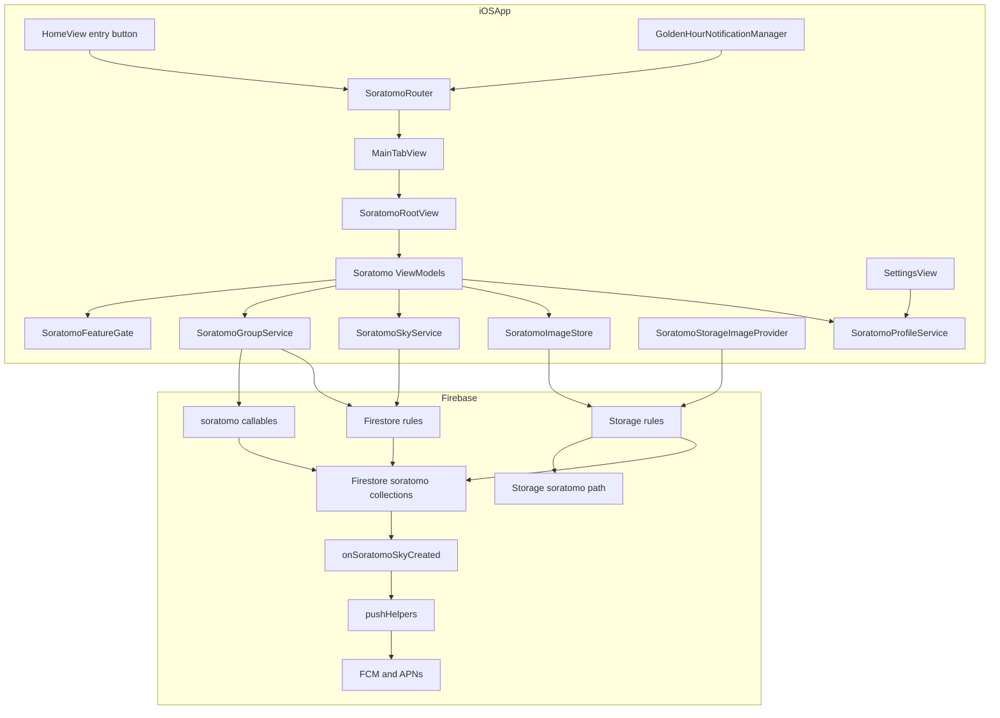
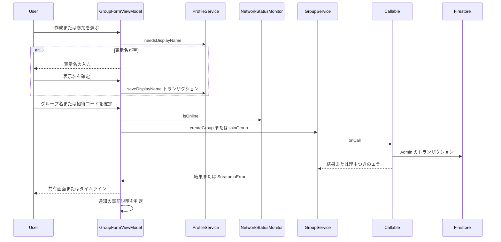
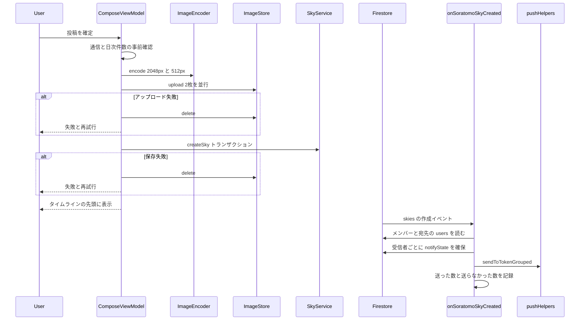
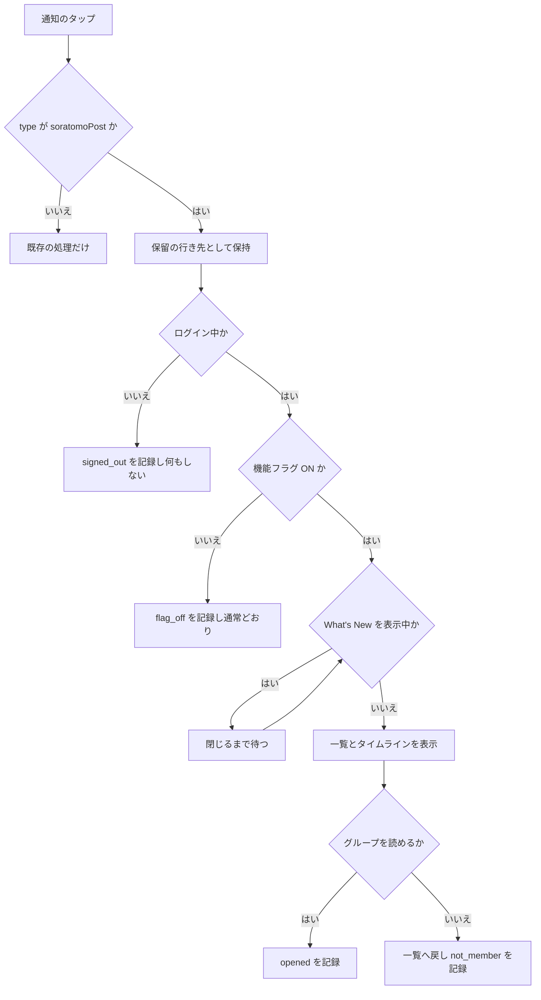
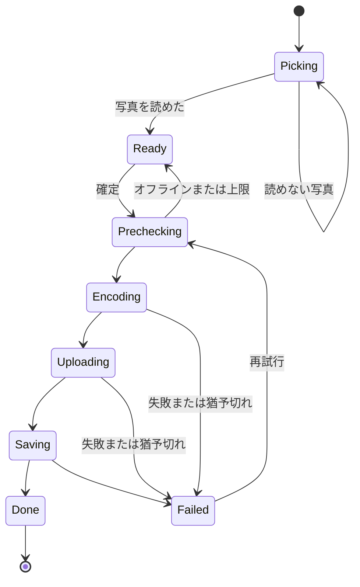
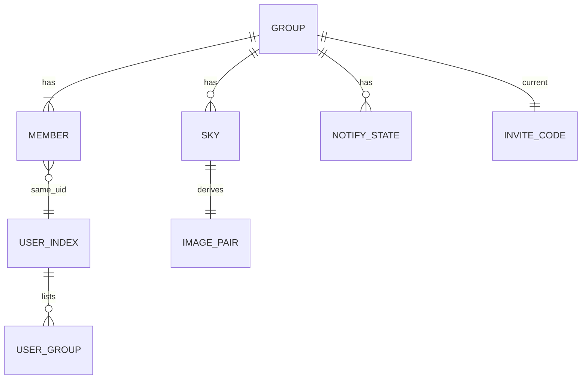
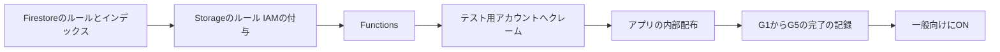

# Design Document（そらとも v1）

## Overview

**Purpose**: そらともは、親しい友達だけの小さなグループで空の写真を見せ合う場を、既存の公開SNSとは別に提供する。グループの作成、招待コードでの参加、写真1枚の投稿、グループ別のタイムライン、新着のプッシュ通知までをv1で届ける。

**Users**: 機能フラグ`soratomoBeta`を付与された開発者とテスト用アカウントが、グループの作成・参加・投稿・閲覧に使う。一般利用者には、公開前ゲート（要件17）がすべて完了するまで、入口と画面を見せない。

**Impact**: 新しいFirestoreのコレクション群（`soratomoGroups`ほか）・Storageのパス`soratomo/`・Callable関数3本・Firestoreトリガー1本を加える。既存のルート`posts`、既存の通知、既存の退会処理、既存の3つの通知設定の挙動は変えない。iOSにはFirebaseFunctionsのSPM製品を新たに加える。

### Goals
- 要件1〜19のすべてを、機能フラグの内側で満たす。
- グループの情報・投稿・画像を、メンバーだけが読める状態にする（Firestoreのルールと、Firestoreを参照するStorageのルール）。
- 通信できないときの作成・参加・投稿・削除・表示名の保存は、端末内へ積まず、失敗として見せる。
- 要件11の各項目と要件3の10について、許可と拒否の両方を自動テストで確かめる。

### Non-Goals
- 公開前ゲートG1（退会時のそらともデータの削除）とG2（通報・ブロック・ガイドラインへの同意・NGワード）。別specで扱う。
- リアクション、退出、グループの削除、メンバーの削除、URLスキーム、編集画面からの共有、複数枚・複数グループへの同時投稿、`member_joined`通知。
- 投稿位置までのスクロール、表示中のグループの通知の抑止、投稿件数のサーバー側の判定、180日の自動削除（いずれもv1.1）。
- 既存の不具合の修正（`storage.rules`の`livingSky`の`allow write`、古いコメント）。`research.md`の「範囲外の発見」に記録した。
- 開発ビルドでの機能フラグの例外。`SkyMotionAccess`のDEBUGの`return true`は踏襲しない。

## Requirements Traceability

| Requirement | Summary | Components | Interfaces | Flows |
|-------------|---------|------------|------------|-------|
| 1.1, 1.2, 1.4, 1.5 | 入口の表示条件 | SoratomoFeatureGate・SoratomoEntryButton | `SoratomoFeatureGate.state` | — |
| 1.3, 17.1, 17.2 | テスト用アカウントだけON | クレームの付与スクリプト | `scripts/set-soratomo-beta-claim.js` | 公開の手順 |
| 1.6 | フラグOFFの読み書きを拒否 | Firestoreのルール・Storageのルール・Callable | `isSoratomoUser()` | 作成と参加 |
| 1.7, 9.11 | フラグOFFへ送らない・数を記録 | onSoratomoSkyCreated・soratomoCore | `classifyRecipient` | 投稿と通知 |
| 2.1, 2.4 | 作成して共有画面へ・オーナー記録 | SoratomoGroupFormViewModel・soratomoCreateGroup | `createGroup` | 作成と参加 |
| 2.2, 2.3, 11.11 | グループ名1〜30文字 | SoratomoTextRules・soratomoCore | `validateGroupName` | 作成と参加 |
| 2.5, 4.7, 11.10 | 所属10個・メンバー20人 | soratomoStore | `createGroupTx`・`joinGroupTx` | 作成と参加 |
| 2.6, 4.9, 12.2 | オフラインでは始めない | NetworkStatusMonitor・SoratomoGroupService | `isOnline` | 作成と参加 |
| 2.7, 4.10 | 二重の操作を受け付けない | SoratomoGroupFormViewModel | `phase` | 作成と参加 |
| 3.1, 3.2, 3.3 | コードの生成・一意・無期限 | soratomoCore・soratomoStore | `generateInviteCode` | 作成と参加 |
| 3.4, 3.5, 3.6, 3.7 | 表示・共有・コピー・再表示 | SoratomoInviteView・SoratomoInviteCode | `displayText` | — |
| 3.8, 3.9, 3.10, 3.11, 3.12, 3.13 | 再発行 | SoratomoInviteViewModel・soratomoRegenerateInviteCode | `regenerateInviteCode` | — |
| 4.1, 4.2, 4.3 | コードの正規化 | SoratomoInviteCode・soratomoCore | `parse(userInput:)`・`normalizeInviteCode` | 作成と参加 |
| 4.4, 4.5, 4.6, 4.8 | 参加の結果 | soratomoJoinGroup・SoratomoGroupFormViewModel | `joinGroup` | 作成と参加 |
| 5.1, 5.2, 5.3, 5.4, 5.5, 5.6 | グループ一覧 | SoratomoGroupListViewModel・SoratomoGroupService | `fetchMyGroups` | — |
| 6.1, 6.2, 6.5 | 写真1枚・プレビュー・投稿先1つ | SoratomoComposeView・SoratomoPhotoPicker | — | 投稿と通知 |
| 6.3, 6.4 | キャプション0〜100文字・改行除去 | SoratomoTextRules | `sanitizeCaption` | — |
| 6.6, 6.7, 6.8, 6.9, 6.10, 6.11 | 投稿の順序・進捗・失敗・背景 | SoratomoComposeViewModel・SoratomoImageStore・SoratomoSkyService | `upload`・`createSky` | 投稿と通知 |
| 6.12 | 1日20件の目安 | SoratomoSkyService | `countTodaySkies` | 投稿と通知 |
| 7.1, 7.2, 7.3, 7.4, 7.5 | 画像の加工とメタデータ除去 | SoratomoImageEncoder | `encode(source:)` | 投稿と通知 |
| 8.1, 8.2, 8.3, 8.4, 8.5, 8.10, 8.11 | タイムライン | SoratomoTimelineViewModel・SoratomoSkyService・SoratomoDaySection | `observeTimeline` | — |
| 8.6, 8.7, 8.8, 8.9, 19.2 | 投稿者の表示・詳細 | SoratomoProfileStore・SoratomoSkyDetailView | `displayName(for:)` | — |
| 8.12, 8.13 | 空の案内・グループ名と人数 | SoratomoTimelineView | `observeGroup` | — |
| 8.14, 11.13 | メンバー判定を経る画像の取得 | SoratomoStorageImageProvider・Storageのルール | `ImageDataProvider` | — |
| 8.15, 8.16, 8.17, 8.18, 8.19, 8.20 | 自分の投稿の削除 | SoratomoTimelineViewModel・SoratomoSkyService | `deleteSky` | — |
| 9.1, 9.2, 9.3, 9.5, 9.6, 9.7, 9.12 | 通知の宛先と内容 | onSoratomoSkyCreated・sendToTokenGrouped | `buildNotification` | 投稿と通知 |
| 9.4, 9.9, 9.10 | 間引き・部分失敗・1分以内 | soratomoStore・onSoratomoSkyCreated | `claimNotifySlot` | 投稿と通知 |
| 9.8 | 無効トークンの削除 | sendToTokenGrouped | `isInvalidTokenError` | 投稿と通知 |
| 9.13, 9.14, 9.15 | 通知設定・既定ON・ブロック | soratomoCore | `soratomoPrefEnabled`・`classifyRecipient` | 投稿と通知 |
| 10.1, 10.2, 10.3, 10.4, 10.5, 10.6 | 通知の事前説明 | SoratomoNotificationPrimer | `decide()` | 作成と参加 |
| 10.7, 10.8, 10.9, 10.10, 10.11, 10.12, 10.13 | 通知のタップ | SoratomoRouter・GoldenHourNotificationManager | `receive(userInfo:)` | 通知のタップ |
| 10.14, 10.15, 10.16, 10.17 | 「そらとも通知」の設定 | SettingsView・SettingsViewModel・SoratomoProfileService | `setNotifySoratomo` | — |
| 11.1, 11.2 | メンバーだけが読む | Firestoreのルール・Storageのルール | `isSoratomoMember` | — |
| 11.3, 11.4, 11.12 | 投稿の作成条件 | Firestoreのルール | `skies`の`create` | 投稿と通知 |
| 11.5, 11.6, 11.7, 11.15 | 画像の保存と削除・投稿者だけが削除 | Storageのルール・Firestoreのルール | `soratomo/`の`create`・`delete` | — |
| 11.8, 11.9 | メンバー追加の経路・コードの秘匿 | Firestoreのルール・Callable | `members`と`soratomoInviteCodes`の書き込み拒否 | 作成と参加 |
| 11.14 | 許可と拒否の自動テスト | ルールのテスト・soratomoStoreのテスト | `scripts/rules_test_soratomo.py` | — |
| 12.1 | オフラインの表示 | Firestoreのキャッシュ・SoratomoImageCache・NetworkStatusMonitor | `isFromCache` | — |
| 12.3, 12.4 | 自動で送り直さない・画像の後始末 | SoratomoSkyService・SoratomoComposeViewModel | トランザクション | 投稿と通知 |
| 12.5, 15.4 | 原因の分かる文言・非致命エラー | SoratomoError | `userMessage` | — |
| 13.1, 13.2, 13.3, 13.4 | 既存の画面とデータに混ざらない | 別コレクション・別のモデル型 | `SoratomoSky` | — |
| 13.5, 13.6 | 既存のトリガーと別 | onSoratomoSkyCreated | — | 投稿と通知 |
| 13.7 | 既存の3つの通知設定を変えない | soratomoCore | `SORATOMO_PREF_DEFAULT` | — |
| 13.8 | 既存のアクセス条件を変えない | ルールは追加だけ | — | — |
| 13.9, 13.10 | 退会処理を変えずに完了させる | 変更なし | `deleteUserData` | — |
| 14.1, 14.2, 14.3, 14.4, 14.5 | 計測 | SoratomoAnalytics | `SoratomoEvent` | — |
| 14.6 | 「そらとも通知」の切り替えの計測 | SettingsViewModel | `prefKey(.soratomo)`が`soratomo`を返す | — |
| 15.1, 15.2, 15.3 | ログに個人情報を出さない | SoratomoAnalytics・soratomo.js | 内部IDだけのログ | — |
| 16.1, 16.2, 16.3 | 性能 | SoratomoImageEncoder・SoratomoImageStore・SoratomoSkyService | — | 投稿と通知 |
| 16.4, 16.5 | VoiceOver | そらともの各画面 | `accessibilityLabel` | — |
| 17.3 | G1とG2を実装しない | Non-Goals | — | — |
| 18.1, 18.2, 18.3, 18.4, 18.5, 18.6, 18.7 | 表示名の事前入力 | SoratomoDisplayNameStep・SoratomoProfileService | `saveDisplayName` | 作成と参加 |
| 19.1, 19.3 | メンバー一覧とオーナーの印 | SoratomoMembersView・SoratomoGroupService | `fetchMembers` | — |

## Architecture

### Existing Architecture Analysis

- **iOS**: SwiftUI（iOS 16.0）と`@MainActor`の`ObservableObject`、プロトコルによる依存注入（`SettingsViewModel`）。読み込み状態は`LoadableState`、計測は`LoggingService.logEvent`と`logScreen`、非致命エラーは`ErrorHandler.logError`。`FirestoreServiceProtocol`には多数のモックがあるため、そらともは新しいプロトコルに分け、既存のプロトコルは広げない。
- **通知**: 通知センターのデリゲートは`GoldenHourNotificationManager.shared`で、`didReceive`はゴールデンアワーの計測だけを行う。`MainTabView`は`switch selectedTab`でタブの中身を作り直し、What's Newの`.fullScreenCover`を持つ。
- **Functions**: JavaScript・Node 22・`asia-northeast1`。プッシュ通知の送信と無効トークンの掃除は`pushHelpers.js`に集約されている。Callableは無い。
- **ルール**: Firestoreの既存の`match`はすべて具体的なパスで、`{path=**}`は無い。Storageの既存のルールはFirestoreを参照していない。
- **守る統合点**: ルート`posts`のクエリ・インデックス・ルール、`onPostCreated`、`PREF_DEFAULTS`、`User.toFirestoreData()`の書き込み項目、`deleteUserData`の対象と順序、`sendToToken`の挙動。

### Architecture Pattern & Boundary Map



**Architecture Integration**:
- Selected pattern: 既存と同じMVVM＋サービス層。サーバー側は「書き込みの権限が強い操作（作成・参加・再発行）はCallable、メンバーの日常の読み書き（閲覧・投稿・削除）はルールで守った直接アクセス、通知は作成トリガー」に分ける。
- Domain/feature boundaries: そらともの型・サービス・画面は`Soratomo`で始まる名前に閉じる。既存のサービスとの接点は、`PublicProfile`の読み取り（`FirestoreServiceProtocol.fetchPublicProfile`）と、通知・設定・ホームへの小さな差し込みだけ。
- Existing patterns preserved:
  - プロトコルによる注入、`ErrorHandler.logError`、`LoggingService`、`pushHelpers.isInvalidTokenError`。
  - `followedTags`と同じ読み取り専用の項目。
  - サインアウト時のキャッシュの破棄（`ContentView`の`onChange`）。
- New components rationale:
  - Callable: 理由付きのエラーと、上限の原子的な判定のため。
  - Storageのcross-service rules: 画像をメンバーだけに読ませるため。
  - `ImageDataProvider`: URLを作らずに画像を取得するため。
  - ルーター: 通知のタップからの遷移のため。ネットワーク監視: オフラインの事前確認のため。
- Steering compliance: `.kiro/steering/`は無い。`CLAUDE.md`・`docs/tech-spec.md`・`docs/firestore-schema.md`・`docs/pre-release-checklist.md`の規約（日本語コメント、`compactMap { try? }`の禁止、インデックスのデプロイ、実データでのハッピーパス）に従う。

### Technology Stack

| Layer | Choice / Version | Role in Feature | Notes |
|-------|------------------|-----------------|-------|
| Frontend | SwiftUI・iOS 16.0・`ObservableObject` | そらともの画面・状態 | 既存と同じ。`NavigationStack`（iOS 16）を使う |
| Frontend | firebase-ios-sdk 12.6.0の**FirebaseFunctions**（新規の製品） | Callableの呼び出し | `project.pbxproj`の3か所を編集する。依存は既存の製品が引いている |
| Frontend | FirebaseFirestore・FirebaseStorage・FirebaseAuth（既存） | 読み書き・画像・クレーム | Storageは`getData`だけを使い、`downloadURL()`を呼ばない |
| Frontend | Kingfisher 8.6.2（既存） | `ImageDataProvider`と専用の`ImageCache` | 名前`soratomo`のキャッシュを分ける |
| Frontend | PhotosUI・ImageIO・Network（OS標準） | 写真の選択・縮小とメタデータ除去・通信状態 | `NWPathMonitor`はプロジェクトで初めて使う |
| Backend | Cloud Functions 2nd gen・Node 22・firebase-functions ^7.4.0・firebase-admin ^14.5.0 | Callable 3本・Firestoreトリガー1本 | プロジェクトで初めての`onCall` |
| Data | Firestore `(default)`・`asia-northeast1` | グループ・メンバー・投稿・状態 | 複合インデックスを1本足す（コレクションID`skies`） |
| Data | Cloud Storage 既定のバケット | 表示用画像とサムネイル | Firestoreを参照するルールを初めて使う（初回デプロイでIAMの付与） |
| Messaging | FCM（Admin SDK）とAPNs | 新着通知 | `thread-id`と`apns-collapse-id`をグループごとにする |
| Test | node:test・Rules test API・Firebase Emulator Suite・XCTest | ルール・Functions・iOSの検証 | エミュレーターは必要な範囲で`firebase.json`に設定を足す |

## System Flows

### 作成と参加



- 表示名の保存に失敗したら、作成・参加の入力へ進まない（18.5）。
- 通信の事前確認で失敗したら、Callableを呼ばない（2.6、4.9、12.2）。Callableは送信キューを持たないため、通信が戻っても勝手に実行されない。
- 処理中は確定の操作を無効にする（2.7、4.10）。作成は`requestId`で冪等にし、タイムアウトの後の再試行で2つ目のグループを作らない。

### 投稿と通知



- 投稿データは、2枚の画像のアップロードが両方成功した後にだけ作る（6.6）。画像の無い投稿は構造上できない（6.11、12.4）。
- 保存のトランザクションが「通信の失敗」で終わり、結果が確定しないときは、画像を消す前にサーバーで投稿の有無を確かめる。確かめられなければ画像を残す（画像の無い投稿よりも、取り残しの画像を選ぶ）。
- バックグラウンドへ移ったときは、`beginBackgroundTask`の中で変換・アップロード・保存を続ける。猶予が切れたとき（expiration handler）だけ、変換中とアップロード中なら中止して後始末し、失敗（`backgroundExpired`）として扱う。保存のトランザクションを送った後は中止せず、結果を待つ（6.11）。

### 通知のタップ



- コールドスタートでは、`didReceive`が`ContentView`の0.5秒の待機より先に呼ばれうる。ルーターはシングルトンで、画面の準備が整うまで行き先を保持する。
- 既存の通知（いいね・コメント・新着投稿・フォロー・おすすめ・ゴールデンアワー）は、`type`の値が異なるので、ルーターは無視する。`willPresent`は変えない（10.12、10.13）。

### 投稿画面の状態



- `Failed`と`Ready`は、選んだ写真とキャプションを保持する（6.10、6.12）。再試行は新しい投稿IDで行う（Storageの上書きを許さないため）。
- バックグラウンドへ移っただけでは`Failed`にしない。`Encoding`と`Uploading`から`Failed`へ移るのは、処理の失敗か、`beginBackgroundTask`の猶予切れのときだけ（「投稿と通知」の箇条書きと同じ扱い）。

## Components and Interfaces

| Component | Domain/Layer | Intent | Req Coverage | Key Dependencies (P0/P1) | Contracts |
|-----------|--------------|--------|--------------|--------------------------|-----------|
| SoratomoFeatureGate | iOS アクセス | 入口と設定の表示可否 | 1.1, 1.2, 1.4, 1.5, 10.10, 10.14 | FirebaseAuth (P0) | State |
| SoratomoRouter | iOS 遷移 | 入口と通知からの遷移 | 10.7, 10.8, 10.9, 10.10, 10.11, 10.12 | Gate (P0), MainTabView (P0) | State |
| SoratomoNotificationPrimer | iOS 通知 | 事前説明と設定案内を1回だけ | 10.1, 10.2, 10.3, 10.4, 10.5, 10.6 | PushNotificationManager (P0) | Service |
| NetworkStatusMonitor | iOS 共通 | 通信の有無 | 2.6, 4.9, 12.1, 12.2 | Network (P0) | State |
| SoratomoGroupService | iOS サービス | グループの作成・参加・再発行・読み取り | 2.1, 2.4, 2.5, 2.6, 3.7, 3.9, 3.11, 3.12, 4.4, 4.5, 4.6, 4.7, 4.8, 4.9, 5.1, 5.2, 5.3, 8.13, 19.1, 19.3 | FirebaseFunctions (P0), Firestore (P0) | Service |
| SoratomoSkyService | iOS サービス | 投稿の監視・作成・削除・件数 | 6.6, 6.8, 6.12, 8.1, 8.2, 8.3, 8.10, 8.11, 8.17, 8.18, 8.19, 12.3, 12.4 | Firestore (P0) | Service |
| SoratomoImageEncoder | iOS 画像 | 縮小・向き・メタデータ除去・JPEG化 | 7.1, 7.2, 7.3, 7.4, 7.5, 16.1 | ImageIO (P0) | Service |
| SoratomoImageStore | iOS 画像 | アップロード・取り消し・削除 | 6.6, 6.9, 6.11, 8.17, 11.5 | FirebaseStorage (P0) | Service |
| SoratomoStorageImageProvider | iOS 画像 | メンバー判定を経る画像の取得 | 8.14, 11.13, 12.1 | Kingfisher (P0), FirebaseStorage (P0) | Service |
| SoratomoProfileService | iOS サービス | 表示名の保存・そらとも通知の保存 | 10.16, 18.1, 18.4, 18.5 | Firestore (P0) | Service |
| SoratomoProfileStore | iOS 状態 | 投稿者とメンバーの表示名・アイコン | 8.6, 8.7, 8.8, 19.1, 19.2 | FirestoreServiceProtocol (P1) | State |
| SoratomoAnalytics | iOS 計測 | 型付きのイベントと画面名 | 14.1, 14.2, 14.3, 14.4, 14.5, 15.1 | LoggingService (P0) | Service |
| soratomo callables | Functions | 作成・参加・再発行 | 1.6, 2.4, 2.5, 3.1, 3.2, 3.3, 3.9, 3.10, 4.5, 4.6, 4.7, 4.8, 11.8, 11.9, 11.10, 11.11 | soratomoStore (P0) | API |
| onSoratomoSkyCreated | Functions | 新着通知 | 1.7, 9.1, 9.2, 9.3, 9.4, 9.6, 9.9, 9.10, 9.11, 9.13, 9.14, 9.15, 13.5, 13.6 | pushHelpers (P0), Auth (P0) | Event |
| sendToTokenGrouped | Functions | APNsのまとめ指定と結果つきの送信 | 9.5, 9.7, 9.8, 9.12 | FCM (P0) | Service |
| Firestoreのルール | Rules | メンバー判定と書き込み条件 | 1.6, 11.1, 11.2, 11.3, 11.4, 11.6, 11.8, 11.9, 11.11, 11.12, 11.13, 11.15 | — | API |
| Storageのルール | Rules | 画像の読み取りと保存・削除 | 1.6, 8.14, 11.1, 11.2, 11.5, 11.6, 11.7, 11.15 | Firestore (P0) | API |

### iOS: アクセスと遷移

#### SoratomoFeatureGate

| Field | Detail |
|-------|--------|
| Intent | 利用者とビルドにかかわらず、クレーム`soratomoBeta`の有無だけで入口を出すかを決める |
| Requirements | 1.1, 1.2, 1.4, 1.5, 10.10, 10.14 |

**Responsibilities & Constraints**
- ログインしていない、または匿名アカウント（`email == nil`、`SettingsViewModel`の先例）なら無効。
- IDトークンのクレーム`soratomoBeta == true`なら有効。取得の失敗は無効に倒す。
- DEBUGビルドでも例外を設けない。クレームの無い開発者に入口を出すと、書き込みがすべてルールで拒否されるため。
- 起動ごとの最初の評価だけトークンを強制的に更新する（クレームの付与の直後でも、再ログインなしで使えるようにするため）。以後はキャッシュ済みのトークンを読む。
- 状態をアプリ全体で共有する（`SoramoyouApp`で環境オブジェクトとして注入）。`GuestTabView`も`HomeView`を使うため、ゲスト中も同じオブジェクトを読む。

**Contracts**: State

##### State Management
```swift
@MainActor
final class SoratomoFeatureGate: ObservableObject {
    enum DisabledReason: Equatable { case signedOut, anonymous, claimMissing, tokenUnavailable }
    enum State: Equatable { case unknown, enabled, disabled(DisabledReason) }

    @Published private(set) var state: State
    var isEnabled: Bool { get }
    /// 現在のログイン状態とトークンから評価し直す。
    @discardableResult func evaluate() async -> State
    /// サインアウト時に unknown へ戻す。
    func reset()
}
```
- Invariants: `isEnabled == true`は`state == .enabled`のときだけ。`unknown`の間は入口を出さない。

#### SoratomoRouter

| Field | Detail |
|-------|--------|
| Intent | ホームの入口と通知のタップから、そらともの画面への遷移を1か所で決める |
| Requirements | 10.7, 10.8, 10.9, 10.10, 10.11, 10.12 |

**Responsibilities & Constraints**
- `GoldenHourNotificationManager.didReceive`の既存の処理の後に、`userInfo`を渡す1行だけを足す。`type`が`soratomoPost`でなければ何もしない。
- 行き先は、表示が確認できるまで保留として保持する。ログインしていなければ破棄して`signed_out`、フラグが無効なら破棄して`flag_off`を記録する。
- 画面は`MainTabView`のタブの中身（`Group`）に付けた`.fullScreenCover`で出す。What's Newの`.fullScreenCover`とは別の階層に付け、What's Newの表示中は閉じるまで待つ。
- そらともの画面の中は`NavigationStack`のパスで管理する。通知の行き先は「一覧の上にタイムライン」の形にする。
- 計測の`soratomo_notification_opened`は、行き先の結果が決まったときに1回だけ記録する。

**Dependencies**
- Inbound: GoldenHourNotificationManager — タップの受け渡し（P0）。HomeView — 入口のボタン（P0）。ContentView — ログイン状態の確定（P0）。
- Outbound: SoratomoFeatureGate — 評価（P0）。SoratomoAnalytics — 記録（P1）。

**Contracts**: State

##### State Management
```swift
struct SoratomoNotificationPayload: Equatable, Sendable {
    static let typeValue = "soratomoPost"
    let groupId: String
    let postId: String
    /// type・groupId・postId が揃わなければ nil（既存の通知はここで落ちる）
    static func parse(_ userInfo: [AnyHashable: Any]) -> SoratomoNotificationPayload?
}

enum SoratomoDestination: Hashable {
    case timeline(groupId: String)
    case invite(groupId: String)
    case members(groupId: String)
    case skyDetail(groupId: String, skyId: String)
}

enum SoratomoNotificationOpenResult: String {
    case opened, notMember = "not_member", flagOff = "flag_off", signedOut = "signed_out"
}

enum SoratomoSession: Equatable { case signedIn, signedOut }

@MainActor
final class SoratomoRouter: ObservableObject {
    static let shared: SoratomoRouter
    @Published var isPresented: Bool
    @Published var path: [SoratomoDestination]
    @Published var notice: String?   // 「グループを開けませんでした」などの一時表示
    @Published private(set) var pending: SoratomoNotificationPayload?

    func openFromEntry()
    func receive(userInfo: [AnyHashable: Any])
    /// ログイン状態・フラグ・他のモーダルの有無が分かった時点で呼ぶ
    func resolvePending(session: SoratomoSession, gate: SoratomoFeatureGate.State, canPresent: Bool)
    /// タイムラインがグループを読めなかったときに呼ぶ（一覧へ戻し not_member を記録）
    func reportNotAccessible(groupId: String)
    func dismiss()
    func clearOnSignOut()
}
```
- Preconditions: `receive`はメインアクターで呼ぶ（`GoldenHourNotificationManager`は`@MainActor`）。
- Postconditions: `resolvePending`の後、`pending`は`nil`になるか、`canPresent == false`のときだけ残る。

**Implementation Notes**
- Integration: ルーターへの差し込みは`GoldenHourNotificationManager`の1行、`ContentView`の状態確定の通知、`MainTabView`のカバー、`HomeView`のツールバーの4か所。
- Risks: タブの中で別のモーダルが表示中だと、カバーを出せない。保留の行き先を残し、次にタブの画面が表示されたときに再び試みる。実機で確かめる。
- Risks: 逆の順番もある。通知のタップで起動し、そらともの画面が先に出たとする。その後でWhat's New（`MainTabView.maybeShowWhatsNew`、起動から1.5秒後）が外側の階層から出ようとすると、表示は失敗する。この起動では既読にならず、What's Newは次回の起動で出る。機能フラグの内側の話で影響は小さいので、設計では待ち合わせを足さず、実機で挙動を確かめる。

#### SoratomoNotificationPrimer

| Field | Detail |
|-------|--------|
| Intent | 作成・参加の完了後に、通知の事前説明か設定の案内を、それぞれ1回だけ出す |
| Requirements | 10.1, 10.2, 10.3, 10.4, 10.5, 10.6 |

**Contracts**: Service

##### Service Interface
```swift
enum SoratomoPrimerDecision: Equatable { case showPrimer, showSettingsGuide, none }
enum SoratomoPrimerChoice: String { case allow, later }

@MainActor
protocol SoratomoNotificationPrimerProtocol {
    /// 端末の許可状態と端末内の既読記録から決める
    func decide() async -> SoratomoPrimerDecision
    /// 「通知を受け取る」は PushNotificationManager.requestAuthorizationAndRegister だけを通す
    func handle(choice: SoratomoPrimerChoice) async -> Bool   // 戻り値は granted
    func markSettingsGuideShown()
}
```
- `notDetermined`かつ未表示なら`showPrimer`、`denied`かつ未案内なら`showSettingsGuide`、それ以外は`none`。既読は`UserDefaults`のキー`soratomo.notificationPrimerShown`と`soratomo.notificationSettingsGuideShown`（端末の許可は端末単位のため）。
- 文言は「友達が空を投稿したらお知らせします」「通知を受け取る」「あとで」。グループ単位でのオフは案内しない（10.17）。
- 設定の案内は`UIApplication.openNotificationSettingsURLString`を開く。

#### NetworkStatusMonitor

| Field | Detail |
|-------|--------|
| Intent | 通信の有無を共有し、事前確認とオフラインの表示に使う |
| Requirements | 2.6, 4.9, 12.1, 12.2 |

**Contracts**: State

```swift
@MainActor
final class NetworkStatusMonitor: ObservableObject {
    static let shared: NetworkStatusMonitor
    @Published private(set) var isOnline: Bool
}
```
- `NWPathMonitor`の`status == .satisfied`を`isOnline`とする。`satisfied`でも実際に届かないことがあるため、事前確認の後もエラーの写像（`SoratomoError.network`）で失敗を拾う。

### iOS: サービス

#### SoratomoGroupService

| Field | Detail |
|-------|--------|
| Intent | Callableによる作成・参加・再発行と、メンバーとしての読み取り |
| Requirements | 2.1, 2.4, 2.5, 2.6, 3.7, 3.9, 3.10, 3.11, 3.12, 4.4, 4.5, 4.6, 4.7, 4.8, 5.1, 5.2, 5.3, 8.13, 19.1, 19.3 |

**Responsibilities & Constraints**
- Callableは`Functions.functions(region: "asia-northeast1")`から呼び、呼び出しの制限時間は20秒にする。
- `FunctionsErrorCode`と`details["reason"]`を`SoratomoError`へ写像する。サーバーの文言は画面に出さない（12.5）。
- 一覧は`soratomoUsers/{uid}/groups`を読み、各グループを1件ずつ`get`して、`lastActivityAt`の新しい順に並べる（最大10件）。
- 読み取りで`permissionDenied`か`notFound`なら`SoratomoError.notMember`にする。

**Dependencies**
- External: FirebaseFunctions — Callable（P0）。FirebaseFirestore — 読み取りと監視（P0）。

**Contracts**: Service

##### Service Interface
```swift
protocol SoratomoGroupServiceProtocol: Sendable {
    func createGroup(name: String, requestId: UUID) async throws(SoratomoError) -> SoratomoGroupSummary
    func joinGroup(code: SoratomoInviteCode) async throws(SoratomoError) -> SoratomoJoinResult
    func regenerateInviteCode(groupId: String) async throws(SoratomoError) -> SoratomoInviteCode
    func fetchMyGroups(uid: String) async throws(SoratomoError) -> [SoratomoGroup]
    func observeGroup(groupId: String,
                      onChange: @escaping @MainActor (Result<SoratomoGroup, SoratomoError>) -> Void) -> SoratomoListenerToken
    func fetchMembers(groupId: String) async throws(SoratomoError) -> [SoratomoMember]
}

struct SoratomoGroupSummary: Equatable, Sendable {
    let groupId: String
    let name: String
    let inviteCode: SoratomoInviteCode
    let memberCount: Int
}

struct SoratomoJoinResult: Equatable, Sendable {
    let groupId: String
    let alreadyMember: Bool
}

struct SoratomoInviteCode: Hashable, Sendable {
    static let alphabet: String          // "ABCDEFGHJKLMNPQRSTUVWXYZ23456789"
    let rawValue: String                 // 正規化済みの8文字
    var displayText: String { get }      // "XXXX-XXXX"
    /// NFKC で全角を半角へ、大文字へ、空白とハイフン類を除去。8文字でなければ nil（4.3）
    static func parse(userInput: String) -> SoratomoInviteCode?
}

final class SoratomoListenerToken { func cancel() }
```
- Postconditions: `joinGroup`で`alreadyMember == true`はエラーではない（4.8）。

#### SoratomoSkyService

| Field | Detail |
|-------|--------|
| Intent | タイムラインの監視と、投稿データの作成・削除・日次件数 |
| Requirements | 6.6, 6.8, 6.12, 8.1, 8.2, 8.3, 8.10, 8.11, 8.17, 8.18, 8.19, 12.1, 12.3, 12.4, 16.2, 16.3 |

**Responsibilities & Constraints**
- タイムラインは`skies`を`createdAt`の降順で、`limit`を20・40・60と伸ばして張り直す1本のリスナーで監視する。追加と削除はどちらもリスナーで届く。
- 引き下げて更新したときは`limit`を20に戻して張り直す（8.11）。
- 作成と削除は、書き込みだけのトランザクションで行う。オフラインでは`unavailable`で失敗し、端末内に積まれない。作成日時は`FieldValue.serverTimestamp()`。
- 文書のデコードに失敗したら、文書のパスをログに残して1件だけ飛ばす（`compactMap { try? }`は使わない）。
- 日次件数は`count()`で数える。失敗したら`nil`を返し、投稿を止めない（v1はアプリ側の目安）。

**Contracts**: Service

##### Service Interface
```swift
protocol SoratomoSkyServiceProtocol: Sendable {
    func newSkyId(groupId: String) -> String
    func observeTimeline(groupId: String, limit: Int,
                         onChange: @escaping @MainActor (Result<SoratomoTimelineSnapshot, SoratomoError>) -> Void) -> SoratomoListenerToken
    func createSky(_ draft: SoratomoSkyDraft) async throws(SoratomoError)
    /// 結果が確定しない失敗の後に、サーバーで存在を確かめる
    func skyExistsOnServer(groupId: String, skyId: String) async throws(SoratomoError) -> Bool
    func deleteSky(groupId: String, skyId: String) async throws(SoratomoError)
    func countTodaySkies(groupId: String, authorId: String, since startOfLocalDay: Date) async -> Int?
}

struct SoratomoSkyDraft: Sendable {
    let groupId: String
    let skyId: String
    let authorId: String
    let caption: String?     // 改行を除いた0〜100文字。空なら nil
    let pixelWidth: Int
    let pixelHeight: Int
}

struct SoratomoTimelineSnapshot: Sendable {
    let skies: [SoratomoSky]
    let isFromCache: Bool
    let mayHaveMore: Bool    // 件数が limit と等しい
}
```

#### SoratomoImageEncoder

| Field | Detail |
|-------|--------|
| Intent | 元の写真から、表示用とサムネイルのJPEGをメタデータ無しで作る |
| Requirements | 7.1, 7.2, 7.3, 7.4, 7.5, 16.1 |

**Responsibilities & Constraints**
- 入力は写真の元のバイト列（`PHPicker`の`loadFileRepresentation`で取り出す）。`UIImage`を経由しない。
- `CGImageSourceCreateThumbnailAtIndex`に「向きを画素へ反映」と「長辺の上限（2048と512）」を指定して縮小する。12MPを全画素で展開しない。
- 書き出しは`CGImageDestination`のJPEGで、渡す属性は圧縮品質だけにする。EXIF・GPS・TIFF・XMPを渡さない。
- 表示用は品質0.85から段階的に下げて1.5MB（1,572,864バイト）以下にする。下げきっても超えるときは長辺1600pxで作り直し、それでも超えれば`imageTooLarge`。サムネイルは200KB（204,800バイト）以下に同じ方式で収める。
- 読めない入力は`imageUnreadable`（7.5）。

**Contracts**: Service

```swift
struct SoratomoEncodedImages: Sendable {
    let display: Data
    let thumbnail: Data
    let pixelWidth: Int      // 表示用画像の画素数
    let pixelHeight: Int
}

enum SoratomoImageEncoder {
    static let displayMaxPixel = 2048
    static let thumbnailMaxPixel = 512
    static let displayMaxBytes = 1_572_864
    static let thumbnailMaxBytes = 204_800
    static func encode(source: Data) throws(SoratomoError) -> SoratomoEncodedImages
}
```
- Postconditions: 出力のどちらにも`kCGImagePropertyGPSDictionary`が無い。EXIFの撮影日時・機種・レンズ、TIFFのメーカーと機種が無い。画素は正立している。

#### SoratomoImageStore・SoratomoStorageImageProvider

| Field | Detail |
|-------|--------|
| Intent | 画像のアップロードと削除、メンバー判定を経る取得とキャッシュ |
| Requirements | 6.6, 6.7, 6.9, 6.11, 8.14, 8.17, 8.20, 11.5, 11.13, 12.1 |

**Responsibilities & Constraints**
- パスは`SoratomoImagePaths`だけが作る。`soratomo/{groupId}/{authorId}/{skyId}/display.jpg`と`thumb.jpg`。
- アップロードは2枚を並行し、メタデータの`contentType`を`image/jpeg`にする。タスクを保持し、1枚あたり45秒の制限時間か取り消しで`cancel()`する。既存の`Storage`の`maxUploadRetryTime`は変えない。
- `downloadURL()`を呼ばない。URLを保存しない。
- 取得は`StorageReference.getData(maxSize: 2_000_000)`。Kingfisherの`ImageDataProvider`で包み、キャッシュの鍵は`soratomo/`で始まるStorageのパスにする。
- キャッシュは`ImageCache(name: "soratomo")`に分ける。サインアウトで消す（`ContentView`の`onChange`の先例）。投稿を削除したら該当の2つの鍵を消す。
- 削除は2枚を並行し、失敗は`ErrorHandler.logError`で非致命エラーとして残す（8.20）。

**Contracts**: Service

```swift
struct SoratomoImagePaths: Hashable, Sendable {
    let display: String
    let thumbnail: String
    init(groupId: String, authorId: String, skyId: String)
}

enum SoratomoImageDeleteOutcome: Equatable { case deleted, partiallyFailed }

protocol SoratomoImageStoreProtocol: Sendable {
    func upload(_ images: SoratomoEncodedImages, to paths: SoratomoImagePaths,
                progress: @escaping @Sendable (Double) -> Void) async throws(SoratomoError)
    func cancelUploads(to paths: SoratomoImagePaths)
    func delete(_ paths: SoratomoImagePaths) async -> SoratomoImageDeleteOutcome
}

struct SoratomoStorageImageProvider: ImageDataProvider {
    let storagePath: String
    var cacheKey: String { get }   // storagePath そのもの
    func data(handler: @escaping @Sendable (Result<Data, any Error>) -> Void)
}

enum SoratomoImageCache {
    static let shared: ImageCache
    static func clear()
    static func remove(_ paths: SoratomoImagePaths)
}
```

#### SoratomoProfileService・SoratomoProfileStore

| Field | Detail |
|-------|--------|
| Intent | 表示名の事前入力と、そらとも通知の保存。投稿者とメンバーの表示名・アイコンの共有 |
| Requirements | 8.6, 8.7, 8.8, 10.15, 10.16, 16.5, 18.1, 18.2, 18.3, 18.4, 18.5, 18.6, 18.7, 19.1, 19.2 |

**Responsibilities & Constraints**
- 表示名が必要かは`users/{uid}.displayName`を前後の空白を除いて判定する（18.1、18.6）。
- 表示名の保存は1つのトランザクションで行う。`users/{uid}`の`displayName`と`updatedAt`を`updateData`で書く。`publicProfiles/{uid}`があれば同じ2項目を更新し、無ければ`PublicProfile(from:)`で作る（`createPublicProfileIfMissing`と同じ形）。`users`全体は書かない。
- 既存の50文字までの表示名は変えない。20文字を超える既存の名前も、保存されたまま使う。画面では1行で省略し、通知では省略しない。
- そらとも通知は`users/{uid}.notifySoratomo`だけを`updateData`で書く（既存の3つの設定と同じ保存の仕組み）。
- 表示名とアイコンは`publicProfiles`から取り、セッションの間だけ保持する。代替は既存の`RankingDisplayText.authorName`と同じ規則（空・未取得は「ユーザー」とプレースホルダーのアイコン）。

**Contracts**: Service・State

```swift
struct SoratomoDisplayName: Equatable, Sendable {
    let value: String   // 前後の空白を除いた1〜20文字（コードポイント数）
}

protocol SoratomoProfileServiceProtocol: Sendable {
    func needsDisplayName(uid: String) async throws(SoratomoError) -> Bool
    func saveDisplayName(uid: String, name: SoratomoDisplayName) async throws(SoratomoError)
    func setNotifySoratomo(uid: String, enabled: Bool) async throws(SoratomoError)
}

@MainActor
final class SoratomoProfileStore: ObservableObject {
    @Published private(set) var profiles: [String: PublicProfile]
    func prefetch(uids: Set<String>) async
    func displayName(for uid: String) -> String
    func clear()
}
```

#### SoratomoTextRules

- 文字数はUnicodeのコードポイント数（`unicodeScalars.count`）で数える。Functionsも同じ数え方にする（`Array.from(s).length`）。キャプションも同じ。ルールの`size()`はUTF-16の単位で数えるため、キャプションのルールは正規表現の回数指定でコードポイントを数える（「要確認」の1・2026-10-01に確定）。
- グループ名は前後の空白を除いて1〜30文字、表示名は1〜20文字、キャプションは改行（`CharacterSet.newlines`）を除いて0〜100文字。
- キャプションが100文字を超える間は、確定の操作を無効にして上限を示す（6.4）。

```swift
enum SoratomoValidationError: Error, Equatable { case empty, tooLong(max: Int) }

enum SoratomoTextRules {
    static func length(_ text: String) -> Int
    static func validateGroupName(_ raw: String) -> Result<String, SoratomoValidationError>
    static func validateDisplayName(_ raw: String) -> Result<SoratomoDisplayName, SoratomoValidationError>
    static func sanitizeCaption(_ raw: String) -> String
    static func isCaptionWithinLimit(_ sanitized: String) -> Bool
}
```

#### SoratomoAnalytics

| Field | Detail |
|-------|--------|
| Intent | 計測を型で表し、個人情報をパラメータに入れられないようにする |
| Requirements | 14.1, 14.2, 14.3, 14.4, 14.5, 15.1 |

**Contracts**: Service

```swift
enum SoratomoCreateFailReason: String {
    case userLimit = "user_limit", invalidName = "invalid_name", network, flagOff = "flag_off", unknown
}
enum SoratomoJoinFailReason: String {
    case invalidFormat = "invalid_format", notFound = "not_found", groupFull = "group_full"
    case userLimit = "user_limit", network, flagOff = "flag_off", unknown
}
enum SoratomoPostFailStage: String { case precheck, image, upload, save }
enum SoratomoPostFailReason: String {
    case offline, dailyLimit = "daily_limit"
    case network, unreadable, tooLarge = "too_large", permission, timeout, background, unknown
}
enum SoratomoInviteShareMethod: String { case shareSheet = "share_sheet", copy }
enum SoratomoRegenerateFailReason: String { case notOwner = "not_owner", network, unknown }
enum SoratomoImageCleanup: String { case deleted, failed }
enum SoratomoDeleteFailReason: String { case network, unknown }
enum SoratomoDisplayNameTrigger: String { case create, join }
enum SoratomoDisplayNameFailReason: String { case invalidLength = "invalid_length", network, unknown }

enum SoratomoEvent {
    case opened(groupCount: Int)
    case groupCreated
    case createFailed(SoratomoCreateFailReason)
    case inviteShared(SoratomoInviteShareMethod)
    case groupJoined(alreadyMember: Bool)            // source は v1 で "code" に固定
    case joinFailed(SoratomoJoinFailReason)
    case postCreated(hasCaption: Bool, durationMs: Int)
    case postFailed(stage: SoratomoPostFailStage, reason: SoratomoPostFailReason)
    case notificationPromptResult(choice: SoratomoPrimerChoice, granted: Bool)
    case notificationOpened(SoratomoNotificationOpenResult)   // type は "post_created" に固定
    case inviteCodeRegenerated
    case inviteRegenerateFailed(SoratomoRegenerateFailReason)
    case postDeleted(imageCleanup: SoratomoImageCleanup)
    case postDeleteFailed(SoratomoDeleteFailReason)
    case displayNameSaved(trigger: SoratomoDisplayNameTrigger)
    case displayNameFailed(SoratomoDisplayNameFailReason)
    case membersViewed(memberCount: Int)
}

enum SoratomoScreen: String {
    case groupList = "そらともグループ一覧"
    case timeline = "そらともタイムライン"
    case compose = "そらとも投稿"
    case invite = "そらとも招待"
    case members = "そらともメンバー一覧"
    case skyDetail = "そらとも投稿詳細"
}

enum SoratomoAnalytics {
    static func log(_ event: SoratomoEvent)   // LoggingService.shared.logEvent へ
    static func screen(_ screen: SoratomoScreen)
}
```
- イベント名とパラメータ名は要件14の表のとおり。文字列のパラメータは列挙型の`rawValue`だけで、グループ名・表示名・キャプション・招待コード・トークンを渡す口が無い（14.4）。
- 要件14の表に無かったイベントは「要件への追加の提案」に分けた。2026-10-01に承認され、要件14に反映した。上の型にも反映済み（要件14の表と1対1で対応する）。

### iOS: 画面と状態（概要）

| Component | Intent | Req Coverage | Implementation Note |
|-----------|--------|--------------|---------------------|
| SoratomoEntryButton | ホームのツールバー右に「そらとも」 | 1.1, 1.2, 1.5 | `ToolbarItem(placement: .navigationBarTrailing)`。ゲートが有効のときだけ出す |
| SoratomoRootView | `NavigationStack`の根 | 5.1 | `MainTabView`のカバーから出す |
| SoratomoGroupListView・ViewModel | 一覧・作成と参加の2つの操作・空の案内 | 5.1, 5.2, 5.3, 5.4, 5.5, 5.6 | 開いたら`opened`と画面名を記録 |
| SoratomoGroupFormViewModel | 表示名の確認→作成または参加→事前説明 | 2.1, 2.3, 2.5, 2.6, 2.7, 4.3, 4.4, 4.5, 4.6, 4.7, 4.8, 4.9, 4.10, 10.1, 10.5, 18.1, 18.4, 18.6 | `phase`で二重の確定を防ぐ。作成の`requestId`は入力を変えるまで保つ |
| SoratomoDisplayNameStep | 表示名の入力 | 18.1, 18.2, 18.3, 18.5 | 失敗しても入力を残す |
| SoratomoInviteView・ViewModel | コードの表示・共有・コピー・再発行 | 3.4, 3.5, 3.6, 3.7, 3.8, 3.11, 3.12 | 再発行はオーナーだけ。共有文の4行は要件3の5のまま。App StoreのURLは定数 |
| SoratomoTimelineView・ViewModel | 日付の区切り・20件ずつ・更新・空の案内・削除 | 8.1, 8.2, 8.3, 8.6, 8.10, 8.11, 8.12, 8.13, 8.15, 8.16, 8.19, 8.20, 12.1 | 先頭にオフラインの表示。削除は確認の後 |
| SoratomoDaySection | `今日`・`昨日`・`M月d日`・`yyyy年M月d日`の見出し | 8.4, 8.5 | 端末のタイムゾーンと`Calendar.current`。純関数でテストする |
| SoratomoComposeView・ViewModel | 写真1枚・プレビュー・キャプション・進捗・再試行 | 6.1, 6.2, 6.3, 6.4, 6.5, 6.7, 6.8, 6.9, 6.10, 6.11, 6.12, 7.5 | `beginBackgroundTask`で送信を続け、猶予切れのときだけ中止して後始末し、失敗として扱う |
| SoratomoPhotoPicker | 1枚だけ選ぶ | 6.1 | `PHPickerConfiguration()`（ライブラリへのアクセス権が不要な形）。元のバイト列を返す |
| SoratomoSkyDetailView | 表示用画像の拡大とキャプションの全文 | 8.9 | サムネイルを先に出し、表示用画像に置き換える |
| SoratomoMembersView・ViewModel | メンバー全員とオーナーの印 | 19.1, 19.2, 19.3 | オーナーを先頭、その後は参加順 |
| SettingsView・SettingsViewModel（変更） | 「そらとも通知」の行 | 10.14, 10.15, 10.16, 10.17, 14.6 | ゲートが有効のときだけ出す。`PushPreference`に`.soratomo`を足し、保存先だけを`setNotifySoratomo`へ分ける。`prefKey(.soratomo)`は`soratomo`を返し、既存の3つの値は変えない |
| User（変更） | `notifySoratomo: Bool?`を足す | 9.14, 10.16 | 読み取りだけ。`toFirestoreData()`では書かない |

- VoiceOver: すべてのボタンにラベルを付ける（16.4）。投稿画像のラベルはキャプション、無ければ「{表示名}さんの空」（16.5）。
- 画面の計測は`SoratomoScreen`で、表示のたびではなく画面の切り替えで1回にする。

### Backend: Cloud Functions

ファイルの構成は次のとおり。`index.js`の末尾に`Object.assign(exports, require("./soratomo"))`を1行足し、`package.json`の`lint`と`test`に新しいファイルを加える。それ以外の既存のコードは変えない。

| File | Responsibility |
|------|----------------|
| `functions/soratomoCore.js` | 純関数（コードの生成と正規化・名前の検証・通知文・宛先の分類・間引きの判定・集計） |
| `functions/soratomoStore.js` | `db`を受け取るAdminのトランザクション（作成・参加・再発行・通知の枠の確保）。エミュレーターでテストする |
| `functions/soratomo.js` | `onCall` 3本と`onDocumentCreated` 1本の配線、クレームの確認、エラーの写像、ログ |
| `functions/pushHelpers.js`（追加） | `sendToTokenGrouped`。`sendToToken`と`isInvalidTokenError`は変えない |

#### soratomo callables

| Field | Detail |
|-------|--------|
| Intent | メンバーの追加とコードの発行を、上限と一意性を守って原子的に行う |
| Requirements | 1.6, 2.1, 2.4, 2.5, 3.1, 3.2, 3.3, 3.9, 3.10, 3.13, 4.4, 4.5, 4.6, 4.7, 4.8, 11.8, 11.9, 11.10, 11.11 |

**選定の理由**: Callableは送信キューを持たず、オフラインでは即座に失敗する。非メンバーにグループを読ませないまま、理由ごとのエラーを返せる。要求文書とトリガーの方式は採らない。要求文書の作成はオフラインでも端末内で成功し、通信が戻ったときに利用者の知らないうちに実行されるため（2.6、4.9、12.2に反する）。クライアントのトランザクションだけの方式は、理由の区別とコードの一意性を守れないため採らない（比較は`research.md`）。

**Responsibilities & Constraints**
- すべての呼び出しで、`request.auth`があり、`request.auth.token.soratomoBeta === true`であることを確かめる。無ければ`permission-denied`（`reason: "flag_off"`）。
- 招待コードは`crypto.randomInt`で字種`ABCDEFGHJKLMNPQRSTUVWXYZ23456789`から8文字を作る。トランザクションの中で`soratomoInviteCodes/{code}`の不在を確かめ、あれば作り直す（最大5回）。期限は持たない。
- 参加の判定は次の順で行う: コードの不在、既存のメンバー、所属10個、満員。既存のメンバーなら、上限とは無関係に成功として返す（4.8）。
- 所属数（`soratomoUsers/{uid}.groupCount`）とメンバー数（`soratomoGroups/{groupId}.memberCount`）は、メンバーの文書・写しと同じトランザクションで増やす。同時の参加でも上限を超えない。
- 再発行はグループの`ownerId`と呼び出し元が一致するときだけ。古いコードの文書を消し、新しいコードの文書を作り、グループの`inviteCode`を書き換える。
- `users`には書かない。ログは`uid`・`groupId`と結果の理由だけにする。

**Contracts**: API

##### API Contract

| Callable | Request | Response | Errors（`HttpsError`の`code`と`details.reason`） |
|----------|---------|----------|------------------------------------------------|
| `soratomoCreateGroup` | `{ name: string, requestId: string }` | `{ groupId: string, name: string, inviteCode: string, memberCount: number }` | `unauthenticated`／`permission-denied`・`flag_off`／`invalid-argument`・`invalid_name`／`resource-exhausted`・`user_limit`／`internal` |
| `soratomoJoinGroup` | `{ code: string }` | `{ groupId: string, alreadyMember: boolean }` | `unauthenticated`／`permission-denied`・`flag_off`／`invalid-argument`・`invalid_format`／`not-found`・`not_found`／`resource-exhausted`・`group_full`または`user_limit`／`internal` |
| `soratomoRegenerateInviteCode` | `{ groupId: string }` | `{ inviteCode: string }` | `unauthenticated`／`permission-denied`・`flag_off`または`not_owner`／`not-found`・`not_found`／`internal` |

- `name`はサーバーでも前後の空白を除いてから1〜30文字を確かめる。`code`はサーバーでも正規化し、8文字かつ字種の範囲内を確かめる。
- 作成は`soratomoUsers/{uid}.lastCreateRequestId`が同じなら、前回作ったグループを返す（冪等）。

```js
/**
 * @typedef {{ reason: "flag_off"|"invalid_name"|"invalid_format"|"not_found"|"group_full"|"user_limit"|"not_owner" }} SoratomoErrorDetails
 * @typedef {{ groupId: string, name: string, inviteCode: string, memberCount: number }} CreateGroupResult
 * @typedef {{ groupId: string, alreadyMember: boolean }} JoinGroupResult
 */
// soratomoStore.js
/** @returns {Promise<CreateGroupResult>} */ async function createGroupTx(db, { uid, name, requestId }) {}
/** @returns {Promise<JoinGroupResult>} */ async function joinGroupTx(db, { uid, code }) {}
/** @returns {Promise<{ inviteCode: string }>} */ async function regenerateInviteCodeTx(db, { uid, groupId }) {}
/** @returns {Promise<"send"|"throttled"|"duplicate">} */ async function claimNotifySlot(db, { groupId, uid, skyId, nowMs }) {}
```
- `soratomoStore.js`は、理由を持つ`SoratomoDomainError`を投げる。`soratomo.js`がそれを`HttpsError`に写す。

#### onSoratomoSkyCreated

| Field | Detail |
|-------|--------|
| Intent | 新しいそらとも投稿を、投稿者以外のメンバーへ知らせる |
| Requirements | 1.7, 9.1, 9.2, 9.3, 9.4, 9.5, 9.6, 9.7, 9.8, 9.9, 9.10, 9.11, 9.12, 9.13, 9.14, 9.15, 13.5, 13.6, 15.2, 15.3 |

**Responsibilities & Constraints**
- トリガーは`onDocumentCreated("soratomoGroups/{groupId}/skies/{skyId}")`。既存の`onPostCreated`とは、名前と対象のどちらも異なる。
- 宛先の分類の順序は「フラグOFF→通知設定OFF→ブロック→トークン無し→（枠の確保で）重複か間引き→送信」。フラグは`getAuth().getUsers()`で一度にまとめて確かめる。
- 通知のタイトルはグループ名。本文は「{表示名}さんが空を投稿しました」。キャプションがあれば、先頭30文字（コードポイント）を「」で囲んで末尾に付ける。表示名は投稿者の`users`の`displayName`を読み、空なら「だれか」（既存の`displayNameOf`と同じ）。
- 間引きの状態は、送る前に受信者ごとのトランザクションで確保する。ほぼ同時の2件の投稿でも、5分以内に送るのは1通だけになる。送信が一時的に失敗しても状態は戻さず、その受信者が最大5分の間に1通を取りこぼすことを受け入れる。
- 1人の失敗で残りを止めない。関数は例外を投げずに終える（再試行で二重に送らないため）。投稿は消さない。
- 送ったあとで、グループの`lastActivityAt`を投稿の`createdAt`との大きいほうに更新する（一覧の並び順、5.3）。
- 最後に1行の集計ログを出す。

**Contracts**: Event

##### Event Contract
- Subscribed events: `soratomoGroups/{groupId}/skies/{skyId}`の作成。
- Published: FCMのメッセージ。

| 項目 | 値 |
|------|----|
| `notification.title` | グループ名 |
| `notification.body` | `{表示名}さんが空を投稿しました`＋任意の`「{キャプションの先頭30文字}」` |
| `data` | `{ type: "soratomoPost", groupId, postId }`（値はすべて文字列） |
| `apns.headers` | `{ "apns-collapse-id": "soratomo-{groupId}" }`（29バイト。上限64バイト以内） |
| `apns.payload.aps` | `{ sound: "default", threadId: "soratomo-{groupId}" }`。`badge`は付けない |

- Ordering / delivery guarantees: トリガーの配信は少なくとも1回。受信者ごとの`notifyState`が`lastSkyId`を持つので、同じ投稿の再配信は「重複」として送らない。
- 集計ログの形: `{ groupId, skyId, sent, throttled, duplicate, noToken, sendFailed, prefOff, blocked, flagOff }`。名前・キャプション・コード・トークンは含めない（9.11、15.2、15.3）。

#### sendToTokenGrouped（pushHelpers.jsへの追加）

```js
/**
 * @typedef {{ threadId: string, collapseId: string }} ApnsGrouping
 * @typedef {"sent"|"no_token"|"invalid_token"|"failed"} SendOutcome
 * @param {string} uid
 * @param {string|null|undefined} token
 * @param {{ title: string, body: string }} notification
 * @param {Object<string, string>} data
 * @param {ApnsGrouping} grouping
 * @returns {Promise<SendOutcome>}
 */
async function sendToTokenGrouped(uid, token, notification, data, grouping) {}
```
- 無効トークンの判定は既存の`isInvalidTokenError`を使い、`users/{uid}`の`fcmToken`を既存と同じ`update`で消す（文書が無ければ失敗するだけで、作り直さない）。
- 例外を投げず、結果を返す。

#### soratomoCore（純関数）

```js
/** 定数: INVITE_ALPHABET, INVITE_CODE_LENGTH=8, MAX_MEMBERS=20, MAX_GROUPS_PER_USER=10,
 *  GROUP_NAME_MAX=30, CAPTION_HEAD=30, THROTTLE_MS=300000,
 *  SORATOMO_PREF_KEY="notifySoratomo", SORATOMO_PREF_DEFAULT=true, FALLBACK_NAME="だれか" */
/** @returns {string} */ function generateInviteCode(randomInt) {}
/** @returns {string|null} 8文字かつ字種内でなければ null */ function normalizeInviteCode(input) {}
/** @returns {{ ok: true, name: string } | { ok: false }} */ function validateGroupName(input) {}
/** @returns {{ title: string, body: string }} */ function buildNotification({ groupName, posterName, caption }) {}
/** @returns {boolean} 欠落は SORATOMO_PREF_DEFAULT */ function soratomoPrefEnabled(userData) {}
/** @returns {"eligible"|"flag_off"|"pref_off"|"blocked"|"no_token"} */
function classifyRecipient({ hasFlag, userData, posterId }) {}
/** @returns {"send"|"throttled"|"duplicate"} */ function decideThrottle(state, skyId, nowMs) {}
```
- `SORATOMO_PREF_DEFAULT`はiOSの`User.notifySoratomoDefault`と一致させる。両方のコメントと単体テストで固定し、`docs/firestore-schema.md`の`users`に規則を書く。`index.js`の`PREF_DEFAULTS`には足さない（13.7）。

### Backend: セキュリティルール

既存の`match`は変えず、新しい`match`だけを足す（13.8）。共通の関数は次の2つ。

- `isSoratomoUser()`: `request.auth != null && request.auth.token.soratomoBeta == true`
- `isSoratomoMember(groupId)`: Firestoreでは`exists(/databases/$(database)/documents/soratomoGroups/$(groupId)/members/$(request.auth.uid))`。Storageでは`firestore.exists(/databases/(default)/documents/soratomoGroups/$(groupId)/members/$(request.auth.uid))`（1回の評価で1件）

#### Firestoreのルール（追加）

| パス | read | create | update | delete |
|------|------|--------|--------|--------|
| `soratomoGroups/{groupId}` | `get`はユーザーかつメンバー。`list`は拒否 | 拒否 | 拒否 | 拒否 |
| `.../members/{memberId}` | ユーザーかつメンバー | 拒否 | 拒否 | 拒否 |
| `.../skies/{skyId}` | ユーザーかつメンバー | 下の条件 | 拒否 | ユーザーかつ`resource.data.authorId == request.auth.uid` |
| `.../notifyState/{uid}` | 拒否 | 拒否 | 拒否 | 拒否 |
| `soratomoInviteCodes/{code}` | 拒否 | 拒否 | 拒否 | 拒否 |
| `soratomoUsers/{uid}` | ユーザーかつ本人 | 拒否 | 拒否 | 拒否 |
| `soratomoUsers/{uid}/groups/{groupId}` | ユーザーかつ本人 | 拒否 | 拒否 | 拒否 |

`skies`の`create`の条件は次のとおり。
- ユーザーかつメンバー。
- `keys().hasOnly(['authorId', 'caption', 'width', 'height', 'createdAt'])`かつ`hasAll(['authorId', 'width', 'height', 'createdAt'])`。画像のパスやURLの項目は持てない（11.4、11.13）。
- `authorId == request.auth.uid`（11.3）。`createdAt == request.time`（11.12）。
- `width`と`height`は1〜2048の整数。
- `caption`は無いか、1〜100文字の文字列で、CR・LF・U+0085・U+2028・U+2029を含まない（11.11）。
  - 長さと改行類は`matches('[^\\r\\n\\x{85}\\x{2028}\\x{2029}]{1,100}')`の1つで見る。`size()`はUTF-16の単位で数え、絵文字1つを2と数えるため使わない。回数指定ならコードポイントで数える（「要確認」の1）。

#### Storageのルール（追加）

| パス | read | create | update | delete |
|------|------|--------|--------|--------|
| `soratomo/{groupId}/{authorId}/{skyId}/{fileName}` | ユーザーかつメンバー | 下の条件 | 拒否 | ユーザーかつ`request.auth.uid == authorId` |

`create`の条件は次のとおり。
- ユーザーかつ`request.auth.uid == authorId`かつメンバー。
- `fileName in ['display.jpg', 'thumb.jpg']`。`request.resource.contentType == 'image/jpeg'`。
- `display.jpg`は1,572,864バイト以下、`thumb.jpg`は204,800バイト以下（11.5）。
- `delete`は内容の検査を含めない（11.7）。作成と削除を同じ`allow write`にまとめない（PR #141と同じ型の不具合を避ける）。

### 運用: 機能フラグの付与

- `scripts/set-soratomo-beta-claim.js <uid> [--revoke]`を新しく作る。Admin SDKで`getUser(uid).customClaims`を読み、`soratomoBeta`だけを足すか消して、合成した結果を`setCustomUserClaims`で書く。`setCustomUserClaims`は既存のクレームを上書きするため、合成しないと`skyMotionBeta`が消える。
- 認証はApplication Default Credentials（`gcloud auth application-default login`）を使う。鍵ファイルはリポジトリに置かない。出力はuidと付与後のクレーム名だけにする。
- ADCでAdmin SDKのAuthを呼ぶと、quota projectの設定を求められることがある。手順書には`gcloud auth application-default set-quota-project soramoyou-ios`を書き添える。
- 付与されたテスターは、アプリの次の起動でトークンが更新されて入口が出る。

## Data Models

### Domain Model



- 集約の根は`GROUP`。メンバーの追加・メンバー数・招待コードの付け替えは、Callableのトランザクションの中だけで変わる。
- 不変条件: `memberCount`は`members`の件数と等しく、20以下。`soratomoUsers/{uid}.groupCount`は`soratomoUsers/{uid}/groups`の件数と等しく、10以下。有効な招待コードはグループごとに1つで、`soratomoInviteCodes`の中で重複しない。
- `SKY`は作成と削除だけで、更新しない。画像の組（`IMAGE_PAIR`）は`groupId`・`authorId`・`skyId`から導く。

### Physical Data Model

**Firestore**

| コレクション | 文書ID | 項目（型） | 書き手 |
|--------------|--------|------------|--------|
| `soratomoGroups` | 自動ID | `name`（文字列）・`ownerId`（文字列）・`inviteCode`（文字列）・`memberCount`（数値）・`createdAt`（時刻）・`lastActivityAt`（時刻） | Functions |
| `soratomoGroups/{groupId}/members` | uid | `uid`（文字列）・`role`（`owner`または`member`）・`joinedAt`（時刻） | Functions |
| `soratomoGroups/{groupId}/skies` | 自動ID | `authorId`（文字列）・`caption`（文字列・任意）・`width`（整数）・`height`（整数）・`createdAt`（サーバー時刻） | アプリ（作成・削除） |
| `soratomoGroups/{groupId}/notifyState` | 受信者のuid | `lastSentAt`（時刻）・`lastSkyId`（文字列） | Functions |
| `soratomoInviteCodes` | 招待コード | `groupId`（文字列）・`createdAt`（時刻） | Functions |
| `soratomoUsers` | uid | `groupCount`（数値）・`lastCreateRequestId`（文字列）・`lastCreatedGroupId`（文字列）・`updatedAt`（時刻） | Functions |
| `soratomoUsers/{uid}/groups` | groupId | `groupId`（文字列）・`joinedAt`（時刻） | Functions |
| `users`（既存に項目を追加） | uid | `notifySoratomo`（真偽値・欠落はON） | アプリ（`updateData`） |

- サブコレクションの名前に`posts`を使わない。collectionGroupのクエリと`{path=**}`のルールは使わない（13.1）。
- **インデックス**: `skies`の複合インデックス（`authorId`昇順・`createdAt`昇順・コレクションの範囲）を`firestore.indexes.json`に足す。日次件数の`count()`だけが使う。タイムラインは`createdAt`の単一項目で足りる。
- **Storage**: `soratomo/{groupId}/{authorId}/{skyId}/display.jpg`と`thumb.jpg`。

**iOSのモデル**

```swift
struct SoratomoGroup: Identifiable, Equatable, Sendable {
    let id: String; let name: String; let ownerId: String; let inviteCode: SoratomoInviteCode
    let memberCount: Int; let createdAt: Date; let lastActivityAt: Date
}
enum SoratomoMemberRole: String, Sendable { case owner, member }
struct SoratomoMember: Identifiable, Equatable, Sendable {
    let id: String /* uid */; let role: SoratomoMemberRole; let joinedAt: Date
}
struct SoratomoSky: Identifiable, Equatable, Sendable {
    let id: String; let groupId: String; let authorId: String; let caption: String?
    let pixelWidth: Int; let pixelHeight: Int
    let createdAt: Date   // 送信直後の推定値は serverTimestampBehavior .estimate で読む
    var imagePaths: SoratomoImagePaths { get }
}
```
- `SoratomoSky`は既存の`Post`と別の型で、既存の画面・お気に入り・おすすめ・ウィジェット・カレンダーの関数には渡せない（13.2、13.3、13.4を型で保証する）。

### Data Contracts & Integration

- **Callable**: 上の「API Contract」の表。JSONで、日時は返さない。
- **プッシュ通知**: 上の「Event Contract」の表。アプリは`SoratomoNotificationPayload.parse`で`type`・`groupId`・`postId`を読む。
- **既存の`User`への追加**: `notifySoratomo: Bool?`を`init(from documentData:)`で読み、`toFirestoreData()`では書かない（`followedTags`と同じ）。`updateUser`の`setData(merge: true)`が古い値で巻き戻すのを防ぐ。既定値は`User.notifySoratomoDefault = true`。

## Error Handling

### Error Strategy

- サービスの境界でFirebaseのエラーを`SoratomoError`に写す。ViewModelは`SoratomoError`だけを扱う。
- 画面の文言は`SoratomoError.userMessage`だけから出し、内部のエラーコードを見せない（12.5）。
- 失敗は`ErrorHandler.logError`で記録する。`context`は固定の文字列にし、利用者の入力を含めない（15.1、15.4）。

```swift
enum SoratomoError: Error, Equatable {
    case network, flagOff, invalidName, invalidFormat, notFound, groupFull, userLimit, notOwner, notMember
    case dailyLimit, captionTooLong, displayNameInvalid, imageUnreadable, imageTooLarge
    case uploadTimeout, backgroundExpired, permissionDenied, unknown
    var userMessage: String { get }   // 利用者の入力を含めない固定の文言
}
```

### Error Categories and Responses

| SoratomoError | 画面の文言 | 計測の理由 |
|---------------|------------|------------|
| `network` | 「通信できませんでした。インターネットにつながる場所でもう一度お試しください」 | `network` |
| `invalidName` | 「グループ名は1〜30文字で入力してください」 | `invalid_name` |
| `invalidFormat` | 「招待コードは8文字です（例: ABCD-EFGH）」 | `invalid_format` |
| `notFound` | 「招待コードが見つかりません」 | `not_found` |
| `groupFull` | 「このグループは満員です（20人）」 | `group_full` |
| `userLimit` | 「参加できるグループは10個までです」 | `user_limit` |
| `dailyLimit` | 「1日に投稿できるのは1つのグループにつき20件までです」 | `daily_limit` |
| `notMember` | 「グループを開けませんでした」 | `not_member` |
| `imageUnreadable` | 「この写真は使えません。別の写真を選んでください」 | `unreadable` |
| `imageTooLarge` | 「この写真は大きすぎて送れません」 | `too_large` |
| `displayNameInvalid` | 「表示名は1〜20文字で入力してください」 | `invalid_length` |
| `flagOff` | 「うまくいきませんでした。時間をおいてもう一度お試しください」 | `flag_off`（作成・参加） |
| `notOwner` | 同上 | `not_owner`（再発行） |
| `permissionDenied` | 同上 | `permission`（投稿） |
| `uploadTimeout` | 同上 | `timeout`（投稿） |
| `backgroundExpired` | 同上 | `background`（投稿） |
| `unknown` | 同上 | `unknown` |

- 投稿の`soratomo_post_failed`では、事前確認で止めた失敗を`stage=precheck`にする。通信が無いときは`reason=offline`、日次件数の上限は`reason=daily_limit`（6.12、12.2）。事前確認を通った後の`network`は、失敗した段階（`image`・`upload`・`save`）の`stage`で`reason=network`とする。
- 計測の理由は、イベントごとに要件14の表で定義された値だけを送る。表に無い組み合わせ（たとえば投稿の`flagOff`）は`unknown`にする。

- 再発行の失敗は「招待コードを再発行できませんでした」、削除の失敗は「削除できませんでした」、表示名の保存の失敗は「表示名を保存できませんでした」を、操作に合わせて出す（3.12、8.19、18.5）。
- **未確定の失敗**: トランザクションが`unavailable`や`deadlineExceeded`で終わったときは、`skyExistsOnServer`で確かめてから成否を決める。投稿の保存では、確かめられなければ画像を消さない。削除では、確かめられなければ投稿を残したまま失敗を出す。
- **削除の後の画像の失敗**: 投稿はタイムラインに戻さず、非致命エラーとして記録する（8.20）。

### Monitoring

- アプリ: 要件14のイベントと`error_occurred`（`ErrorHandler`経由）。公開前ゲートG4で、テスト端末と開発者の操作を除いて集計できることを確かめる。
- Functions: Callableは理由ごとの件数（`not_found`の増加は総当たりの兆候）、トリガーは投稿1件ごとの集計ログ。通知の開封率は`soratomo_notification_opened`の件数を集計ログの`sent`で割る。

## Testing Strategy

### Unit Tests（iOS・XCTest）
- `SoratomoInviteCode.parse`: 全角・小文字・ハイフン・空白・全角ハイフンの混在、7文字と9文字の拒否、`displayText`の形。
- `SoratomoImageEncoder`: GPS付きのJPEG（テストの中でGPSとEXIFの撮影日時・機種を書き込んで作る）を入れ、出力のどちらにもGPS・撮影日時・機種が無いこと。向き`.right`の入力が正立して出ること。長辺と容量の上限を守ること。
- `SoratomoTextRules`: 30・31文字の名前、絵文字と結合文字を含む数え方、改行の除去、20文字の表示名。
- `SoratomoDaySection`: 今日・昨日・今年・去年の見出し、日付の境界（端末のタイムゾーン）。
- `SoratomoNotificationPayload.parse`と`SoratomoRouter`: 既存の`type`（`like`・`comment`・`newPost`・`follow`・`recommend`）とゴールデンアワーを無視すること。`signed_out`・`flag_off`・`not_member`・`opened`の分岐。
- `SoratomoFeatureGate`: 匿名・未ログイン・クレーム無し・取得失敗が無効になること。DEBUGでも有効にならないこと。
- 各ViewModel（モックのサービス）: 二重の確定を受け付けないこと、失敗で入力を残すこと、作成の`requestId`の再利用、日次件数の数え方の失敗で投稿を止めないこと。

### Unit Tests（Functions・node:test）
- `soratomoCore`: コードの字種と長さ、正規化、名前の検証（コードポイント）、通知文（キャプション有無・30文字の切り詰め・名前の代替）、`soratomoPrefEnabled`の欠落の扱い、宛先の分類の順序、間引きの判定（5分ちょうどの境界・同じ投稿ID）。
- ログの形: 集計ログのキーに名前・キャプション・コード・トークンが無いこと。

### Integration Tests（ルールとトランザクション）

要件11の各項目と要件3の10を、許可と拒否の両方で確かめる（11.14）。Firestoreのルールは先例の`scripts/rules_test_post_update.py`と同じRules test APIの方式で、新しい`scripts/rules_test_soratomo.py`に書き、`exists`をモックする。Storageのルールは「要確認」の方式で行う。Callableのトランザクションは、Firestoreのエミュレーターに対して`soratomoStore.js`を直接呼ぶ。

| 項目 | 許可されるべき操作 | 拒否されるべき操作 | 層 |
|------|--------------------|--------------------|----|
| 1.6 | クレーム有りのメンバーの読み取り | クレーム無しのメンバーの読み取りと投稿 | Firestore・Storage |
| 11.1, 11.2 | メンバーのグループ・メンバー・投稿・画像の読み取り | 非メンバーと未ログインの読み取り・`soratomoGroups`の`list` | Firestore・Storage |
| 11.3 | メンバーが自分の`authorId`で作成 | 非メンバーの作成・他人の`authorId` | Firestore |
| 11.4 | 許可された5項目だけの作成 | `imagePath`や`url`の項目を足した作成 | Firestore |
| 11.5 | 自分のパスへの1.5MB以下と200KB以下のJPEG | 他人のパス・PNG・上限超え・他のファイル名・非メンバー | Storage |
| 11.6, 11.15 | 投稿者による投稿と画像の削除 | 他のメンバーとオーナーによる削除 | Firestore・Storage |
| 11.7 | 内容の無い削除の要求が、投稿者本人なら通る | 他人のパスの削除・クレームの無い削除。どちらも`request.resource`を参照せずに拒否されること | Storage |
| 11.8 | Callableによる参加でメンバーが増える | クライアントからの`members`の作成・`memberCount`の更新 | Firestore・トランザクション |
| 11.9 | メンバーによるグループの`inviteCode`の読み取り | `soratomoInviteCodes`の`list`と`get`・非メンバーのグループの読み取り | Firestore |
| 11.10 | 19人のグループへの1人の参加 | 25件の同時参加でメンバーが21人以上・所属が11個以上になること | トランザクション |
| 11.11 | 30文字の名前・100文字のキャプション（絵文字を含む） | 31文字の名前・101文字・改行を含むキャプション | Callable・Firestore |
| 11.12 | `createdAt == request.time` | 端末の時刻の`createdAt` | Firestore |
| 11.13 | 許可された5項目だけの作成（11.4と同じ）。`Soratomo`で始まるファイルの`downloadURL`のgrepが0件 | 投稿の文書にURLを持たせる作成 | Firestore・静的検査 |
| 3.10 | オーナーによる再発行 | メンバーによる再発行（`not_owner`）・古いコードでの参加（`not_found`） | トランザクション |

- 陽性対照: 各ケースは先に「わざと壊したルール」で期待外れになることを1回確かめてから、正しいルールで通す（`rules/workflow.md`の検証の作法）。
- エミュレーターを使う場合は`firebase.json`に`emulators`の設定（Firestore・Storage・Auth）を足す。デプロイには影響しない。

### E2E/UI Tests（実機）
- 2台の実機（クレーム付与済みの2アカウント）で、作成→コードの共有→参加→投稿→もう一方に通知→タップでタイムライン（起動中とコールドスタートの両方）。
- 表示名が空のアカウントで、作成の前に表示名を求められ、保存後にタイムラインと通知に名前が出ること。
- 機内モードで、作成・参加・投稿・削除・表示名の保存が始まらないか失敗として出ること。機内モードを解いても後から実行されないこと。
- 既存の通知（いいね・コメント・フォロー・ゴールデンアワー）のタップの挙動が変わらないこと。
- What's Newが未読の状態で、そらともの通知のタップからコールドスタートしたとき、What's Newがその起動か次回の起動に1回出て既読になること（SoratomoRouterのRisks）。
- そらともに参加・投稿したアカウントで、既存の退会処理がエラーなく終わること（13.9）。

### Performance
- Wi-Fiで12MPの写真の投稿が10秒以内（確定から完了まで。`duration_ms`で計測）（16.1）。
- タイムラインの最初の表示が、キャッシュありで1.5秒以内、なしで3秒以内（16.2）。
- もう一方の端末での反映が10秒以内（16.3）。
- 通知が投稿の作成から1分以内に送り出されること（Functionsのログの時刻）（9.10）。

## Security Considerations

- **メンバー判定**: 読み取りはすべてメンバーの文書の存在で判定する。画像もStorageのルールで同じ判定を経る。トークン付きのURLは作らず保存しない。
- **ダウンロードトークン**: アップロード時に自動で付く場合、メンバーは改造したアプリから共有用のURLを作れる。これはメンバーが画像を保存して渡すのと同等の残余リスクとして受け入れる（`research.md`の要確認の3）。
- **機能フラグ**: アプリ・ルール・Functionsの3か所で同じクレームを要求する。一般公開の際にクレームの運用をやめるなら、3か所を同時に変える（ずれると、入口は出るのに書き込みが拒否される）。
- **招待コード**: 32文字種の8桁。一覧の取得と非メンバーの読み取りはルールで拒否する。`not_found`の件数を監視する。
- **個人情報**: アプリとFunctionsのログ・計測に、グループ名・表示名・キャプション・招待コード・トークンを出さない。通知の本文には名前とキャプションが含まれる（要件9の2と9の3のとおり）。
- **既知の受け入れ**: 改造したアプリによる1日20件の超過（v1はアプリ側の判定だけ）。投稿の失敗時に削除しきれなかった画像の取り残し。

## Performance & Scalability

| 操作 | Firestoreの読み取り | 備考 |
|------|---------------------|------|
| 一覧を開く | 写し最大10件＋グループ最大10件 | ルールの`exists`が1件ずつ加わる |
| タイムラインを開く | 最大20件＋グループ1件 | 続きを読むたびに張り直しの分が加わる |
| 画像1枚を表示 | 1件（Storageのルールの`exists`） | キャッシュがあれば0件 |
| 投稿 | 日次件数の`count()`＋作成 | 画像2枚のアップロード |
| 新着通知 | メンバー最大20件＋宛先の`users`最大19件＋状態最大19件 | `getUsers`は1回 |

- 投稿の10秒の目標は、ImageIOのサムネイルAPIによる縮小と、2枚の並行アップロードによって満たす。
- 規模の上限はメンバー20人・所属10個・1人1グループ1日20件で、v1ではキャッシュやバッチの追加をしない。

## Migration Strategy



- デプロイはすべて追加だけで、既存のデータの移行は無い。
- Functionsは、mainを取り込んだブランチからデプロイする（古いブランチからデプロイすると、既存の関数の設定が戻る）。
- Storageのルールの初回デプロイで、StorageからFirestoreを読む権限の付与を求められる。付与しないとメンバーの読み取りも拒否される。
- インデックスは、デプロイの後に作成の完了を確かめてからアプリを配る（`docs/pre-release-checklist.md`§1）。
- 一般向けのONを判断するときは、G1〜G5の完了を確かめた記録を残す（17.2）。それまでクレームはテスト用アカウントにだけ付ける（17.1）。
- `docs/firestore-schema.md`に新しいコレクションと`users.notifySoratomo`（既定値の一致の規則）を書き足す。

## 要確認（実装時に現物で確かめる）

次の事項は文書で確定できなかった。確かめるまで「検証済み」と書かない。詳細と根拠は`research.md`にある。

| # | 事項 | 確かめ方 | 結果ごとの扱い |
|---|------|----------|----------------|
| 1 | ルールの`string.size()`の単位 | 絵文字と結合文字を含む100文字のキャプションをRules test APIで評価する | **結果（2026-10-01・検証済み）: `size()`はUTF-16の単位。ユーザーの判断で、ルールは正規表現の回数指定`{1,100}`（コードポイント単位）で長さを見る。アプリは`unicodeScalars.count`のまま。下の`utf16.count`の代替案は採らない（詳細は`research.md`）。** 当初の扱い: 拒否されたら（`size()`がUTF-16の単位で数えると分かったら）、ルールの上限は100のままにし、アプリのキャプションの数え方を`utf16.count`に変えて上限をそろえる（残り文字数の表示も同じ数え方）。絵文字を含むと、見た目の文字数が100未満でも上限に達する。`skies`はアプリが直接書き、Functionsはキャプションを見ないため、サーバー側の検証はルールの`size()`だけが担う（11.11）。11.11のテストの許可側は「UTF-16で100単位」に変える。この代替案も、100単位が通り101単位が拒否されることを先に確かめてから採用する（陽性対照） |
| 2 | Storageのルールの`firestore.exists`をテストで評価できるか | Rules test APIの`functionMocks`で指定する | 使えなければ、エミュレーターでAdmin SDKから種データを入れる。どちらでも許可と拒否の両方を観測する |
| 3 | アップロード時のダウンロードトークンの自動付与 | Admin SDKでオブジェクトのメタデータを読む | 付くなら残余リスクとして受け入れる（Security Considerations）。付かなければ対応しない |
| 4 | Callableの公開呼び出しの許可 | 初回デプロイと未ログインの呼び出し | 組織のポリシーで失敗したら、呼び出し元の設定を見直す |
| 5 | 日次件数の複合インデックスの向き | エミュレーターか本番の`count()` | エラーの作成リンクで合わせる。失敗しても投稿は止めない |

## 要件への追加の提案（承認済み。2026-10-01に要件14へ反映）

要件14の表には、v1で加わった操作のイベントが無い。次の追加を提案し、2026-10-01に承認され、要件14に反映した。命名は既存と同じ英小文字のスネークケースで、パラメータに個人情報を含めない。

| イベント | 記録する時点 | パラメータ | 理由 |
|----------|--------------|------------|------|
| `soratomo_invite_code_regenerated` | 再発行に成功した | なし | 再発行の利用の有無を見る（3.9） |
| `soratomo_invite_regenerate_failed` | 再発行に失敗した | `reason`（`not_owner`・`network`・`unknown`） | 失敗の切り分け（3.12） |
| `soratomo_post_deleted` | 自分の投稿の削除に成功した | `image_cleanup`（`deleted`・`failed`） | 削除と画像の後始末の失敗を数える（8.17、8.20） |
| `soratomo_post_delete_failed` | 削除に失敗した | `reason`（`network`・`unknown`） | 8.19の発生を数える |
| `soratomo_display_name_saved` | 表示名の事前入力で保存した | `trigger`（`create`・`join`） | 表示名が空の利用者の割合を見る（18.4） |
| `soratomo_display_name_failed` | 表示名の保存に失敗した | `reason`（`invalid_length`・`network`・`unknown`） | 18.5の発生を数える |
| `soratomo_members_viewed` | メンバー一覧を開いた | `member_count` | メンバー一覧の利用を見る（19.1） |
| 既存の`push_pref_changed` | 「そらとも通知」を切り替えた | `pref`に`soratomo`を足す・`enabled` | 既存の3つの設定と同じ形にそろえる（10.15） |

あわせて、次の値の追加も、同じく2026-10-01に承認され、要件14に反映した。

- `soratomo_post_failed`の`stage`に`precheck`を足し、`reason`に`offline`と`daily_limit`を足す（6.12、12.2の発生を数える）。`reason`の値は`network`・`unreadable`・`too_large`・`permission`・`timeout`・`background`・`unknown`とする（要件14の表では未定義）。
- `soratomo_create_failed`と`soratomo_join_failed`の`reason`に`flag_off`を足す（クレームの付与漏れの切り分け）。
- 画面名に「そらともメンバー一覧」と「そらとも投稿詳細」を足す（14.5）。
