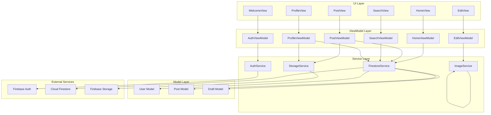
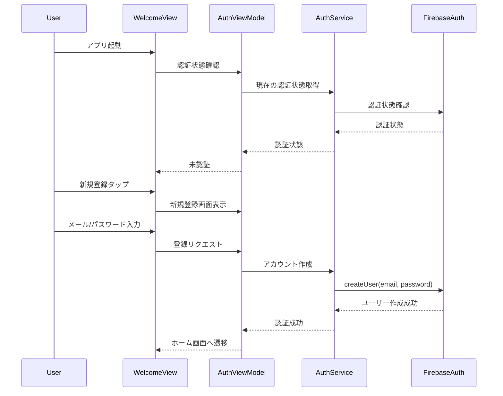
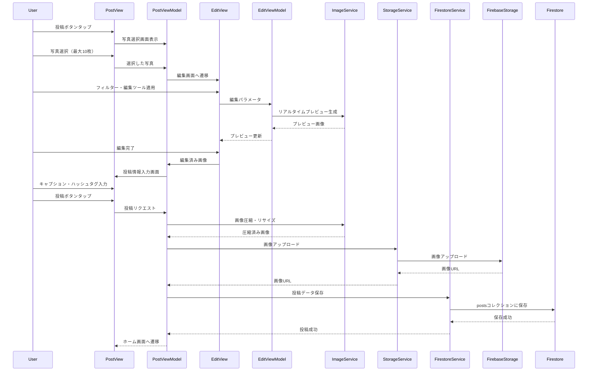

# Design Document

---
**Purpose**: Provide sufficient detail to ensure implementation consistency across different implementers, preventing interpretation drift.

**Approach**:
- Include essential sections that directly inform implementation decisions
- Omit optional sections unless critical to preventing implementation errors
- Match detail level to feature complexity
- Use diagrams and tables over lengthy prose

**Warning**: Approaching 1000 lines indicates excessive feature complexity that may require design simplification.
---

## Overview

そらもようは、空の写真を投稿・編集・共有するiOS SNSアプリケーションです。この機能は、ユーザーが空の写真を選択し、豊富な編集ツールとフィルターで加工して投稿し、他のユーザーの投稿を閲覧・検索できることを実現します。

**Users**: 一般ユーザー（空の写真を撮影・共有したい人）が、写真の選択、編集、投稿、閲覧、検索のワークフローを利用します。

**Impact**: 新規iOSアプリケーションとして、FirebaseをバックエンドとするSNSプラットフォームを構築します。MVVMアーキテクチャパターンに基づき、SwiftUIで実装されます。

### Goals
- ユーザー認証機能による安全なアカウント管理
- 直感的な画像編集機能（フィルター10種類、編集ツール27種類）
- 効率的な投稿・閲覧・検索機能
- パフォーマンス最適化された画像処理と表示
- Firebase統合によるスケーラブルなバックエンド

### Non-Goals
- アプリ内カメラ機能（Phase 3で実装予定）
- フォロー/フォロワー機能（Phase 2で実装予定）
- いいね・コメント機能（Phase 2で実装予定）
- 通知機能（Phase 2で実装予定）
- マップビュー（Phase 2で実装予定）

## Architecture

### Architecture Pattern & Boundary Map

**Selected pattern**: MVVM (Model-View-ViewModel)

**Architecture Integration**:
- Selected pattern: MVVM — SwiftUIの標準的な状態管理パターンで、ビジネスロジックとUIの分離が明確
- Domain/feature boundaries: 
  - **UI Layer**: SwiftUI Views（表示のみ）
  - **ViewModel Layer**: ObservableObjectを実装したViewModels（状態管理とビジネスロジック）
  - **Service Layer**: Firebase統合サービス（認証、データベース、ストレージ）
  - **Model Layer**: データ構造とドメインモデル
- Existing patterns preserved: SwiftUIの標準的な状態管理パターン（@StateObject, @ObservedObject, @State）
- New components rationale: 
  - ViewModels: 各機能モジュールにViewModelを配置し、状態管理とFirebaseサービスとの通信を担当
  - Services: Firebase統合を抽象化し、ViewModelから利用可能にする
  - Models: ドメインデータ構造を定義
- Steering compliance: SwiftUIの標準パターンに準拠、型安全性を確保



### Technology Stack

| Layer | Choice / Version | Role in Feature | Notes |
|-------|------------------|-----------------|-------|
| Frontend | SwiftUI | UIフレームワーク | iOS 15.0+、宣言的UI |
| Language | Swift 5.9+ | プログラミング言語 | 型安全性、モダンな構文 |
| State Management | Combine | リアクティブプログラミング | @Published, ObservableObject |
| Backend / Services | Firebase Authentication | ユーザー認証 | メール/パスワード認証 |
| Backend / Services | Cloud Firestore | データベース | NoSQL、リアルタイム同期 |
| Backend / Services | Firebase Storage | ファイルストレージ | 画像ファイル保存 |
| Image Processing | Core Image / CIFilter | 画像編集 | フィルター、編集ツール |
| Image Cache | Kingfisher | 画像キャッシュ | 遅延読み込み、キャッシュ管理 |
| Location | CoreLocation | 位置情報取得 | 現在地、ランドマーク |
| Map | MapKit | 地図表示 | 位置情報表示、ランドマーク選択 |
| Ads | Google Mobile Ads SDK | 広告表示 | AdMobバナー広告 |
| Infrastructure / Runtime | iOS 15.0+ | 実行環境 | 最小サポートバージョン |

## System Flows

### ユーザー認証フロー



### 投稿フロー



## Requirements Traceability

| Requirement | Summary | Components | Interfaces | Flows |
|-------------|---------|------------|------------|-------|
| 1.1-1.8 | ユーザー認証 | AuthViewModel, AuthService | AuthServiceProtocol | 認証フロー |
| 2.1-2.8 | 写真選択 | PostViewModel, ImagePicker | ImagePickerService | 投稿フロー |
| 3.1-3.5 | フィルター適用 | EditViewModel, ImageService | ImageFilterService | 投稿フロー |
| 4.1-4.5 | 編集ツール | EditViewModel, ImageService | ImageEditService | 投稿フロー |
| 5.1-5.7 | 編集装備システム | ProfileViewModel, FirestoreService | UserService | プロフィールフロー |
| 6.1-6.9 | 投稿情報入力 | PostViewModel | PostViewModel | 投稿フロー |
| 7.1-7.7 | 自動情報抽出 | ImageService, MetadataService | ImageAnalysisService | 投稿フロー |
| 8.1-8.8 | 投稿保存 | PostViewModel, StorageService, FirestoreService | PostService | 投稿フロー |
| 9.1-9.5 | 下書き保存 | PostViewModel, FirestoreService | DraftService | 投稿フロー |
| 10.1-10.7 | フィード表示 | HomeViewModel, FirestoreService | PostService | フィードフロー |
| 11.1-11.7 | 検索機能 | SearchViewModel, FirestoreService | SearchService | 検索フロー |
| 12.1-12.8 | プロフィール機能 | ProfileViewModel, FirestoreService, StorageService | UserService | プロフィールフロー |
| 13.1-13.4 | AdMob広告 | AdBannerView, AdService | AdService | 全画面 |
| 14.1-14.6 | 画像仕様・パフォーマンス | ImageService, StorageService | ImageService | 全機能 |
| 15.1-15.5 | セキュリティ・アクセス制御 | FirestoreService, StorageService | SecurityRules | 全機能 |

## Components and Interfaces

| Component | Domain/Layer | Intent | Req Coverage | Key Dependencies (P0/P1) | Contracts |
|-----------|--------------|--------|--------------|--------------------------|-----------|
| AuthViewModel | ViewModel | 認証状態管理とUI更新 | 1.1-1.8 | AuthService (P0) | Service, State |
| AuthService | Service | Firebase Authentication統合 | 1.1-1.8 | Firebase Auth (P0) | Service |
| PostViewModel | ViewModel | 投稿フロー管理 | 2.1-2.8, 6.1-6.9, 8.1-8.8, 9.1-9.5 | FirestoreService (P0), StorageService (P0), ImageService (P0) | Service, State |
| EditViewModel | ViewModel | 画像編集状態管理 | 3.1-3.5, 4.1-4.5 | ImageService (P0) | Service, State |
| ImageService | Service | 画像処理（フィルター、編集、圧縮） | 3.1-3.5, 4.1-4.5, 7.1-7.7, 14.1-14.6 | Core Image (P0) | Service |
| HomeViewModel | ViewModel | フィード表示管理 | 10.1-10.7 | FirestoreService (P0) | Service, State |
| SearchViewModel | ViewModel | 検索機能管理 | 11.1-11.7 | FirestoreService (P0) | Service, State |
| ProfileViewModel | ViewModel | プロフィール管理 | 5.1-5.7, 12.1-12.8 | FirestoreService (P0), StorageService (P0) | Service, State |
| FirestoreService | Service | Firestore統合 | 5.1-5.7, 8.1-8.8, 9.1-9.5, 10.1-10.7, 11.1-11.7, 12.1-12.8 | Firestore (P0) | Service |
| StorageService | Service | Firebase Storage統合 | 8.1-8.8, 12.1-12.8 | Firebase Storage (P0) | Service |
| AdService | Service | AdMob広告統合 | 13.1-13.4 | Google Mobile Ads SDK (P1) | Service |

### ViewModel Layer

#### AuthViewModel

| Field | Detail |
|-------|--------|
| Intent | ユーザー認証状態の管理とUI更新 |
| Requirements | 1.1, 1.2, 1.3, 1.4, 1.5, 1.6, 1.7, 1.8 |

**Responsibilities & Constraints**
- 認証状態（未認証/認証済み）の管理
- ログイン/新規登録の処理
- 認証エラーの処理と表示
- 認証状態の永続化（自動ログイン）

**Dependencies**
- Inbound: WelcomeView, LoginView, SignUpView — UI入力 (P0)
- Outbound: AuthService — 認証処理 (P0)
- External: Firebase Authentication — 認証サービス (P0)

**Contracts**: Service [✓] / State [✓]

##### Service Interface
```swift
protocol AuthServiceProtocol {
    func signIn(email: String, password: String) async throws -> User
    func signUp(email: String, password: String) async throws -> User
    func signOut() async throws
    func currentUser() -> User?
    func observeAuthState() -> AsyncStream<User?>
}
```
- Preconditions: メールアドレスとパスワードが有効な形式
- Postconditions: 認証成功時はUserオブジェクトを返す、失敗時はエラーをthrow
- Invariants: 認証状態は常に一貫性を保つ

##### State Management
- State model: `@Published var isAuthenticated: Bool`, `@Published var currentUser: User?`
- Persistence & consistency: Firebase Authenticationの認証状態を監視
- Concurrency strategy: MainActorで状態更新、非同期処理はasync/await

**Implementation Notes**
- Integration: AuthServiceと連携し、認証状態をViewModelに反映
- Validation: メールアドレスとパスワードの形式検証
- Risks: ネットワークエラー時の処理、認証状態の同期

#### PostViewModel

| Field | Detail |
|-------|--------|
| Intent | 投稿フローの状態管理（写真選択、編集、投稿情報入力、保存） |
| Requirements | 2.1-2.8, 6.1-6.9, 8.1-8.8, 9.1-9.5 |

**Responsibilities & Constraints**
- 写真選択の管理（最大枚数制限、画像検証）
- 編集済み画像の管理
- 投稿情報（キャプション、ハッシュタグ、位置情報、公開設定）の管理
- 投稿保存処理（画像アップロード、Firestore保存）
- 下書き保存・読み込み処理

**Dependencies**
- Inbound: PostView, EditView — UI入力 (P0)
- Outbound: FirestoreService — データ保存 (P0), StorageService — 画像アップロード (P0), ImageService — 画像処理 (P0)
- External: Firebase Storage, Firestore — バックエンドサービス (P0)

**Contracts**: Service [✓] / State [✓]

##### Service Interface
```swift
protocol PostServiceProtocol {
    func createPost(_ post: Post) async throws -> Post
    func saveDraft(_ draft: Draft) async throws -> Draft
    func loadDraft(draftId: String) async throws -> Draft
    func deleteDraft(draftId: String) async throws
}

protocol StorageServiceProtocol {
    func uploadImage(_ image: UIImage, path: String) async throws -> URL
    func uploadThumbnail(_ image: UIImage, path: String) async throws -> URL
}
```
- Preconditions: 画像が有効、投稿情報が完全
- Postconditions: 投稿成功時はPostオブジェクトを返す、失敗時はエラーをthrow
- Invariants: 投稿データの整合性を保つ

##### State Management
- State model: `@Published var selectedImages: [UIImage]`, `@Published var editedImages: [UIImage]`, `@Published var postInfo: PostInfo`, `@Published var isUploading: Bool`
- Persistence & consistency: 下書きはFirestoreに保存、投稿はFirestoreとStorageに保存
- Concurrency strategy: 非同期処理で画像アップロード、進捗表示

**Implementation Notes**
- Integration: 複数のサービス（FirestoreService, StorageService, ImageService）と連携
- Validation: 画像サイズ・枚数制限、投稿情報の必須項目チェック
- Risks: ネットワークエラー、アップロード失敗時のロールバック、メモリ管理
- **投稿保存の整合性保証戦略**:
  - 処理順序: 1) 画像圧縮・リサイズ → 2) Storageに画像アップロード → 3) Firestoreに投稿データ保存
  - エラーハンドリング:
    - Storageアップロード成功後にFirestore保存が失敗した場合: Storageからアップロード済み画像を削除（cleanup処理）
    - Firestore保存成功後は整合性が保証される（Storage URLはFirestoreに保存済み）
  - リトライ戦略: ネットワークエラー時は最大3回までリトライ、それでも失敗した場合はエラーメッセージを表示
  - 孤立ファイル防止: 定期的なバッチ処理でFirestoreに参照されていないStorageファイルを削除（将来実装）

#### EditViewModel

| Field | Detail |
|-------|--------|
| Intent | 画像編集状態の管理（フィルター、編集ツール） |
| Requirements | 3.1-3.5, 4.1-4.5 |

**Responsibilities & Constraints**
- フィルター適用の管理（10種類）
- 編集ツール適用の管理（27種類、装備ツールのみ表示）
- リアルタイムプレビューの生成
- 編集パラメータの管理

**Dependencies**
- Inbound: EditView — UI入力 (P0)
- Outbound: ImageService — 画像処理 (P0)
- External: Core Image — 画像処理フレームワーク (P0)

**Contracts**: Service [✓] / State [✓]

##### Service Interface
```swift
protocol ImageEditServiceProtocol {
    func applyFilter(_ filter: FilterType, to image: UIImage) async throws -> UIImage
    func applyEditTool(_ tool: EditTool, value: Float, to image: UIImage) async throws -> UIImage
    func generatePreview(_ image: UIImage, edits: EditSettings) async throws -> UIImage
}
```
- Preconditions: 画像が有効、編集パラメータが範囲内
- Postconditions: 編集済み画像を返す、失敗時はエラーをthrow
- Invariants: 編集パラメータは常に有効な範囲内

##### State Management
- State model: `@Published var currentImage: UIImage?`, `@Published var previewImage: UIImage?`, `@Published var editSettings: EditSettings`, `@Published var equippedTools: [EditTool]`
- Persistence & consistency: 編集設定は一時的に保持、下書き保存時に永続化
- Concurrency strategy: バックグラウンドスレッドで画像処理、メインスレッドでUI更新

**Implementation Notes**
- Integration: ImageServiceと連携し、Core Imageで画像処理
- Validation: 編集パラメータの範囲チェック、画像形式の検証
- Risks: メモリ不足、処理時間の長さ、リアルタイムプレビューのパフォーマンス

#### HomeViewModel

| Field | Detail |
|-------|--------|
| Intent | フィード表示の状態管理（投稿一覧、ページネーション） |
| Requirements | 10.1-10.7 |

**Responsibilities & Constraints**
- 公開投稿の取得と表示
- ページネーション処理
- 画像の遅延読み込み管理
- ローディング状態の管理

**Dependencies**
- Inbound: HomeView — UI表示 (P0)
- Outbound: FirestoreService — データ取得 (P0)
- External: Firestore — データベース (P0)

**Contracts**: Service [✓] / State [✓]

##### Service Interface
```swift
protocol PostServiceProtocol {
    func fetchPosts(limit: Int, lastDocument: DocumentSnapshot?) async throws -> [Post]
    func fetchPost(postId: String) async throws -> Post
}
```
- Preconditions: 認証状態が有効（公開投稿は認証不要）
- Postconditions: 投稿配列を返す、失敗時はエラーをthrow
- Invariants: 投稿は時系列順で取得

##### State Management
- State model: `@Published var posts: [Post]`, `@Published var isLoading: Bool`, `@Published var lastDocument: DocumentSnapshot?`
- Persistence & consistency: Firestoreからリアルタイムで取得、キャッシュは画像のみ
- Concurrency strategy: 非同期処理で投稿取得、ページネーション

**Implementation Notes**
- Integration: FirestoreServiceと連携し、公開投稿を取得
- Validation: 公開設定の確認、ページネーションの制御
- Risks: ネットワークエラー、大量データのメモリ管理、パフォーマンス

#### SearchViewModel

| Field | Detail |
|-------|--------|
| Intent | 検索機能の状態管理（ハッシュタグ、色、時間帯、空の種類） |
| Requirements | 11.1-11.7 |

**Responsibilities & Constraints**
- 検索クエリの管理
- 検索結果の取得と表示
- 複数条件の組み合わせ検索

**Dependencies**
- Inbound: SearchView — UI入力 (P0)
- Outbound: FirestoreService — 検索クエリ実行 (P0)
- External: Firestore — データベース (P0)

**Contracts**: Service [✓] / State [✓]

##### Service Interface
```swift
protocol SearchServiceProtocol {
    func searchByHashtag(_ hashtag: String) async throws -> [Post]
    func searchByColor(_ color: String) async throws -> [Post]
    func searchByTimeOfDay(_ timeOfDay: TimeOfDay) async throws -> [Post]
    func searchBySkyType(_ skyType: SkyType) async throws -> [Post]
    func search(hashtag: String?, color: String?, timeOfDay: TimeOfDay?, skyType: SkyType?) async throws -> [Post]
}
```
- Preconditions: 検索条件が有効
- Postconditions: 検索結果配列を返す、失敗時はエラーをthrow
- Invariants: 検索結果は公開投稿のみ

##### State Management
- State model: `@Published var searchResults: [Post]`, `@Published var searchQuery: SearchQuery`, `@Published var isLoading: Bool`
- Persistence & consistency: 検索結果は一時的、キャッシュなし
- Concurrency strategy: 非同期処理で検索実行

**Implementation Notes**
- Integration: FirestoreServiceと連携し、複合インデックスを使用
- Validation: 検索条件の検証、色検索の近似マッチング
- Risks: 検索パフォーマンス、複合インデックスの設計、色検索の精度
- **色検索の実装方針**: 
  - Firestoreの配列クエリでは近似検索が困難なため、クライアント側でフィルタリングを実装
  - RGB色空間でのユークリッド距離計算（ΔE）により類似色を判定
  - 検索色と投稿のskyColors配列内の各色を比較し、閾値（例：ΔE < 30）以内の色を含む投稿を抽出
  - パフォーマンス最適化のため、まずFirestoreで公開投稿を取得し、その後クライアント側で色フィルタリングを実行

#### ProfileViewModel

| Field | Detail |
|-------|--------|
| Intent | プロフィール表示・編集の状態管理 |
| Requirements | 5.1-5.7, 12.1-12.8 |

**Responsibilities & Constraints**
- プロフィール情報の表示・編集
- 編集装備システムの管理
- 自分の投稿一覧の表示
- 他ユーザーのプロフィール表示

**Dependencies**
- Inbound: ProfileView — UI表示・入力 (P0)
- Outbound: FirestoreService — データ取得・更新 (P0), StorageService — 画像アップロード (P0)
- External: Firestore, Firebase Storage — バックエンドサービス (P0)

**Contracts**: Service [✓] / State [✓]

##### Service Interface
```swift
protocol UserServiceProtocol {
    func fetchUser(userId: String) async throws -> User
    func updateUser(_ user: User) async throws -> User
    func updateEditTools(_ tools: [EditTool], order: [String]) async throws
    func fetchUserPosts(userId: String) async throws -> [Post]
}
```
- Preconditions: ユーザーIDが有効、認証状態が有効
- Postconditions: ユーザー情報を返す、失敗時はエラーをthrow
- Invariants: プロフィール情報の整合性を保つ

##### State Management
- State model: `@Published var user: User?`, `@Published var userPosts: [Post]`, `@Published var equippedTools: [EditTool]`
- Persistence & consistency: Firestoreに保存、リアルタイム更新
- Concurrency strategy: 非同期処理でデータ取得・更新

**Implementation Notes**
- Integration: FirestoreServiceとStorageServiceと連携
- Validation: プロフィール情報の検証、編集ツールの制約（5-8個）
- Risks: プロフィール画像のアップロード、編集ツールの順序管理

### Service Layer

#### AuthService

| Field | Detail |
|-------|--------|
| Intent | Firebase Authentication統合サービス |
| Requirements | 1.1-1.8 |

**Responsibilities & Constraints**
- Firebase Authenticationとの通信
- 認証状態の監視
- エラーハンドリング

**Dependencies**
- Inbound: AuthViewModel — 認証リクエスト (P0)
- Outbound: Firebase Authentication — 認証サービス (P0)
- External: Firebase SDK — 認証SDK (P0)

**Contracts**: Service [✓]

##### Service Interface
```swift
protocol AuthServiceProtocol {
    func signIn(email: String, password: String) async throws -> User
    func signUp(email: String, password: String) async throws -> User
    func signOut() async throws
    func currentUser() -> User?
    func observeAuthState() -> AsyncStream<User?>
}
```

**Implementation Notes**
- Integration: Firebase Authentication SDKを使用
- Validation: メールアドレスとパスワードの形式検証
- Risks: ネットワークエラー、認証失敗時の処理

#### FirestoreService

| Field | Detail |
|-------|--------|
| Intent | Cloud Firestore統合サービス |
| Requirements | 5.1-5.7, 8.1-8.8, 9.1-9.5, 10.1-10.7, 11.1-11.7, 12.1-12.8 |

**Responsibilities & Constraints**
- Firestoreへのデータ読み書き
- クエリの実行（検索、フィード取得）
- セキュリティルールの適用

**Dependencies**
- Inbound: ViewModels — データ操作リクエスト (P0)
- Outbound: Cloud Firestore — データベース (P0)
- External: Firebase SDK — Firestore SDK (P0)

**Contracts**: Service [✓]

##### Service Interface
```swift
protocol FirestoreServiceProtocol {
    // Posts
    func createPost(_ post: Post) async throws -> Post
    func fetchPosts(limit: Int, lastDocument: DocumentSnapshot?) async throws -> [Post]
    func fetchPost(postId: String) async throws -> Post
    func deletePost(postId: String) async throws
    
    // Drafts
    func saveDraft(_ draft: Draft) async throws -> Draft
    func fetchDrafts(userId: String) async throws -> [Draft]
    func loadDraft(draftId: String) async throws -> Draft
    func deleteDraft(draftId: String) async throws
    
    // Users
    func fetchUser(userId: String) async throws -> User
    func updateUser(_ user: User) async throws -> User
    func updateEditTools(userId: String, tools: [EditTool], order: [String]) async throws
    
    // Search
    func searchByHashtag(_ hashtag: String) async throws -> [Post]
    func searchByColor(_ color: String) async throws -> [Post]
    func searchByTimeOfDay(_ timeOfDay: TimeOfDay) async throws -> [Post]
    func searchBySkyType(_ skyType: SkyType) async throws -> [Post]
}
```

**Implementation Notes**
- Integration: Firestore SDKを使用、セキュリティルールでアクセス制御
- Validation: データの整合性チェック、クエリの最適化
- Risks: ネットワークエラー、クエリパフォーマンス、インデックス設計

#### StorageService

| Field | Detail |
|-------|--------|
| Intent | Firebase Storage統合サービス |
| Requirements | 8.1-8.8, 12.1-12.8 |

**Responsibilities & Constraints**
- 画像ファイルのアップロード
- サムネイル画像の生成・アップロード
- アップロード進捗の管理

**Dependencies**
- Inbound: ViewModels — アップロードリクエスト (P0)
- Outbound: Firebase Storage — ストレージサービス (P0)
- External: Firebase SDK — Storage SDK (P0)

**Contracts**: Service [✓]

##### Service Interface
```swift
protocol StorageServiceProtocol {
    func uploadImage(_ image: UIImage, path: String) async throws -> URL
    func uploadThumbnail(_ image: UIImage, path: String) async throws -> URL
    func deleteImage(path: String) async throws
    func uploadProgress(path: String) -> AsyncStream<Double>
}
```

**Implementation Notes**
- Integration: Firebase Storage SDKを使用、セキュリティルールでアクセス制御
- Validation: 画像サイズ・形式の検証、パスの検証
- Risks: ネットワークエラー、アップロード失敗、ストレージ容量

#### ImageService

| Field | Detail |
|-------|--------|
| Intent | 画像処理サービス（フィルター、編集、圧縮、分析） |
| Requirements | 3.1-3.5, 4.1-4.5, 7.1-7.7, 14.1-14.6 |

**Responsibilities & Constraints**
- Core Image / CIFilterによる画像処理
- フィルター適用（10種類）
- 編集ツール適用（27種類）
- 画像圧縮・リサイズ
- 画像分析（色抽出、色温度、空の種類判定）

**Dependencies**
- Inbound: ViewModels — 画像処理リクエスト (P0)
- Outbound: Core Image — 画像処理フレームワーク (P0)
- External: Core Image Framework — iOS画像処理 (P0)

**Contracts**: Service [✓]

##### Service Interface
```swift
protocol ImageServiceProtocol {
    // Filter
    func applyFilter(_ filter: FilterType, to image: UIImage) async throws -> UIImage
    
    // Edit Tools
    func applyEditTool(_ tool: EditTool, value: Float, to image: UIImage) async throws -> UIImage
    func applyEditSettings(_ settings: EditSettings, to image: UIImage) async throws -> UIImage
    
    // Preview
    func generatePreview(_ image: UIImage, edits: EditSettings) async throws -> UIImage
    
    // Compression & Resize
    func resizeImage(_ image: UIImage, maxSize: CGSize) async throws -> UIImage
    func compressImage(_ image: UIImage, quality: CGFloat) async throws -> Data
    
    // Analysis
    func extractColors(_ image: UIImage, maxCount: Int) async throws -> [String]
    func calculateColorTemperature(_ image: UIImage) async throws -> Int
    func detectSkyType(_ image: UIImage) async throws -> SkyType
    func extractEXIFData(_ image: UIImage) async throws -> EXIFData
}
```

**Implementation Notes**
- Integration: Core Image / CIFilterを使用、バックグラウンドスレッドで処理
- Validation: 画像形式の検証、編集パラメータの範囲チェック
- Risks: メモリ不足、処理時間、リアルタイムプレビューのパフォーマンス
- **空の種類判定の実装方針**:
  - Core ImageとVision Frameworkを組み合わせて実装
  - 色温度（colorTemperature）と色分布（HSV色空間での分析）を組み合わせて判定
  - 判定ロジック: 
    - clear: 青系色が多く、色温度が高い（5000K以上）
    - cloudy: グレー系色が多く、彩度が低い
    - sunset/sunrise: オレンジ・赤系色が多く、色温度が低い（3000K以下）
    - storm: 暗い色が多く、コントラストが高い
  - 機械学習モデルは初期実装では不要。必要に応じてCore MLモデルを後から追加可能

#### AdService

| Field | Detail |
|-------|--------|
| Intent | AdMob広告統合サービス |
| Requirements | 13.1-13.4 |

**Responsibilities & Constraints**
- AdMobバナー広告の表示
- 広告読み込みの管理
- エラーハンドリング（アプリ動作に影響なし）

**Dependencies**
- Inbound: Views — 広告表示リクエスト (P1)
- Outbound: Google Mobile Ads SDK — 広告SDK (P1)
- External: AdMob — 広告サービス (P1)

**Contracts**: Service [✓]

##### Service Interface
```swift
protocol AdServiceProtocol {
    func loadBannerAd(adUnitId: String) async throws -> GADBannerView
    func observeAdLoadState(adUnitId: String) -> AsyncStream<AdLoadState>
}
```

**Implementation Notes**
- Integration: Google Mobile Ads SDKを使用
- Validation: 広告ユニットIDの検証
- Risks: 広告読み込み失敗（アプリ動作に影響なし）、広告の表示位置

## Data Models

### Domain Model

**Aggregates**:
- **User**: ユーザー情報の集約（プロフィール、編集装備設定）
- **Post**: 投稿情報の集約（画像、メタデータ、公開設定）
- **Draft**: 下書き情報の集約（編集状態、投稿情報）

**Entities**:
- User (userId, email, displayName, photoURL, bio, customEditTools, customEditToolsOrder)
- Post (postId, userId, images, caption, hashtags, location, skyColors, capturedAt, timeOfDay, skyType, colorTemperature, visibility, likesCount, commentsCount, createdAt, updatedAt)
- Draft (draftId, userId, images, editedImages, editSettings, caption, hashtags, location, visibility, createdAt, updatedAt)

**Value Objects**:
- Location (latitude, longitude, city, prefecture, landmark)
- ImageInfo (url, thumbnail, width, height, order)
- EditSettings (brightness, contrast, saturation, ...)
- FilterType (enum: natural, clear, drama, soft, warm, cool, vintage, monochrome, pastel, vivid)
- EditTool (enum: exposure, brightness, contrast, ...)
- TimeOfDay (enum: morning, afternoon, evening, night)
- SkyType (enum: clear, cloudy, sunset, sunrise, storm)
- Visibility (enum: public, followers, private)

**Domain Events**:
- PostCreated
- PostUpdated
- DraftSaved
- UserUpdated

### Logical Data Model

**Structure Definition**:

**users コレクション**:
- userId (String, Primary Key)
- email (String, Required)
- displayName (String, Optional)
- photoURL (String, Optional)
- bio (String, Optional)
- customEditTools (Array<String>, Optional)
- customEditToolsOrder (Array<String>, Optional)
- followersCount (Int, Default: 0)
- followingCount (Int, Default: 0)
- postsCount (Int, Default: 0)
- createdAt (Timestamp, Required)
- updatedAt (Timestamp, Required)

**posts コレクション**:
- postId (String, Primary Key)
- userId (String, Required, Foreign Key → users.userId)
- images (Array<ImageInfo>, Required)
- caption (String, Optional)
- hashtags (Array<String>, Optional)
- location (Location, Optional)
- skyColors (Array<String>, Max: 5, Optional)
- capturedAt (Timestamp, Optional)
- timeOfDay (String, Enum: morning/afternoon/evening/night, Optional)
- skyType (String, Enum: clear/cloudy/sunset/sunrise/storm, Optional)
- colorTemperature (Int, Optional)
- visibility (String, Enum: public/followers/private, Default: public)
- likesCount (Int, Default: 0)
- commentsCount (Int, Default: 0)
- createdAt (Timestamp, Required)
- updatedAt (Timestamp, Required)

**drafts コレクション**:
- draftId (String, Primary Key)
- userId (String, Required, Foreign Key → users.userId)
- images (Array<ImageInfo>, Required)
- editedImages (Array<ImageInfo>, Optional)
- editSettings (EditSettings, Optional)
- caption (String, Optional)
- hashtags (Array<String>, Optional)
- location (Location, Optional)
- visibility (String, Enum: public/followers/private, Default: public)
- createdAt (Timestamp, Required)
- updatedAt (Timestamp, Required)

**Consistency & Integrity**:
- Transaction boundaries: 投稿作成時は画像アップロードとFirestore保存をトランザクション化（Firestoreトランザクションは使用不可のため、エラーハンドリングで整合性を保証）
- Cascading rules: ユーザー削除時は投稿と下書きも削除（将来実装）
- Temporal aspects: createdAt, updatedAtでバージョン管理

### Physical Data Model

**For Firestore (Document Store)**:

**Collection: users**
- Document ID: userId (自動生成)
- Fields: 上記Logical Data Model参照
- Indexes:
  - createdAt (降順) — ユーザー一覧取得用

**Collection: posts**
- Document ID: postId (自動生成)
- Fields: 上記Logical Data Model参照
- Indexes:
  - visibility + createdAt (降順) — フィード取得用
  - userId + createdAt (降順) — ユーザー投稿一覧取得用
  - hashtags (配列) — ハッシュタグ検索用
  - timeOfDay + createdAt (降順) — 時間帯検索用
  - skyType + createdAt (降順) — 空の種類検索用
  - skyColors (配列) — 色検索用（近似検索のため範囲クエリ）

**Collection: drafts**
- Document ID: draftId (自動生成)
- Fields: 上記Logical Data Model参照
- Indexes:
  - userId + createdAt (降順) — 下書き一覧取得用

**Sharding key design**: 不要（Firestoreが自動管理）

### Data Contracts & Integration

**API Data Transfer**:

**Post Creation Request**:
```swift
struct CreatePostRequest {
    let userId: String
    let images: [ImageInfo]
    let caption: String?
    let hashtags: [String]?
    let location: Location?
    let skyColors: [String]?
    let capturedAt: Date?
    let timeOfDay: TimeOfDay?
    let skyType: SkyType?
    let colorTemperature: Int?
    let visibility: Visibility
}
```

**Post Response**:
```swift
struct PostResponse {
    let postId: String
    let userId: String
    let images: [ImageInfo]
    let caption: String?
    let hashtags: [String]?
    let location: Location?
    let skyColors: [String]?
    let capturedAt: Date?
    let timeOfDay: TimeOfDay?
    let skyType: SkyType?
    let colorTemperature: Int?
    let visibility: Visibility
    let likesCount: Int
    let commentsCount: Int
    let createdAt: Date
    let updatedAt: Date
}
```

**Validation Rules**:
- 画像は最大10枚、各画像は最大2048x2048ピクセル、5MB以下
- ハッシュタグは最大30個、各ハッシュタグは50文字以下
- キャプションは最大1000文字

**Serialization Format**: JSON (Firestoreの標準形式)

## Error Handling

### Error Strategy

**Error Categories**:
- **User Errors (4xx)**: 入力検証エラー、認証エラー、権限エラー
- **System Errors (5xx)**: ネットワークエラー、Firebaseサービスエラー、画像処理エラー
- **Business Logic Errors (422)**: 投稿制限違反、編集ツール制限違反

**Error Handling Patterns**:
- **Fail Fast**: 入力検証は早期に実行し、明確なエラーメッセージを表示
- **Graceful Degradation**: ネットワークエラー時はリトライ機能を提供、広告読み込み失敗はアプリ動作に影響なし
- **User Context**: エラーメッセージはユーザーに分かりやすく、アクション可能な内容
- **Observability**: エラーはログに記録し、クラッシュレポートに送信

### Error Categories and Responses

**User Errors (4xx)**:
- **Invalid Input**: フィールドレベルの検証エラー → 該当フィールドにエラーメッセージを表示
- **Unauthorized**: 認証エラー → ログイン画面へ誘導
- **Not Found**: リソースが見つからない → 適切な画面へナビゲーション

**System Errors (5xx)**:
- **Infrastructure Failures**: ネットワークエラー、Firebaseサービスエラー → リトライ機能、エラーメッセージ表示
- **Timeouts**: タイムアウトエラー → リトライ機能、タイムアウト時間の調整
- **Exhaustion**: レート制限エラー → レート制限メッセージ表示、リトライ待機

**Business Logic Errors (422)**:
- **Rule Violations**: 投稿制限違反（画像枚数超過など） → 条件説明とエラーメッセージ
- **State Conflicts**: 編集ツール制限違反（5-8個の制約） → 制約説明とエラーメッセージ

### Monitoring

**Error Tracking**:
- Firebase Crashlyticsでクラッシュレポートを収集
- エラーログはFirebase Analyticsに送信
- ネットワークエラーはリトライ回数と成功率を記録

**Logging**:
- エラーレベル: Error, Warning, Info
- エラーコンテキスト: ユーザーID、操作、エラー詳細
- 機密情報はログに含めない（パスワード、トークンなど）

## Testing Strategy

### Unit Tests
- **AuthService**: 認証メソッドのテスト（成功/失敗ケース）
- **ImageService**: 画像処理メソッドのテスト（フィルター、編集ツール、圧縮）
- **FirestoreService**: データ操作メソッドのテスト（CRUD操作）
- **StorageService**: 画像アップロードメソッドのテスト（成功/失敗ケース）
- **ViewModel**: 状態管理とビジネスロジックのテスト

### Integration Tests
- **認証フロー**: ログイン/新規登録からホーム画面遷移まで
- **投稿フロー**: 写真選択から投稿保存まで
- **検索フロー**: 検索条件から結果表示まで
- **Firebase統合**: Firestore、Storage、Authenticationの統合テスト

### E2E/UI Tests
- **認証**: ログイン/新規登録のUI操作
- **投稿**: 写真選択、編集、投稿情報入力、投稿保存のUI操作
- **フィード**: フィード表示、ページネーション、投稿詳細表示のUI操作
- **検索**: 検索条件入力、検索結果表示のUI操作
- **プロフィール**: プロフィール表示、編集、編集装備設定のUI操作

### Performance/Load Tests
- **画像処理**: リアルタイムプレビューのパフォーマンス（処理時間、メモリ使用量）
- **ネットワーク**: 画像アップロードのパフォーマンス（アップロード時間、進捗表示）
- **データ取得**: フィード表示のパフォーマンス（読み込み時間、ページネーション）
- **メモリ**: 大量画像処理時のメモリ使用量

## Security Considerations

### Authentication and Authorization
- Firebase Authenticationでユーザー認証を実装
- Firestore Security Rulesでデータアクセス制御
- 投稿の所有者のみ編集・削除可能
- 公開設定（public/followers/private）に応じたアクセス制御

### Data Protection
- 画像ファイルはFirebase Storageに保存、適切なアクセス権限を設定
- ユーザー情報はFirestore Security Rulesで保護
- APIキーは環境変数で管理、.gitignoreに追加

### Security Controls
- Firestore Security Rules:
  - users: 認証済みユーザーのみ読み書き可能、自分のデータのみ更新可能
  - posts: 公開投稿は全員読み取り可能、自分の投稿のみ作成・更新・削除可能
  - drafts: 自分の下書きのみ読み書き可能
- Firebase Storage Security Rules:
  - 画像ファイルは認証済みユーザーのみアップロード可能
  - 公開画像は全員読み取り可能、プライベート画像は所有者のみ読み取り可能

## Performance & Scalability

### Target Metrics
- **画像処理**: リアルタイムプレビュー生成時間 < 100ms
- **画像アップロード**: 1枚あたりのアップロード時間 < 5秒（ネットワーク状況による）
- **フィード表示**: 初回読み込み時間 < 2秒、ページネーション読み込み時間 < 1秒
- **検索**: 検索結果取得時間 < 1秒

### Scaling Approaches
- **Horizontal Scaling**: FirestoreとFirebase Storageは自動スケーリング
- **Caching**: 画像キャッシュ（Kingfisher）で読み込み速度向上
- **Lazy Loading**: 画像の遅延読み込みで通信量削減
- **Pagination**: フィード表示はページネーションでメモリ使用量削減

### Optimization Techniques
- **画像処理**: サムネイルプレビュー（512x512）でリアルタイム処理を高速化
- **画像圧縮**: JPEG形式（圧縮率80-90%）でファイルサイズ削減
- **バックグラウンド処理**: 画像処理はバックグラウンドスレッドで実行
- **メモリ管理**: 処理済み画像は適切に解放、メモリプールを使用

## Supporting References

詳細な調査結果と設計決定の根拠は `research.md` を参照してください。

